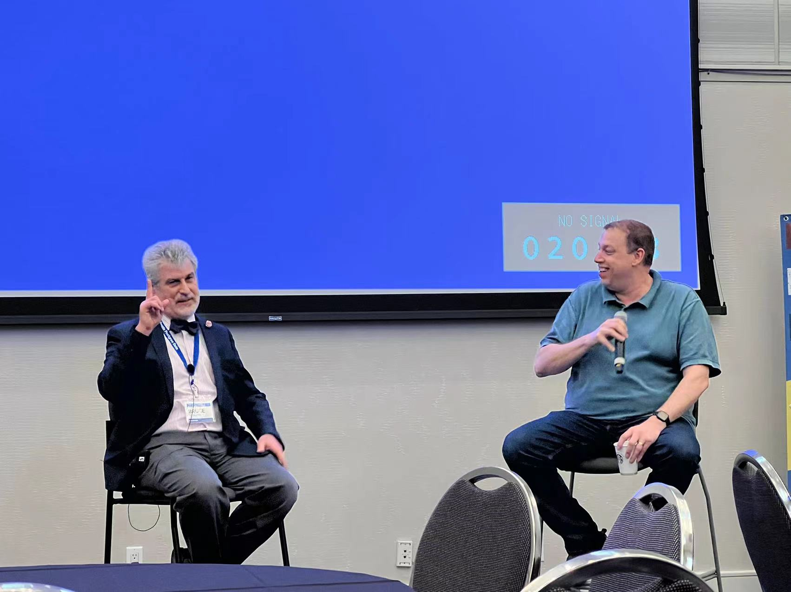
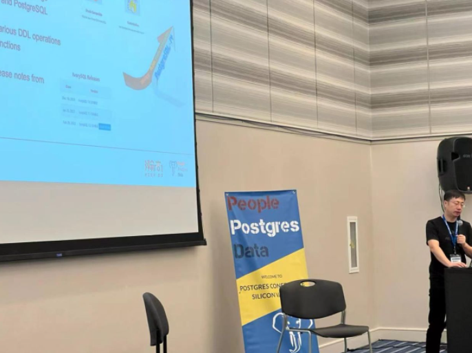
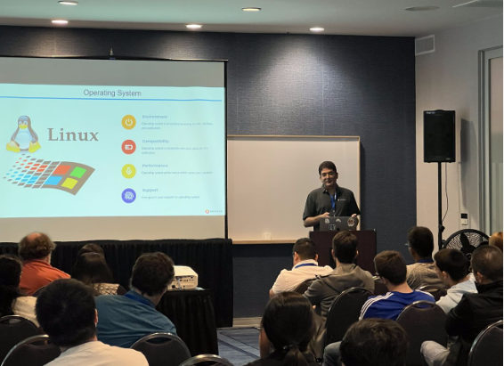
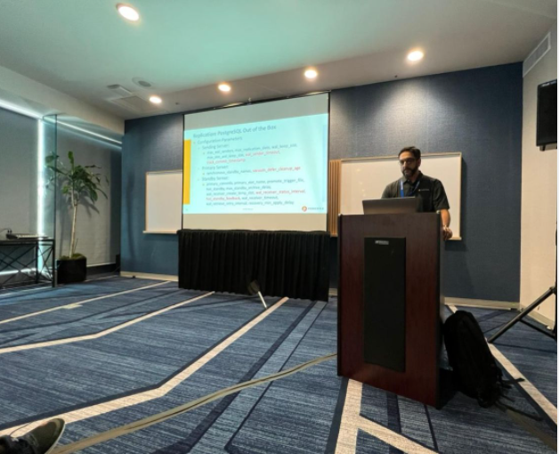

The Postgres Conference in Silicon Valley is the largest PG conference on the West Coast and one of the most important Postgres conferences of the year in the US and globally. It will be held on April 7-8, 2022 (PDT) at the Hilton Hotel SAN Jose, California, USA. As an annual technology event for PostgreSQL technologists, practitioners, and enthusiasts around the world, the Silicon Valley Conference is dedicated to bringing together and discussing the relationship between people, Postgres, and data! The conference is as inclusive and fair as silicon Valley, bringing together the best speakers, audiences and sponsors, all working to create growth opportunities for the global Postgres ecosystem.

 About 200 people attended the meeting, the largest offline meeting since the outbreak. 

**Bruce Momjian, a key member of the community**, attended the conference, which was organized by PostgresConf,Joshua D.Drake, Jim Mlodgenski, and others. People from the United States,China, Canada, Brazil, Spain, Germany, India, Pakistan and other countries participated.

**Grant Zhou, head of Highgo North America Research Institute and Secretary general of PostgreSQL China International Advisory Committee, was invited to participate in PostgreSQL internal development discussions and community project contributions.** 

The following is a two-day Postgres conference briefing in Silicon Valley brought to you by the IvorySQL open source database community.

## Some of the speech

**Digital Rights and Privacy: Concerns for the 21st century--by Andres Arrieta**

The Electronic Frontier Foundation has been protecting and fighting for our civil liberties for over 30 years. In those 30 years a lot has happened: Our relationship to the internet has fundamentally changed, and yet, in many ways, our understanding of how it works has remained stagnant. 30 years ago, the Internet was a mystical place of wizardry with many unknowns, and a realm which was difficult to access. Today it’s a core part of our life that we have become reliant on, and while it has become far easier than ever to access the many gifts that the Internet provides, understanding of how it works - from policy makers to enforcement agencies - continues to lag. During that time, EFF and its mission have grown to cover many of the aspects that technology has brought for better or worse and to help protect those impacted by it, while ensuring a bright future with innovation that improves our lives. So what is happening today and where are our efforts going? Why have some issues like privacy and competition become so strongly intertwined, and what new opportunities and threats lay ahead? I’ll walk you through some of our work, some of the areas of concern, and some of the things I believe will help us work towards a better future.

**Past, Present, and Future of Logical Replication--by Amit Kapila**
In this talk, I will tell how the Logical Replication has been evolved over years in PostgreSQL. This will explain some of the major recent enhancements like facilitating logical replication of two-phase and large in-progress transactions. I will share my views on how this technology can be leveraged to build a highly scalable and available database solution for large Enterprises. After that, I will also talk about some of the important enhancements being discussed in this technology area for future releases of PostgreSQL. I'll also cover how this technology can be enhanced for data migration from PostgreSQL to other databases.

**IvorySQL--An Open Source Oracle-compatible Database Based on PostgreSQL--by GRANT ZHOU**
There are many users who need to migrate their applications from Oracle to the open source Postgres, but in order to support the new database, users often need to re-develop the application, which is inconvenient. If there is a database based on Postgres and compatible with most Oracle syntax and functions, it will be too convenient for customers. However, the official Postgres project will not accept this kind of code submission. After all, Postgres is Postgres, and Oracle is Oracle. So, let's make an Oracle compatible database. This talk will introduce how to make a database compatible with Oracle syntax based on PG, and introduce the IvorySQL project. This project is an open source project (Apache 2.0) led by Highgo Software, and currently has released version 1.2 based on PostgreSQL 14.2. Welcome everyone to contribute on this open source Oracle compatible database - IvorySQL, powered by PostgreSQL.

**Non-Relational Postgres--by Bruce Momjian**
Postgres has always had strong support for relational storage. However, there are many cases where relational storage is either inefficient or overly restrictive. This talk shows the many ways that Postgres has expanded to support non-relational storage, specifically the ability to store and index multiple values, even unrelated ones, in a single database field. Such storage allows for greater efficiency and access simplicity, and can also avoid the negatives of entity-attribute-value (eav) storage. The talk will cover many examples of multiple-value-per-field storage, including arrays, range types, geometry, full text search, xml, json, and records.

**Using Global database in Amazon Aurora PostgreSQL--by Shayon Sanyal and Sukhpreet Bedi**
An Amazon Aurora Global database is designed for globally distributed applications, allowing a single Amazon Aurora database to span multiple AWS Regions. It replicates your data with no impact on database performance, enables fast local reads with low latency in each Region, and provides disaster recovery (DR) from Region-wide outages. In this session, learn how to plan for cross-Region DR and easily scale Aurora reads across the world to place your applications close to your users. You also learn how to meet your recovery point objective (RPO) and recovery time objective (RTO) with Amazon Aurora global databases.

**Amazon Babelfish for Aurora--by chandra pathivada**
Now the Babelfish for Aurora is available. This presentation is about how Babelfish helps customers to migrate SQL Server workloads to Postgres. In this presentation, we are going to give a demo of what is Babelfish , the internals of Aurora ,Aurora for SQL Server DBAs using Babelfish, and Labs on Application Migration.

**The Biography of a Modern Cloud Native Application--by Alexandra Elchinoff and Karthik Ranganathan**
Modern cloud native applications lead exciting lives - from their birth in the cloud and dealing with massive unplanned success to surviving cloud outages and handling customers worldwide. In this talk, Yugabyte CTO Karthik Ranganathan walks through the eventful life of a successful cloud native app, as seen from the perspective of the data layer.

## Some of the pictures

## Postgres Conference in Silicon Valley 2022

https://postgresconf.org/conferences/SV2022

---

>Join the IvorySQL community by subscribing to mailing lists:  
>- **[Hackers List](https://lists.ivorysql.org/postorius/lists/hackers.ivorysql.org/)**  
>- **[Users List](https://lists.ivorysql.org/postorius/lists/general.ivorysql.org/)**  
>  
>***Also, don't forget to give us a :star: on [Github](https://github.com/IvorySQL/IvorySQL)***
