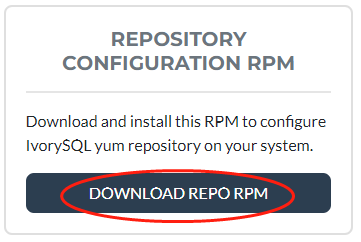
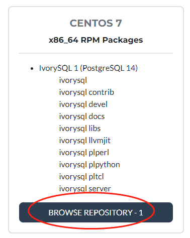
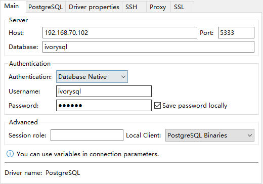
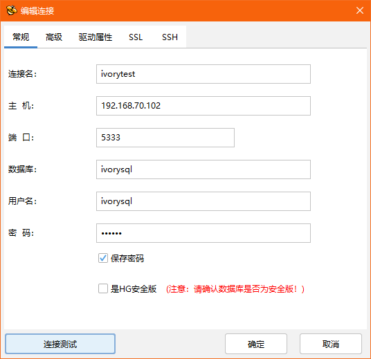

 

## Install software through the YUM source


This section uses Centos7.9 as an example to show how to install the IvorySQL database. Here is the simplest YUM source installation.

 

### 1.1 Installing the YUM Source

 

Download address: https://yum.highgo.ca/ivorysql.html

 

Click "DOWNLOAD REPO RPM" to DOWNLOAD ivorysqL-release-1.0-1.noarch. RPM and upload it to Centos7.9:



Or use wget on Centos7 to download:

```
wget https://yum.highgo.ca/dists/ivorysql-rpms/repo/ivorysql-release-1.0-1.noarch.rpm
```

 

Install ivorysql - release - 1.0-1. Noarch. RPM:

```
rpm -ivh ivorysql-release-1.0-1.noarch.rpm
```

After installation, will create the YUM source configuration file: / etc/yum.repos. d/ivorysql.repo.

 

Search to view related installation packages:

```
yum search ivorysql
```


The search results are described in Table 1:

Table 1 Description of YUM sources

| **No.** | **Package Name**                                             | **Description**                                              |
| ------- | ------------------------------------------------------------ | ------------------------------------------------------------ |
| 1       | [ivorysql1.x86_64](https://yum.highgo.ca/dists/ivorysql-rpms/1/redhat/rhel-7-x86_64/ivorysql1-1.2-1.rhel7.x86_64.rpm) | IvorySQL client program and library files                    |
| 2       | [ivorysql1-contrib.x86_64](https://yum.highgo.ca/dists/ivorysql-rpms/1/redhat/rhel-7-x86_64/ivorysql1-contrib-1.2-1.rhel7.x86_64.rpm) | Contributed source code and binaries shipped with IvorySQL   |
| 3       | ivorysql1-devel.x86_64                                       | IvorySQL development header files and libraries              |
| 4       | ivorysql1-docs.x86_64                                        | Additional documentation for IvorySQL                        |
| 5       | [ivorysql1-libs.x86_64](https://yum.highgo.ca/dists/ivorysql-rpms/1/redhat/rhel-7-x86_64/ivorysql1-libs-1.2-1.rhel7.x86_64.rpm) | Shared libraries required by all IvorySQL clients            |
| 6       | ivorysql1-llvmjit.x86_64                                     | Instant compilation support for IvorySQL                     |
| 7       | ivorysql1-plperl.x86_64                                      | Procedure language Perl for IvorySQL                         |
| 8       | ivorysql1-plpython3.x86_64                                   | The procedure language Python3 for IvorySQL                  |
| 9       | ivorysql1-pltcl.x86_64                                       | The procedure language Tcl for IvorySQL                      |
| 10      | [ivorysql1-server.x86_64](https://yum.highgo.ca/dists/ivorysql-rpms/1/redhat/rhel-7-x86_64/ivorysql1-server-1.2-1.rhel7.x86_64.rpm) | Create and run programs required by the IvorySQL server      |
| 11      | ivorysql1-test.x86_64                                        | Test suite shipped with IvorySQL                             |
| 12      | ivorysql-release.noarch                                      | Highgo Basic Software Co., LTD. Yum source configuration RPM package |

**Note: 1, 2, 5, 10 are required for RPM package installation, hyperlinks can be downloaded separately.**

 

### 1.2 installation IVORYSQL

To install the database service, install ivorysQL1-Server.

Run the following command in the user root session:

```
yum install -y ivorysql1-server
```


**Installation List:**

ivorysql1-server.x86_64 0:1.2-1.rhel7  


**Dependent installation:**

-  ivorysql1.x86_64 0:1.2-1.rhel7			ivorysql1-contrib.x86_64 0:1.2-1.rhel7

-  ivorysql1-libs.x86_64 0:1.2-1.rhel7		libicu.x86_64 0:50.2-4.el7_7

-  libtirpc.x86_64 0:0.2.4-0.16.el7			libxslt.x86_64 0:1.1.28-6.el7

-  python3.x86_64 0:3.6.8-18.el7			python3-libs.x86_64 0:3.6.8-18.el7

-  python3-pip.noarch 0:9.0.3-8.el7		python3-setuptools.noarch 0:39.2.0-10.el7

 

### 1.3 Installed Directory


Table 2 describes the file directories generated during the YUM installation process.

 Table 2 Installation directory file description

| **No.** | **File path**                              | **Description**                                              |
| ------- | ------------------------------------------ | ------------------------------------------------------------ |
| 1       | /usr/local/ivorysql/ivorysql-1             | Software Installation Directory                              |
| 2       | /var/lib/ivorysql/ivorysql-1/data          | Data directory (default)                                     |
| 3       | /usr/bin/ivorysql-1-setup                  | Helps system administrators with basic database cluster management |
| 4       | /usr/lib/systemd/system/ivorysql-1.service | Guarding services                                            |

 

### 1.4 RPM installation


RPM installations, by the way, need to be installed in this order:

```
yum install -y libicu libxslt python3					--先安装依赖
rpm -ivh ivorysql1-libs-1.2-1.rhel7.x86_64.rpm
rpm -ivh ivorysql1-1.2-1.rhel7.x86_64.rpm
rpm -ivh ivorysql1-contrib-1.2-1.rhel7.x86_64.rpm --nodeps
rpm -ivh ivorysql1-server-1.2-1.rhel7.x86_64.rpm
```

So, it's quite convenient to install using YUM. If not, download it separately and install it in this order.

Download address: https://yum.highgo.ca/ivorysql.html



Click BROWSE Repository-1 to find the corresponding package to download (note: dependency packages are not available on the website).

 

## Initialize the database


The IvorySQL database is easy to initialize and start or stop by default.


### 2.1 Default Initialization


To initialize the system, run the following command as user root:

```
/usr/local/ivorysql/ivorysql-1/bin/ivorysql-1-setup initdb
```

**Note: IvorysQL-1 is read by default because SERVICE_NAME is not provided.**


Enable and start the service:

```
systemctl enable --now ivorysql-1.service
```


IvorysqL-1-setup

```
ivorysql-1-setup {initdb|check_upgrade|upgrade} [SERVICE_NAME]
```

**Note: For details about how to use this command, run ivorysqL-1-setup --help.**

 

### 2.2 Custom Initialization


If we have a requirement to specify the data file path (/ ivorysQL /1.2/data/) and port number (5866), then we can customize the initialization.


According to the default service file "/ usr/lib/systemd/system/ivorysql - 1. The service" in the same directory replication of a new "ivorysql - 5866. The service" :

```
cp /usr/lib/systemd/system/ivorysql-1.service /usr/lib/systemd/system/ivorysql-5866.service
```


Modify Add the following information:

```
Environment=PGDATA=/ivorysql/1.2/data/
Environment=PGPORT=5866
```


Specify SERVICE_NAME as ivorysQL-5866 to initialize:

```
/usr/local/ivorysql/ivorysql-1/bin/ivorysql-1-setup initdb ivorysql-5866
```


Enable and start the service:

```
systemctl enable --now ivorysql-5866.service
```


### 2.3 Common Service Operations


IvorSQL Database service operation commands:

```
systemctl start ivorysql-1.service				--启动数据库服务
systemctl stop ivorysql-1.service				--停止数据库服务
systemctl restart ivorysql-1.service			--重启数据库
systemctl status ivorysql-1.service			--查看数据库状态
systemctl reload ivorysql-1.service			--可以满足部分数据库配置修改完后生效
```


## Configure database services


We only have a simple configuration here, can be local and remote connection is ok

 

### 3.1 Client Authentication


Modify the/var/lib/ivorysql/ivorysql - 1 / data/pg_hba. Conf, add the following content:

```
host    all             all             0.0.0.0/0               scram-sha-256
```


Run the following command to load the configuration:

```
systemctl reload ivorysql-1.service
```


### 3.2 Basic Parameters


Switch to user ivorysQL:

```
su - ivorysql
```


Connect to database through PSQL:

```
psql
```


Change ivorysQL password for remote connection:

```
alter system set listen_addresses = '*';
alter user ivorysql password '666666';
```

**Note: User ivorysQL does not have a password. If you do not change the password, you can change the client authentication mode to Trust to avoid secret login.**


Return to user root and restart the service for the Settings to take effect:

```
systemctl restart ivorysql-1.service
```


## The firewall


If the firewall is enabled, port 5333 needs to be opened:

```
firewall-cmd --zone=public --add-port=5333/tcp --permanent
firewall-cmd --reload
```

**Note: The default ivorysQL service port is 5333. If this port is disabled, external clients fail to connect to the IVorysQL service through an IP address.**

 

## The client connects to the database


The IvorySQL client is the same as the PostgreSQL client.


### 4.1 PSQL connection


Operating system user IvorysQL session connection:

```
[root@Node02 ~]# su - ivorysql 
Last login: Wed Apr 27 23:58:57 CST 2022 on pts/0
-bash-4.2$ psql
psql (14.2)
Type "help" for help.

ivorysql=#
```


### 4.2 DBeaver connection


DBeaver is a powerful open source tool with the following connectivity configurations:




### 4.3 Highgo Developer connection


Highgo Developer is a tool independently developed by Highgo, which supports not only Highgo database, but also PostgreSQL and IvorySQL database. The connection configuration is as follows:



 

## Uninstall


Since we installed through yum, it is recommended to use yum to uninstall. Try not to use RPM, which may cause incomplete uninstall. Of course, you can also uninstall it according to the Yum installation list.


### 5.1 Backing Up Data


Data directory in/var/lib/ivorysql under/data/ivorysql - 1, so we can this directory will be protected, and best to stop the service, do a backup.


### 5.2 YUM uninstall


Stop the database service first:

```
systemctl stop ivorysql-1.service
```


Use the "yum history list" to determine the transaction ID of the yum installation:

```
[root@Node02 ~]# yum history list
Loaded plugins: fastestmirror
ID     | Login user               | Date and time    | Action(s)      | Altered
-------------------------------------------------------------------------------
     5 | root <root>              | 2022-04-27 12:38 | Install        |   11  <
     4 | root <root>              | 2022-03-26 16:08 | Install        |   35 > 
     3 | root <root>              | 2022-03-26 16:07 | I, U           |   19   
     2 | root <root>              | 2022-03-26 16:07 | I, U           |   73   
     1 | System <unset>           | 2022-03-26 15:59 | Install        |  299   
history list
```


You can see that ID 5 is the transaction that performs the installation. Run the following command to uninstall (replace XX with 5) :

```
yum history undo XX
```


You can also use the following command to uninstall:

```
yum remove ivorysql-server
```


However, the command is not completely uninstalled, only removing two dependencies and failing to remove eight dependencies. You can decide whether to uninstall this way depending on whether to keep these dependencies.

 

## Postscript


- For more detailed operations, see postgresQL operations. For example, direct initialization with initDB.


- You can also refer to the IvorySQL documentation:


/usr/share/doc/ivorysqL1-1.2/readme.rpm -dist

- If you have any question, welcome to the official community IvorySQL warehouse: **github.com/IvorySQL/IvorySQL**  submit issue.

 

---

>Join the IvorySQL community by subscribing to mailing lists:  
>- **[Hackers List](https://lists.ivorysql.org/postorius/lists/hackers.ivorysql.org/)**  
>- **[Users List](https://lists.ivorysql.org/postorius/lists/general.ivorysql.org/)**  
>  
>***Also, don't forget to give us a :star: on [Github](https://github.com/IvorySQL/IvorySQL)***
