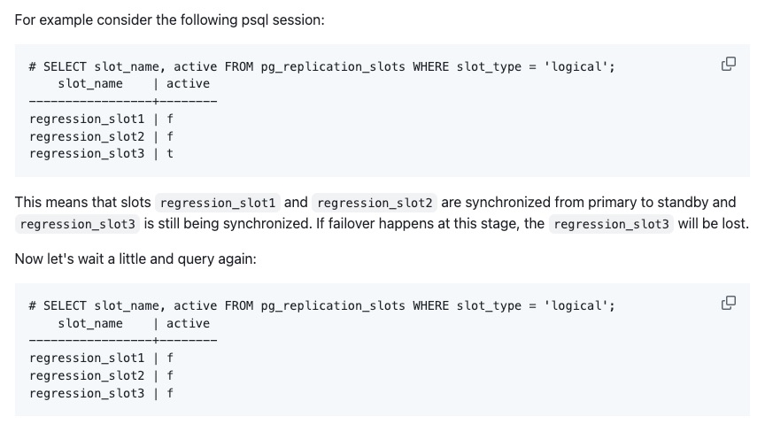
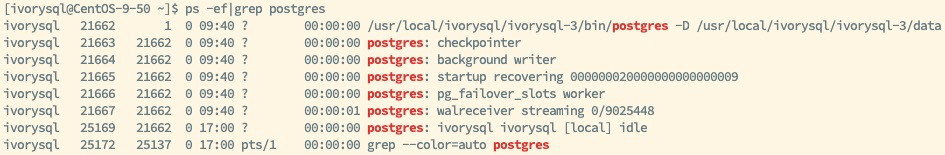
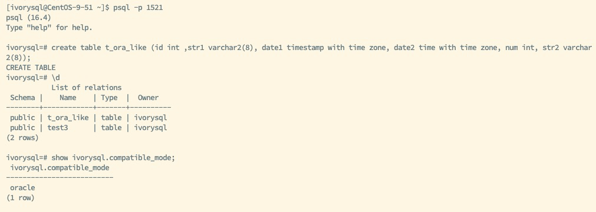
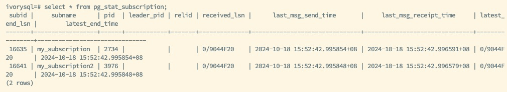
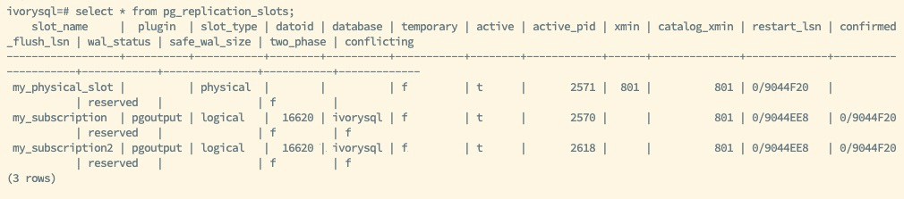
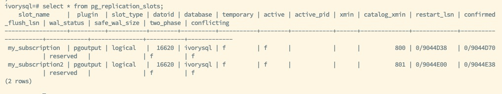
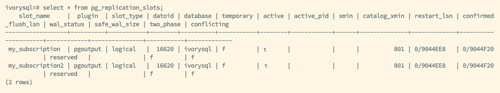
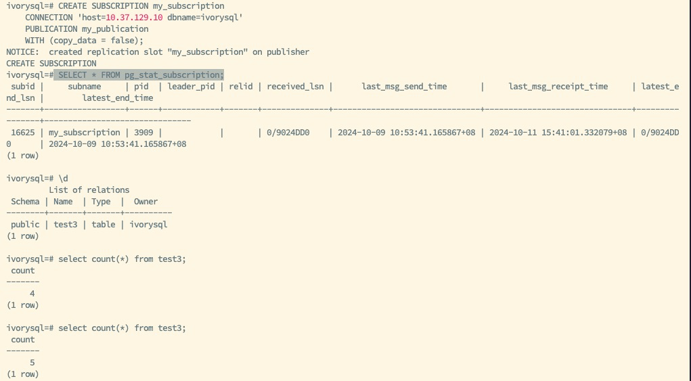
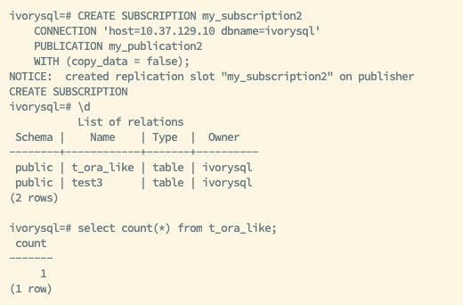

## Introduction

In a database high-availability architecture, logical replication is one of the key mechanisms for data synchronization and scaling. With logical replication, database administrators can selectively replicate data from specific tables, rather than replicating the entire database instance as in physical replication. However, the limitation of logical replication slots is that they only exist on the primary node, meaning after a failover, the new primary node cannot continue sending data changes to downstream systems until the logical replication slot is recreated or manually restored. This situation may cause data loss or require manual intervention from the administrator, impacting business continuity.

PostgreSQL, as an excellent open-source relational database, provides various high availability tools, among which the `pg_failover_slot` plugin specifically addresses the issue of logical replication slots not syncing during failover. IvorySQL, a PostgreSQL-based database that is Oracle-compatible, also supports this plugin.

This article will explain how to install and configure the `pg_failover_slot` plugin and how it helps IvorySQL achieve seamless logical replication slot synchronization.

## The Principles and Limitations of Logical Replication Slots

In PostgreSQL, logical replication is different from physical replication. It allows for row-level fine-grained control over data changes in specific tables and can synchronize data across different database versions and architectures. The key to logical replication is the logical replication slot, which records and maintains data changes on the primary node, and these changes can be captured and applied by downstream subscribers.

### Working Principle of Logical Replication Slots

Logical replication slots are a buffering mechanism that PostgreSQL uses to track data changes. They store incremental data changes since the last transmission until the downstream subscriber successfully receives this data. The replication slot also records the last change received by the downstream subscriber, allowing incomplete data to be resent in the event of system failures or network issues.

### Limitations of Logical Replication Slots

Since logical replication slots are maintained only on the primary node, the following issues can occur:

- Data loss after failover: When the primary node fails and the standby node is promoted to primary, the new primary node does not have the replication slot's records. At this point, subscribers cannot receive data changes from the new primary until the administrator manually creates a new replication slot on the new primary node.
- Manual creation and reinitialization of logical replication slots: Manually creating replication slots is tedious and can cause data synchronization interruptions, possibly requiring the reinitialization of logical replication tables, adding extra load and complexity.

To address these challenges, the `pg_failover_slot` plugin can automatically synchronize logical replication slots between the primary and standby nodes, ensuring continuity of data during failover.

## Overview of the `pg_failover_slot` Plugin

`pg_failover_slot` is a plugin developed specifically for PostgreSQL to solve the issue of logical replication slots not syncing between the primary and standby nodes. The plugin synchronizes logical replication slots between the primary and standby nodes, ensuring that when the standby node is promoted to primary, it can continue sending data changes to downstream subscribers without requiring the creation of a new slot or manual intervention.

Key features of the plugin include:

- Automatic replication slot synchronization: `pg_failover_slot` synchronizes logical replication slots between the primary and standby nodes, ensuring the standby node has the corresponding slot records.
- Simplified failover process: After a primary-standby switch, there's no need to manually create new logical replication slots, ensuring subscribers can immediately receive data changes from the new primary node.
- High availability support: By synchronizing the slots, `pg_failover_slot` enhances the system's fault tolerance and availability, reducing the management burden during outages.



## Installing and Configuring the `pg_failover_slot` Plugin

To use the `pg_failover_slot` plugin on IvorySQL, follow these steps.

### System Environment Setup

Assuming you have already deployed IvorySQL in a production environment and configured the primary and standby node setup:

- Primary node: primary_node
- Standby node: standby_node

Ensure the IvorySQL primary-standby architecture is running correctly, and logical replication slots have been created. Use high availability tools to manage the failover process and VIP management for drift.

### Download and Compile the Plugin

First, download and compile the `pg_failover_slot` plugin from GitHub:

```
git clone https://github.com/EnterpriseDB/pg_failover_slots.git
cd pg_failover_slots
make
make install
```

### Configuring IvorySQL

Next, add the `pg_failover_slot` plugin to `shared_preload_libraries` in the `postgresql.conf` file on both the primary and standby nodes. Also, set the `wal_level` to `logical` or higher:

```
wal_level = logical
shared_preload_libraries = 'pg_failover_slots'
```

Ensure the primary database has already created logical replication slots, as this is a prerequisite.

On the standby node, configure:

```
hot_standby_feedback = on
primary_slot_name = ‘slot_name’
```

This configuration ensures that the plugin is loaded when the database starts. After completing the configuration, restart the IvorySQL instances on both the primary and standby nodes:

`pg_ctl restart -D $PGDATA`



After a successful restart, you can see the `pg_failover_slot worker` child process in the process list, and running `show shared_preload_libraries` will show `pg_failover_slots`, indicating the plugin is active.

### Creating Logical Replication Slots

Connect to Oracle mode using port 1521, and create tables `t_ora_like` and `test3` on the primary node with Oracle-compatible fields. The following shows the Oracle mode with Oracle attribute `varchar2` fields in the `t_ora_like` table as a base test table, aiming to test the compatibility between the plugin and Oracle attributes.



Then create publications on the primary node:

```
CREATE PUBLICATION my_publication FOR TABLE test3;
CREATE PUBLICATION my_publication2 FOR TABLE t_ora_like;
```

At this point, when a subscriber subscribes to this publication via VIP, corresponding logical replication slots will be created. The `pg_failover_slot` plugin will automatically synchronize the replication slots to the standby node, and you do not need to manually create replication slots on the standby node.





### Synchronizing Logical Replication Slots

The standby node will synchronize the corresponding logical replication slots.



## Failover and Replication Slot Recovery

Once the `pg_failover_slot` plugin is configured on both the primary and standby nodes, it will automatically manage the synchronization and failover of logical replication slots.

### Failover Process

When a failure occurs on the primary node, use high availability tools to perform a failover. The standby node will be promoted to the new primary, and the VIP will drift to the new node. The `pg_failover_slot` plugin will ensure the new primary node takes over and recovers the logical replication slot.

### Verifying Replication Slot Status

Check if the replication slot has been recovered on the new primary node:

`SELECT * FROM pg_replication_slots;`

The new primary node will already contain the logical replication slot that was previously created on the old primary. This means that downstream subscribers can continue receiving data changes from the new primary node, ensuring seamless logical replication.



### Subscriber Synchronization

Downstream subscribers do not need any additional action. They will automatically receive updates from the new primary node via VIP, without reconfiguring subscriptions.





## Best Practices and Considerations

When using the `pg_failover_slot` plugin, the following best practices can help you better manage and maintain the high availability of logical replication slots:

- Configure replication slot limits properly: In high-concurrency or large-scale replication scenarios, ensure that the `max_replication_slots` parameter is configured appropriately. This parameter in IvorySQL's `postgresql.conf` file should be adjusted based on workload complexity to prevent replication slot overload.
- Regularly monitor replication slot status: Use the `pg_stat_replication_slots` view to periodically check the status of replication slots, ensuring no delays or losses during synchronization between the primary and standby nodes. When used with high availability tools, automated failover can ensure seamless switching between primary and standby nodes and management of VIP drift. When `pg_failover_slot` is used alongside high availability tools, it ensures seamless takeover of replication slots during failover.
- Performance optimization and monitoring: Logical replication can put pressure on system performance during high concurrency, so it is recommended to regularly monitor system I/O performance and CPU utilization. If necessary, optimize system configurations.

## Conclusion

IvorySQL, together with the `pg_failover_slot` plugin, provides robust support for logical replication in high-availability environments. By automatically synchronizing logical replication slots between the primary and standby nodes, `pg_failover_slot` solves the problem of having to reinitialize replication slots after failover, significantly improving the stability and availability of logical replication.

For users who need seamless failover and wish to avoid data loss for downstream subscribers due to replication slot issues, `pg_failover_slot` is an essential tool. It simplifies the management of logical replication slots, reduces the complexity of database maintenance, and ensures data consistency in high-availability environments.

By following the steps outlined in this article, you can configure and use the `pg_failover_slot` plugin in IvorySQL to ensure your logical replication environment operates efficiently during primary-standby switches.