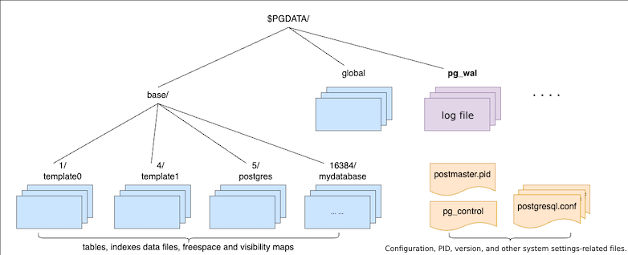
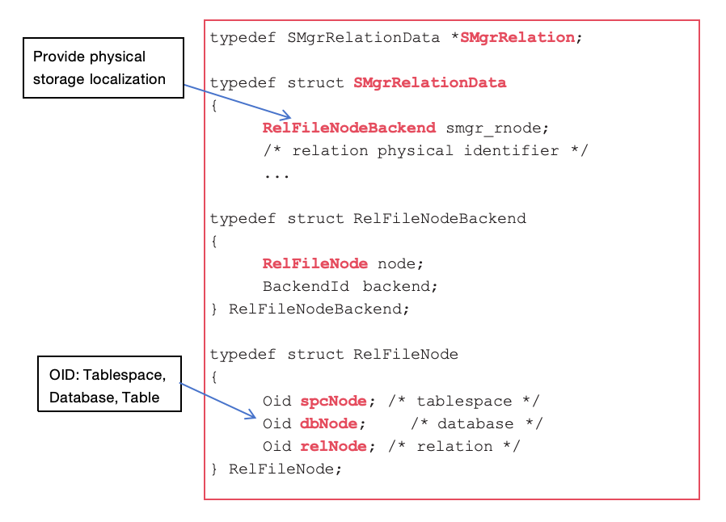

In general, a database storage system is divided into two parts: memory and external storage. Except for in-memory databases, data is eventually persisted, which means that it needs to be written from the memory buffer to the external storage. This article will discuss the external storage manager in IvorySQL.

## Classification of Storage Files

The storage manager used by IvorySQL is essentially the same as PostgreSQL. Its directory and file structure are shown in the following diagram:



From a storage perspective, file management is divided into three main parts:

- Configuration-related files, such as `pg_control`, `postgresql.conf`, `pg_hba.conf`, `PG_VERSION`, etc.;
- WAL log files, such as `000000010000000000000001`, `000000010000000000000002`, etc.;
- Data record files for tables and indexes, and corresponding remaining space and visibility mapping files.

Configuration-related files in PostgreSQL are handled with standard file read/write functions, for example, the `pg_control` file, which records the database state and operations. The background module reads and writes using `ReadControlFile()`, `WriteControlFile()`, and `UpdateControlFile()`. Front-end tools use `get_controlfile()` and `update_controlfile()` for reading and writing. Whether front-end or back-end, these read/write operations ultimately use standard file functions like `open()`, `read()`, and `write()`. These direct operations on configuration files are not within the scope of SMGR management.

WAL log files are read and written similarly to configuration files using standard file functions such as `read()`, `write()`, etc. However, file names need to be dynamically calculated based on the LSN.

Table and index data records are stored in the subdirectories of the corresponding database under the base directory. Changes to cluster-level catalog (system table) data records are reflected in the global directory. The management of system tables is similar to user tables, using the OID naming convention.

## Process of SQL Statements Accessing Storage Media

An SQL statement typically accesses data records on disk through the following steps:

- First, the statement goes through 5 stages of query processing: parse, rewrite, analyze, plan, and execute.
- Then, it enters the Table/Index Access Method layer.
- The Access Method layer typically uses the Buffer Manager service to operate on data entries, deciding whether to mark data blocks as "dirty" based on the operation.
- The Buffer Manager layer calls the Storage Manager service, using the buffer tag to invoke `smgr_read()` or `smgr_write()` to read or write data to the storage media.


## SMGR API Interface

PostgreSQL originally had many implementations of the SMGR API interfaces, but currently, only the implementation for Magnetic Disk (md.c) remains. In fact, the disk manager can support any type of device as long as the operating system provides a standard file system interface for the device. However, the storage manager (smgr.c) layer is kept as an intermediate layer in case other types of storage managers are introduced. Removing this intermediate layer would not save significant overhead, as operations on storage media are much more expensive than a single C function call. `f_smgr` is a structure of function pointers that contains the functions required by PostgreSQL for storage. `smgr.c` defines wrapper functions for all function interfaces, and these wrappers eventually call the actual registered implementation functions, i.e., `mdXXXX` functions.

```c
static const f_smgr smgrsw[] = {
/* magnetic disk */
{
.smgr_init = mdinit,
.smgr_shutdown = NULL,
.smgr_open = mdopen,
.smgr_close = mdclose,
.smgr_create = mdcreate,
.smgr_exists = mdexists,
.smgr_unlink = mdunlink,
.smgr_extend = mdextend,
.smgr_prefetch = mdprefetch,
.smgr_read = mdread,
.smgr_write = mdwrite,
.smgr_writeback = mdwriteback,
.smgr_nblocks = mdnblocks,
.smgr_truncate = mdtruncate,
.smgr_immedsync = mdimmedsync,
}
};
```

`SMgrRelation` is an important structure, and almost all SMGR-related functions require this structure.



## Key SMGR Interface Functions

- `Smgrread()`: Locates an 8K data block based on 5 parameters: tablespace, database, relation, forknum, and blocknum, and reads it into the specified memory.

  `smgrread(SMgrRelation reln, ForkNumber forknum, BlockNumber blocknum, char * buffer)`

- `Smgrwrite()`: Locates an 8K data block based on 5 parameters and then overwrites it with the values from the specified memory. The `skipFsync` parameter determines whether to ensure data is successfully flushed to disk before returning.

  `smgrwrite(SMgrRelation reln, ForkNumber forknum, BlockNumber blocknum, char * buffer, bool skipFsync)`

- `smgrextend`: Extends the current file with a new 8K block and writes the data from the specified memory, similar to `smgrwrite`.

   `smgrextend(SMgrRelation reln, ForkNumber forknum, BlockNumber blocknum, char * buffer, bool skipFsync)`

- `smgrnblocks`: Returns the total number of 8K data blocks for the specified table, which is important for the planner stage of query processing.

  `smgrnblocks(SMgrRelation reln, ForkNumber forknum)`

- Shared object existence.

  `smgropen(RelFileNode rnode, BackendId backend)`

- `smgrclose`: Responsible for deleting the specified `SMgrRelation` object from the hash table.

  `smgrclose(SMgrRelation reln)`

- `smgrtruncate`: Deletes a specified number of 8K data blocks from the file (data, remaining space, visibility) from the end of the file, potentially removing multiple data blocks from the three fork files to reduce the file size.

  `smgrtruncate(SMgrRelation reln, ForkNumber *forknum, int nforks, BlockNumber *nblocks)`

- `smgrprefetch`: Uses POSIX_FADV_WILLNEED to request the operating system to pre-fetch disk data blocks into the cache, helping to avoid disk I/O bottlenecks.

  `smgrprefetch(SMgrRelation reln, ForkNumber forknum, BlockNumber blocknum)`

`smgrwrite` and `smgrextend` are crucial functions for writing to disk and key to system I/O performance. They are called in the following scenarios:

- `smgrwrite`:
  - When a Buffer is modified, `smgrwrite` is called to write the data to the corresponding file on disk.
  - When a transaction commits, it is necessary to ensure that all dirty data is written back to disk, requiring `smgrwrite`.
  - During the VACUUM operation, when the visibility information of a table is updated, the corresponding buffer may become dirty, requiring `smgrwrite` to write it to disk.
  
- `smgrextend`:
  - When a file (table or index) needs to be extended, `smgrextend` is called to expand the file to the required size.
  - When creating a new table or index, its initial size is determined, and `smgrextend` is called.
  - When performing the CLUSTER operation, which reorganizes a table, `smgrextend` may also be called.
  
`smgrwrite` and `smgrextend` ensure data persistence, with `smgrwrite` being used to write modified data to disk, while `smgrextend` is used to expand the file size.