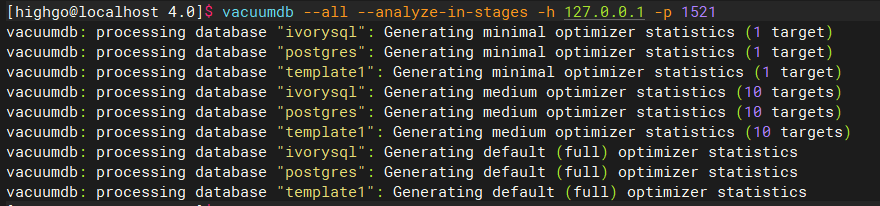

Recently, IvorySQL 4.0 was released, offering full support for PostgreSQL 17 and enhanced compatibility with Oracle.

This article will detail the process of upgrading from IvorySQL 3.x to IvorySQL 4.0.

## Introduction to the pg_upgrade Tool

Recently, IvorySQL 4.0 was released, offering full support for PostgreSQL 17 and enhanced compatibility with Oracle.

This article will detail the process of upgrading from IvorySQL 3.x to IvorySQL 4.0.

## Introduction to the `pg_upgrade` Tool

The `pg_upgrade` tool is a built-in PostgreSQL utility for cross-version upgrades, allowing for in-place upgrades of the database without the need for export and import operations. Since IvorySQL is derived from PostgreSQL, it can also use the `pg_upgrade` tool for major version upgrades.

`pg_upgrade` provides a compatibility check before the upgrade (`-c` or `--check` option) to identify issues such as plugin and data type incompatibilities. If the `--link` option is specified, the new version can directly use the original database files without copying, allowing the upgrade to be completed in just a few minutes.

Common parameters include:

* `-b bindir, --old-bindir=bindir`: Path to the old IvorySQL executable directory
* `-B bindir, --new-bindir=bindir`: Path to the new IvorySQL executable directory
* `-d configdir, --old-datadir=configdir`: Path to the old data directory
* `-D configdir, --new-datadir=configdir`: Path to the new data directory
* `-c, --check`: Perform only a compatibility check without making any changes to data
* `-k, --link`: Upgrade using hard links

Next, we will explain how to use `pg_upgrade` to upgrade IvorySQL to the latest 4.0 version on the CentOS8 platform.

## Upgrade Preparation

First, stop the old version of the IvorySQL 3.4 database:

Then, install the new version of the IvorySQL 4.0 database:

Initialize the new IvorySQL 4.0 data directory:

Check version compatibility:

Finally, if `Clusters are compatible` appears, it indicates that there are no compatibility issues between the two versions, and the upgrade can proceed.

## Official Upgrade

When you see `Upgrade Complete`, it indicates that the upgrade has been successfully completed.

## Update Statistics

`pg_upgrade` will create new system tables and reuse old data for the upgrade, but the statistics are not migrated during the upgrade process. Therefore, before enabling the new version, you should first re-gather statistics to avoid incorrect query plans due to missing statistics.

First, start the new version of the database:

Manually run the vacuum command:

## Post-Upgrade Cleanup

After confirming there are no issues, delete the old database:

With this, we have completed the entire upgrade process.

If you encounter any issues during the upgrade process, feel free to submit an [issue](https://github.com/IvorySQL/IvorySQL/issues) on GitHub, and we will assist you promptly. Additionally, if you have any ideas or expectations for future IvorySQL features, you can also submit an issue to provide feedback.