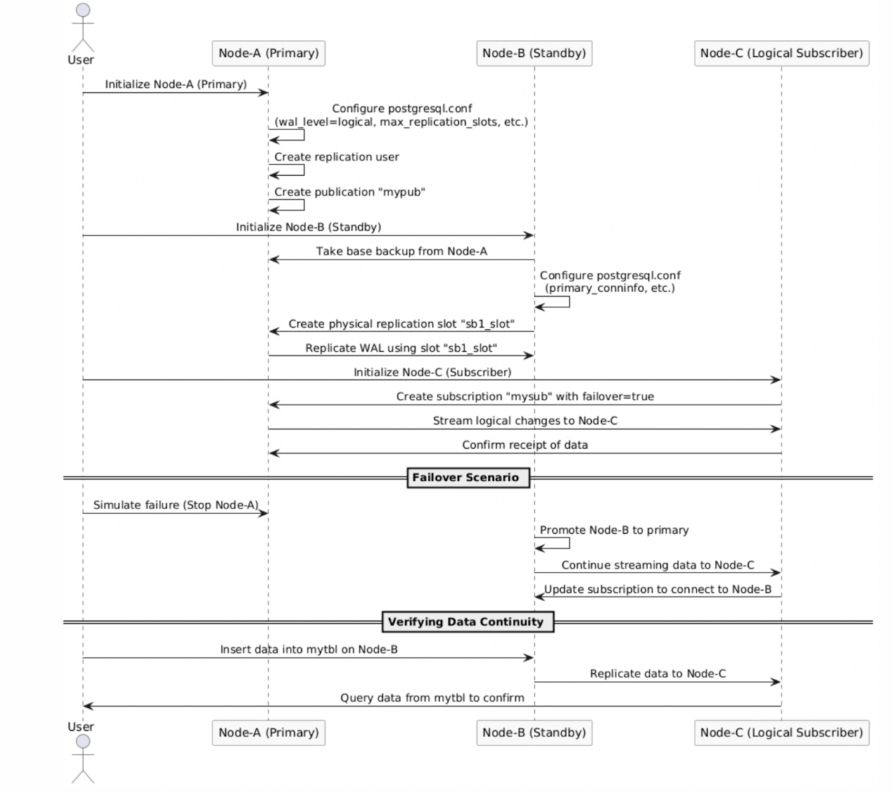
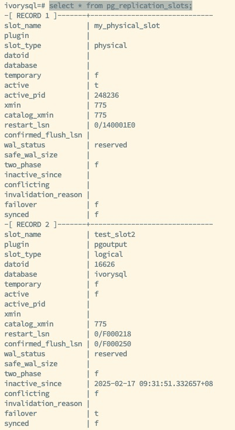
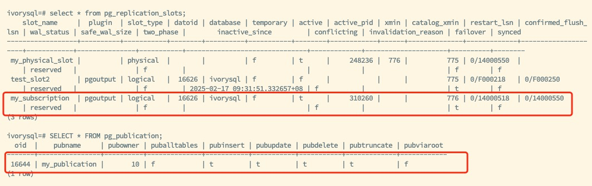
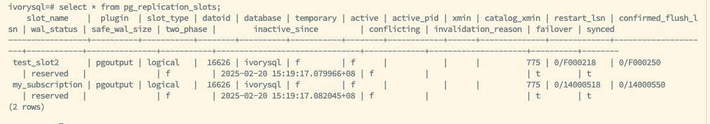

IvorySQL v4 is based on PostgreSQL 17 and introduces the capability of synchronizing logical replication slots to hot standby databases. This improvement effectively addresses the issue of logical replication interruption after switching from the primary database to the backup database in older versions. For databases that prioritize high data availability and business continuity, this is undoubtedly a significant advantage. It not only enhances the overall stability of the system but also ensures that the data replication process can continue seamlessly in the event of a failure, thereby minimizing the likelihood of business interruption.


## Replication Slot Synchronization Mechanism

### Prerequisites

1. **Physical Replication Slot**: There must be a physical replication slot between the primary database and the backup database, serving as the foundation for synchronizing logical replication slots and ensuring effective data transfer between them.

2. **Configuration Parameters**:
   - Configure the `primary_slot_name` parameter on the backup database and specify the replication slot when using the `pg_basebackup` tool. This configuration step ensures that the backup database can correctly receive data from the primary database.
   - Enable the `hot_standby_feedback` feature on the backup database to ensure it can receive and send back WAL logs. This feature guarantees the activity of the backup database during data reception and maintains the integrity of its feedback mechanism.
   - Specify a valid database name (`dbname`) in the `primary_conninfo` parameter. This configuration ensures that the target database for the replication process is clear and correct.

3. **Recommended Configuration**: Configure the `standby_slot_names` parameter on the primary database to maintain consistency in replication slot synchronization. This configuration helps maintain a consistent state of replication slots between the primary and backup databases, thereby enhancing the reliability of the replication process.

### Implementation Method

1. **Creating Logical Replication Slots**: 
   When calling the `pg_create_logical_replication_slot` function, set `failover=true` to specify the synchronization of the replication slot to the backup database. This setting is crucial as it determines the behavior of the replication slot during primary and standby switches.

2. **Subscription Configuration**: 
   When using the `CREATE SUBSCRIPTION` statement, specify `failover=true` to ensure the replication slot is synchronized to the backup database. This provides database administrators with flexible configuration options, allowing them to tailor replication strategies based on actual business needs and environmental characteristics.

3. **Manual Synchronization**: 
   Execute the `pg_sync_replication_slots` function on the backup database to manually synchronize the replication slots. This method offers an immediate synchronization mechanism, particularly suitable for scenarios requiring rapid reflection of changes from the primary database.

4. **Automatic Synchronization**: 
   Set the `sync_replication_slots = on` parameter on the backup database to achieve regular automatic synchronization without the need to restart the database. This automation simplifies database maintenance, allowing administrators to focus more on other critical tasks.

The following diagram illustrates the process of configuring and creating synchronized logical replication slots, detailing the steps to configure the basic parameters for synchronized logical replication slots and how to create one.



## Functions and Parameters

1. `pg_create_logical_replication_slot`
   - A new `failover` parameter has been added, with a default value of false. If set to true, it indicates that the replication slot needs to be synchronized to the backup database.
   - Example syntax:
     ```sql
     SELECT pg_create_logical_replication_slot('test_slot', 'test_decoding', false, false, true)
     ```
   - This function provides database administrators with finer control, making the management of logical replication slots more flexible and efficient.

2. `pg_sync_replication_slots`
   - This function is used to manually synchronize replication slots to the backup database.
   - Example syntax:
     ```sql
     SELECT pg_sync_replication_slots()
     ```
   - Using this function allows for the instant synchronization of changes from the primary database to the backup database, ensuring data consistency and integrity.

3. `sync_replication_slots`
   - Setting this parameter to on on the backup database enables regular automatic synchronization of replication slot changes without restarting the database.
   - This automation significantly reduces the burden on database administrators, making the maintenance of replication slots easier and more efficient.




As shown in the figure above, the status of the replication slots for the primary and backup databases is displayed. The primary database has created the logical replication slot `test_slots2` with the attribute `failover` set to true, enabling the failover functionality of this slot. Whether manually or automatically, the status and information of the logical replication slot `test_slots2` can be synchronized to the backup database. When a switch occurs or a failover happens, and the backup is promoted to the new primary, the information of the logical replication slot `test_slots2` will be retained, ensuring that the subscription side does not lose any data during the transition.

## Operational Steps and Verification

### Manual Synchronization of Replication Slots

Set up the primary and backup database environments, ensuring correct configurations for both physical replication slots and streaming replication users. This process requires careful planning and execution to ensure the stability and reliability of the replication environment.

1. **Create the Replication Slot**:
   - Execute:
     ```sql
     SELECT pg_create_logical_replication_slot('test_slot2', 'test_decoding', false, false, true)
     ```
   - This operation is the starting point for synchronizing the logical replication slot, laying the foundation for subsequent data replication.

2. **Manually Synchronize the Replication Slot on the Backup Database**:
   - Execute:
     ```sql
     SELECT pg_sync_replication_slots()
     ```
   - This operation ensures that changes to the replication slot are promptly reflected on the backup database, guaranteeing data synchronization and consistency.

3. **Verify Replication Slot Synchronization**:
   - Execute a query on the backup database to ensure the replication slot has been synchronized.
   - Execute:
     ```sql
     SELECT * FROM pg_replication_slots
     ```
   - This verification step is crucial for confirming the successful synchronization of the replication slots, ensuring the correctness and completeness of the replication process.

### Automatic Synchronization of Replication Slots

1. **Set `sync_replication_slots = on` on the Backup Database**:
   - Execute:
     ```sql
     ALTER SYSTEM SET sync_replication_slots = on
     ```
   - Then execute:
     ```sql
     SELECT pg_reload_conf()
     ```
   - This automation simplifies the synchronization tasks for replication slots, allowing administrators to complete synchronization without manual intervention.

2. **Verify Automatic Synchronization**:
   - Insert data into the primary database and observe changes in the backup database's replication slots to ensure that changes in the primary database are automatically synchronized to the backup database. This verification step is critical for confirming the proper functioning of the automatic synchronization feature, ensuring the automation and reliability of the replication process.


### Simulating the Switch Between the Primary and Backup Databases

1. **Perform the Primary Database Promotion on the Backup Database**:
   - Simulate a primary database failure by shutting down the primary database.
   - Execute on the backup database:
     ```sql
     pg_ctl -D data promote
     ```
   - This operation simulates an emergency switch in the event of a primary database failure, serving as an important step in testing the functionality of replication slot synchronization in real failure scenarios.

2. **Continue Logical Replication on the New Primary Database**:
   - Bind the VIP to the new primary database to ensure logical replication can continue. This operation ensures that logical replication can proceed seamlessly after the switch of the primary database, maintaining business continuity and data consistency.





The above diagram shows the new primary after the switch, retaining the existing logical replication slot `my_subscription` and publication information `my_publication`. After configuring other necessary parameters, the logical replication slot synchronization capability of the new backup is restored.

The subscriber routes to the new primary database using the VIP, continuing to utilize the synchronized logical replication slot to ensure normal data replication.


## Conclusion

The logical replication slot synchronization feature enhances the reliability of IvorySQL in high-availability environments, resolving the issue of logical replication slot loss after switching between the primary and backup databases. This feature ensures that information regarding logical replication slots is not lost during primary and standby switches, guaranteeing the continuity and consistency of the data replication process.

The synchronization process must meet the following conditions:

- Replication slots with `failover=true` set;
- Configuration of physical replication slots between the primary and backup databases;
- Enabling `hot_standby_feedback` on the backup database;
- Correct configuration of the database name in the `primary_conninfo` parameter on the backup database;
- Recommended configuration of the `standby_slot_names` parameter to ensure consistency;
- The backup database can manually or automatically synchronize replication slots through `pg_sync_replication_slots` or the `sync_replication_slots` parameter, ensuring seamless logical replication switching.

This series of measures and features collectively constitutes the power and flexibility of the logical replication slot synchronization functionality in IvorySQL, providing database administrators with robust tools to address various complex and challenging data replication scenarios.