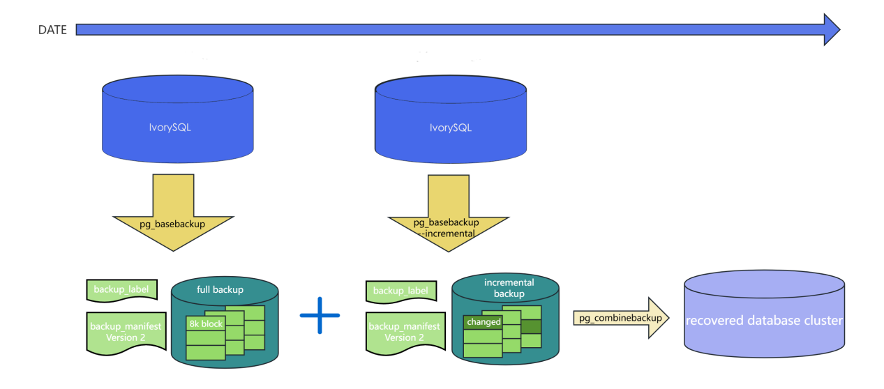
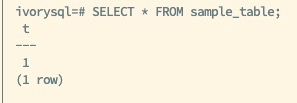
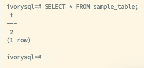
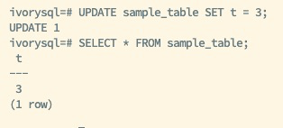
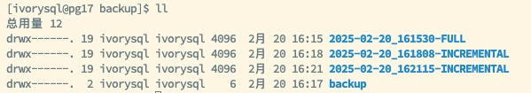
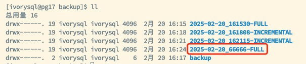
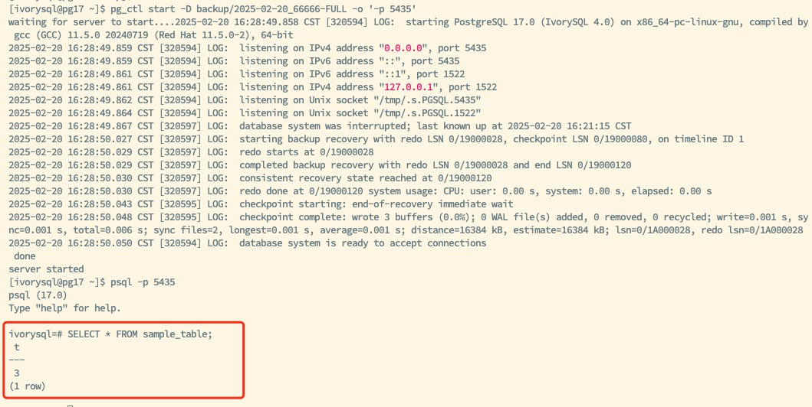
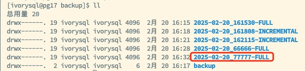
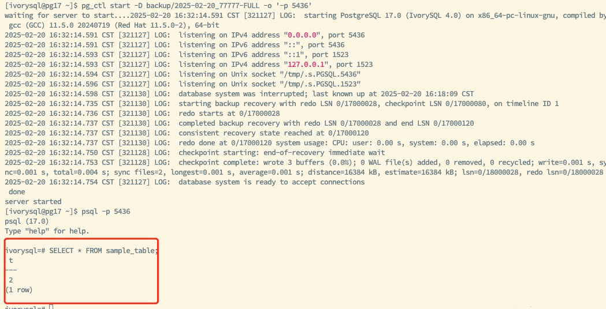

## 1. Overview

IvorySQL v4 introduces block-level incremental backup and incremental backup merge features aimed at optimizing the database backup and recovery process. By supporting incremental backups through the `pg_basebackup` tool, storage requirements and backup times are significantly reduced. Additionally, the `pg_combinebackup` tool can merge multiple incremental backups into a single full backup, enhancing the flexibility and efficiency of data recovery.

## 2. Feature Introduction

IvorySQL’s incremental backup works by recording data changes during each checkpoint cycle, ensuring that only the data blocks changed since the last backup are included. This mechanism not only reduces the required storage space but also shortens I/O operation times during the backup process. Furthermore, the `pg_combinebackup` tool supports merging multiple incremental backups into one full backup, eliminating the need to apply incremental backups one by one during data recovery, thus simplifying the recovery process.



### 2.1 Enabling Incremental Backup Feature

To enable the incremental backup functionality, the relevant parameters must first be configured in the database, and the configuration file must be reloaded:

```sql
ALTER SYSTEM SET summarize_wal = ON;
SELECT pg_reload_conf();
``` 

Then, create a test table and insert initial data for subsequent backup operations:

```sql
CREATE TABLE sample_table(t INT);
INSERT INTO sample_table VALUES (1);
SELECT * FROM sample_table;
``` 



### 2.2 Performing Full Backup

Use the `pg_basebackup` tool to perform a full backup and generate a backup file containing the `backup_manifest` for use as the base for future incremental backups:

```bash
pg_basebackup -Fp -D /backup/\$(date +%Y-%m-%d*%H%M%S-FULL)
``` 

This command saves the full backup data to the specified directory and records the current backup state.

### 2.3 Performing Incremental Backup

(1) After modifying the data, perform an incremental backup to record changes since the last full or incremental backup.

Modify the table data and perform the first incremental backup:

```sql
UPDATE sample_table SET t = 2;
SELECT * FROM sample_table;
```



Execute the incremental backup:

```bash
pg_basebackup -Fp -D /backup/\$(date +%Y-%m-%d*%H%M%S-INCREMENTAL) -i /backup/2025-02-20_161530-FULL/backup_manifest
```

(2) Modify the table data again and perform the second incremental backup.

```sql
UPDATE sample_table SET t = 3;
SELECT * FROM sample_table;
```



Then perform the second incremental backup:

```bash
pg_basebackup -Fp -D /backup/\$(date +%Y-%m-%d*%H%M%S-INCREMENTAL) -i /backup/2025-02-20_161808-INCREMENTAL/backup_manifest
```



### 2.4 Merging Incremental Backups

Merge the full backup and multiple incremental backups to create a new full backup for subsequent recovery operations:

```bash
cd /backup
pg_combinebackup 2025-02-20_161530-FULL 2025-02-20_161808-INCREMENTAL 2025-02-20_162115-INCREMENTAL -o 2025-02-20_66666-FULL
```



> Note: The full backup must be listed first in the parameter list, and the incremental backups should be ordered chronologically to ensure data recovery integrity and consistency.

### 2.5 Restoring Merged Backup

Start the database and verify the integrity of the data:

```sql
pg_ctl start -D /backup/2025-02-20_66666-FULL -o '-p 5435'
SELECT * FROM sample_table;
```



### 2.6 Merging Specific Incremental Backup

If you need to restore to a specific incremental backup state, you can merge up to a specific intermediate incremental backup:

```sql
pg_combinebackup 2025-02-20_161530-FULL 2025-02-20_161808-INCREMENTAL -o 2025-02-20_77777-FULL
```



Then start the database and verify the data:

```sql
pg_ctl start -D /backup/2025-02-20_77777-FULL -o '-p 5436'
SELECT * FROM sample_table;
```



## 3. Considerations

### Backup Sequence
Ensure that the full backup is listed first in the merge command, with incremental backups ordered chronologically to avoid data inconsistency during the merge process.
  
### Incremental Backup Storage Management
While incremental backups reduce storage space requirements, recovery operations depend on the complete incremental backup chain. Any loss of an incremental backup will result in recovery failure. Therefore, it is recommended to regularly check and merge incremental backups to ensure the integrity and reliability of the backup chain.

### Performance Monitoring
Monitor the database performance when performing incremental backup and merge operations to ensure that the impact on system performance remains within acceptable limits, avoiding backup operations during peak load periods.

## 4. Summary

The block-level incremental backup and `pg_combinebackup` tool provided by IvorySQL significantly enhance the efficiency of database backup and recovery. By backing up only changed data blocks, incremental backups show excellent performance in reducing storage usage and shortening backup times. The incremental backup merge feature further simplifies the recovery process, making operations more convenient.

These advanced features make IvorySQL an ideal choice for large-scale databases and environments with strict data recovery requirements, offering flexible and efficient backup and recovery solutions to ensure data security and availability.