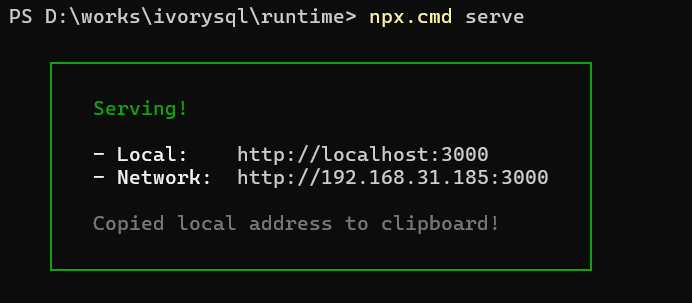
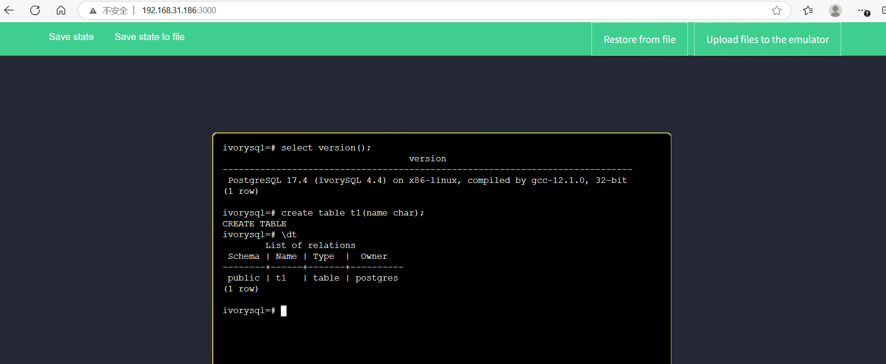
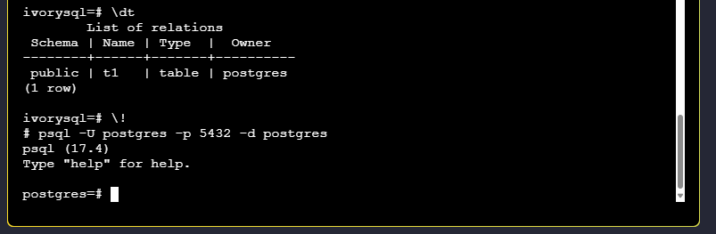

## Introduction

To lower the usage barrier for community users and enhance their experience, the IvorySQL community has launched the IvorySQL-WASM project, enabling users to quickly access online demos.

IvorySQL-WASM is developed based on the open-source Postgres-WASM framework. It allows users to experience IvorySQL directly in web browsers without local installations or complex deployments. By combining WebAssembly and virtualization technologies, IvorySQL-WASM provides a simple, lightweight, and accessible way for developers, testers, and database enthusiasts to effortlessly explore the powerful features of IvorySQL.

## Technical Analysis

Core technologies of IvorySQL-WASM:

- **V86**: An x86 emulator that simulates the hardware environment required for virtual operating systems, including CPU, memory, VGA, BIOS, and serial ports.
  
- **BuildRoot**: Used to build a minimal Linux system image running on V86, integrated with IvorySQL 4.4 services and a stable runtime environment.

- **WebAssembly (WASM)**: A low-level, assembly-like binary instruction format. Tools like [Emscripten](https://emscripten.org/) compile C/C++ code into WASM modules, enabling the migration of existing C library ecosystems to the web platform. With its compact binary format and near-native performance, WASM serves as the core technology for running database services in the IvorySQL-WASM project.

## Quick Deployment

Developers can follow these steps to deploy the IvorySQL-WASM project locally:

### Linux Environment

1. Install dependencies: Node.js and npm.
2. Clone the project: `git clone git@github.com:IvorySQL/ivorysql-wasm.git`
3. Navigate to the `package/runtime` directory and start the HTTP server: `npx serve`
4. Access via browser: `http://server_ip:3000`

### Windows Environment

1. Download and install [Node.js](https://nodejs.org/dist/v22.15.0/node-v22.15.0-x64.msi).
2. Execute `npx.cmd serve` in the corresponding PowerShell directory to start the HTTP server.



## Experience

By accessing `http://192.168.31.186:3000/`, users can perform online IvorySQL operations, such as creating a `t1` table and listing tables.



When running the minimal Linux virtual machine, the browser first downloads the system image files (~35MB) and state snapshot (15MB). Thus, the initial page load may take several seconds to over 20 seconds, depending on whether the HTTP server is hosted internally or externally. The state snapshot enables rapid loading of preconfigured databases.

Task Manager observations show that IvorySQL’s browser-based operation consumes CPU and memory resources efficiently.


### Notes

1. Databases are stored in memory. Refreshing the page clears the database and restores the system to its initial state.
2. IvorySQL uses dual ports. The default connection port is 1521. To log in via port 5432, exit psql in the shell terminal and execute:

   ```bash
   psql -U postgres -p 5432 -d postgres
   ```

   

3. To save the current database: Click "Save state to file". The browser will automatically generate and download a `v86state.bin` file. To reuse the saved database: Click "Restore from file" on the page and upload the `v86state.bin` file.
4. The V86 system has a minimum memory configuration of 128 MB (current setting).

### Developers can modify the source code to meet specific needs.

1. For BuildRoot, refer to `package/buildroot/README.md`.
2. For V86, refer to https://github.com/copy/v86/releases/tag/latest.
3. For the web interface, refer to `package/runtime/README.md`.

## Community Edition Coming Soon

The IvorySQL-WASM Community Edition will be released alongside IvorySQL 4.5. For details, follow the [IvorySQL Official Website](https://www.ivorysql.org/zh-cn/).