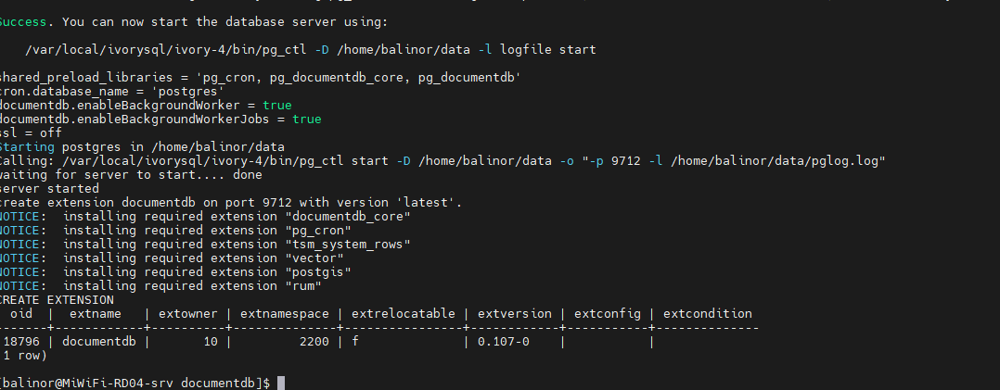
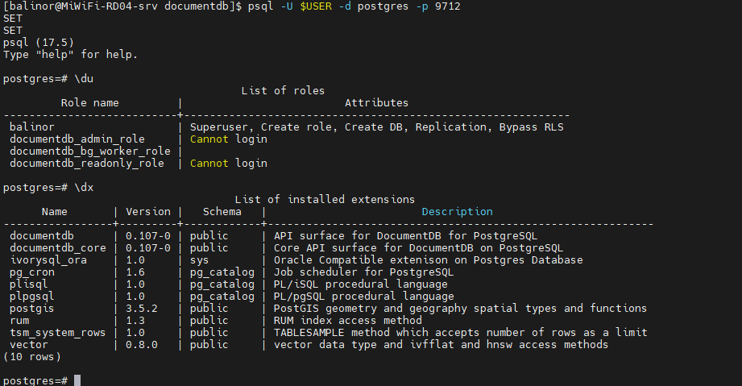
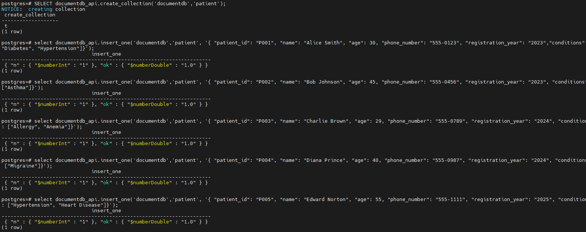

## Background

Since its inception, MongoDB has stood out for its **excellent ease of use** and **comprehensive driver documentation**. It can be regarded as a significant innovation compared to traditional relational databases, and for this reason, it quickly became a popular choice in the developer community.

However, as its licensing model shifted from open-source to the [SSPL License](https://www.ferretdb.com/sspl), MongoDB's authorization mechanism has become increasingly complex. This change directly means it is no longer compatible with many open-source projects, and also makes it difficult for many early-stage commercial projects to include it in their technology selection.

Against this backdrop, more and more users have begun to seek alternative document database solutions to MongoDB. Among these, the **combination of FerretDB and PostgreSQL with the DocumentDB plugin** has emerged as a highly competitive and high-quality option, thanks to its compatibility features and flexible licensing advantages.

Developed by Microsoft, DocumentDB is an engine that powers vCore-based Azure Cosmos DB for MongoDB. It introduces BSON data types and provides APIs to enable seamless operations within native PostgreSQL.

Many have noticed that the newly released IvorySQL 4.6 includes a new feature: a MongoDB-compatible solution using FerretDB and DocumentDB. This solution allows IvorySQL 4.6 to be compatible with MongoDB in addition to its existing compatibility with Oracle.

`ivydocumentdb` is a project based on Microsoft DocumentDB and adapted for IvorySQL. It provides a native implementation of a document-oriented NoSQL database, enabling users to perform seamless CRUD (Create, Read, Update, Delete) operations on BSON (Binary JSON) data types within the IvorySQL framework.

This article will explain how to use `ivydocumentdb` to set up a local IvorySQL environment with the DocumentDB plugin as a replacement for MongoDB.


## Installation Method

Installation Environment: CentOS Stream 9

### Download Source Code

```
sudo dnf install -y git
git clone https://github.com/IvorySQL/ivydocumentdb.git
cd ivydocumentdb && git checkout IVYDOCDB_REL_4_STABLE
```

### Create a Temporary Folder and Copy Installation Scripts

```
sudo dnf install -y wget curl cmake unzip
sudo mkdir -p /tmp/install_setup
sudo cp ./scripts/* /tmp/install_setup
sudo chmod 777 /tmp/install_setup/*
```

### Prepare the Compilation Environment

```
sudo dnf install -y epel-release
sudo dnf install -y bison readline-devel zlib-devel openssl-devel
sudo dnf groupinstall -y 'Development Tools'
sudo dnf config-manager --set-enabled crb
sudo dnf install -y perl-IPC-Run
sudo dnf install -y  gnupg2        tzdata pkgconf-pkg-config cmake       glibc-langpack-en     gcc     gdb      bison     flex     readline-devel     zlib-devel     krb5-devel     libtool     libicu-devel     openssl-devel perl-Test-Harness perl-core libxml2-devel
```

### Install IvorySQL and Compile Related Plugins

```
export MAKE_PROGRAM=cmake && sudo INSTALL_DEPENDENCIES_ROOT=/tmp/install_setup /tmp/install_setup/install_setup_libbson.sh

sudo INSTALL_DEPENDENCIES_ROOT=/tmp/install_setup /tmp/install_setup/install_setup_postgres.sh -d "/var/local/ivorysql/ivory-4" -v 4

sudo env "PATH=/var/local/ivorysql/ivory-4/bin:$PATH" IVORYVERSION=4 INSTALL_DEPENDENCIES_ROOT=/tmp/install_setup /tmp/install_setup/install_setup_rum_oss.sh

sudo env "PATH=/var/local/ivorysql/ivory-4/bin:$PATH" IVORYVERSION=4 INSTALL_DEPENDENCIES_ROOT=/tmp/install_setup /tmp/install_setup/install_setup_citus_core_oss.sh 12

sudo env "PATH=/var/local/ivorysql/ivory-4/bin:$PATH" IVORYVERSION=4 INSTALL_DEPENDENCIES_ROOT=/tmp/install_setup /tmp/install_setup/install_citus_indent.sh


sudo env "PATH=/var/local/ivorysql/ivory-4/bin:$PATH"  IVORYVERSION=4 INSTALL_DEPENDENCIES_ROOT=/tmp/install_setup /tmp/install_setup/install_setup_system_rows.sh

sudo env "PATH=/var/local/ivorysql/ivory-4/bin:$PATH"  IVORYVERSION=4 INSTALL_DEPENDENCIES_ROOT=/tmp/install_setup /tmp/install_setup/install_setup_pg_cron.sh

sudo INSTALL_DEPENDENCIES_ROOT=/tmp/install_setup /tmp/install_setup/install_setup_intel_decimal_math_lib.sh

sudo INSTALL_DEPENDENCIES_ROOT=/tmp/install_setup /tmp/install_setup/install_setup_pcre2.sh

sudo env "PATH=/var/local/ivorysql/ivory-4/bin:$PATH"  INSTALL_DEPENDENCIES_ROOT=/tmp/install_setup IVORYVERSION=4 /tmp/install_setup/install_setup_pgvector.sh

sudo dnf install -y proj-devel libxml2-devel json-c-devel geos-devel

sudo env "PATH=/var/local/ivorysql/ivory-4/bin:$PATH"  INSTALL_DEPENDENCIES_ROOT=/tmp/install_setup IVORYVERSION=4 /tmp/install_setup/install_setup_postgis.sh
```

### Compile and Install ivydocumentdb

```
sudo env "PATH=/var/local/ivorysql/ivory-4/bin:$PATH" make
sudo env "PATH=/var/local/ivorysql/ivory-4/bin:$PATH" make install
env "PATH=/var/local/ivorysql/ivory-4/bin:$PATH" IVY_VERSION_USED=4 /tmp/install_setup/start_oss_server.sh -d ~/data
```

When you see the content shown in the image below, DocumentDB has been installed successfully.




## Usage Method

### Connect to the Database and Test

To verify that the DocumentDB plugin is working properly, you need to connect to the database and perform CRUD operations.
`psql -U $USER -d postgres -p 9712`



Create a document and insert data:

```
SELECT documentdb_api.create_collection('documentdb','patient');

select documentdb_api.insert_one('documentdb','patient', '{ "patient_id": "P001", "name": "Alice Smith", "age": 30, "phone_number": "555-0123", "registration_year": "2023","conditions": ["Diabetes", "Hypertension"]}');
select documentdb_api.insert_one('documentdb','patient', '{ "patient_id": "P002", "name": "Bob Johnson", "age": 45, "phone_number": "555-0456", "registration_year": "2023", "conditions": ["Asthma"]}');
select documentdb_api.insert_one('documentdb','patient', '{ "patient_id": "P003", "name": "Charlie Brown", "age": 29, "phone_number": "555-0789", "registration_year": "2024", "conditions": ["Allergy", "Anemia"]}');
select documentdb_api.insert_one('documentdb','patient', '{ "patient_id": "P004", "name": "Diana Prince", "age": 40, "phone_number": "555-0987", "registration_year": "2024", "conditions": ["Migraine"]}');
select documentdb_api.insert_one('documentdb','patient', '{ "patient_id": "P005", "name": "Edward Norton", "age": 55, "phone_number": "555-1111", "registration_year": "2025", "conditions": ["Hypertension", "Heart Disease"]}');
```



Query the data just inserted:

```
SELECT document FROM documentdb_api.collection('documentdb','patient');
```


At this point, users can use `documentdb_api` on IvorySQL to perform CRUD operations.


## FerretDB

Finally, we need to use FerretDB as a proxy to convert MongoDB 5.0+ wire protocol queries into SQL, and use IvorySQL with the DocumentDB extension as the database engine to complete the replacement of MongoDB.

```
wget https://github.com/FerretDB/FerretDB/releases/download/v2.5.0/ferretdb-amd64-linux && chmod 777 ferretdb-amd64-linux
ferretdb-amd64-linux --postgresql-url "postgres://<username>:<user_password>@localhost:9712/postgres"
```

For detailed introduction and usage of FerretDB, please refer to the [FerretDB official website](https://docs.ferretdb.io/).

At this point, the deployment of FerretDB is complete. MongoDB clients can connect to IvorySQL with the DocumentDB plugin via FerretDB's port `27017` and the username/password of the IvorySQL database, and successfully perform operations such as CRUD.


## Summary
Through the steps in this article, we have successfully set up an IvorySQL environment with the DocumentDB plugin under CentOS Stream 9, and combined it with FerretDB to replace MongoDB. This solution not only solves the compatibility issues caused by MongoDB's SSPL License but also leverages IvorySQL's inherent Oracle compatibility to provide enterprises with more flexible and diverse database options.

For open-source projects or early-stage commercial projects, this solution eliminates concerns about complex licensing mechanisms. Meanwhile, it enables interaction with MongoDB clients through familiar SQL operations, reducing the cost of technical migration. In the future, developers can further explore data backup strategies, performance optimization solutions, or extend more functions based on actual business scenarios using this environment. This fully leverages the advantages of the IvorySQL and FerretDB combination, providing stable and reliable database support for business development.