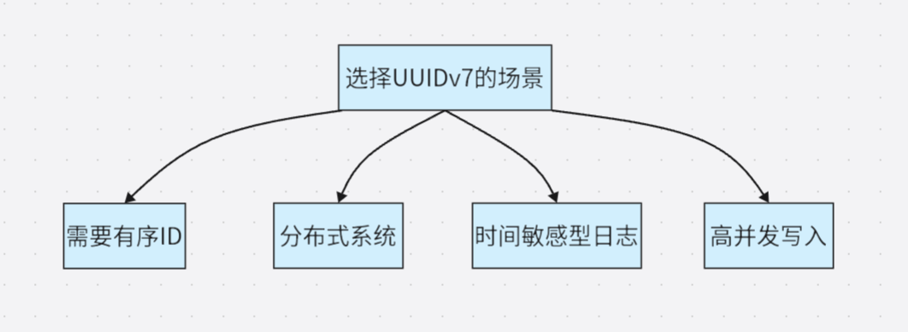
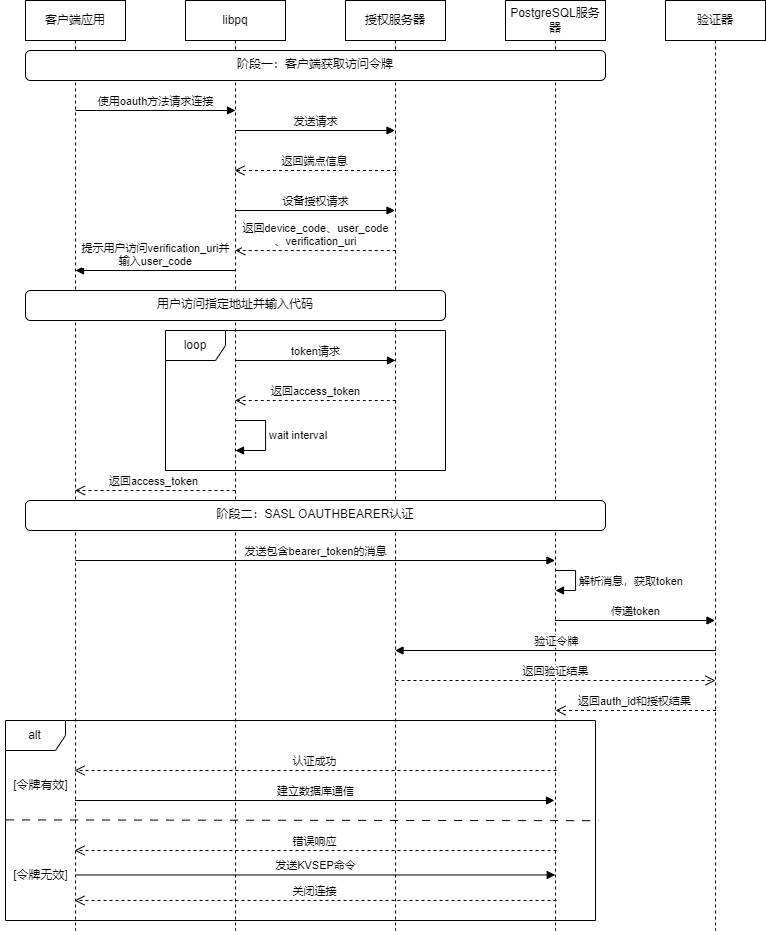

The Global Development Group of PostgreSQL released the first Beta version of PostgreSQL 18 on May 8, 2025, with the official version officially launched on September 25. The IvorySQL community will break down the six highlight features of PostgreSQL 18 for you in this article.

## 1. PG Asynchronous I/O (AIO) Framework: The First Step to Breaking the Synchronous Blocking Bottleneck
PostgreSQL 18 has newly introduced an asynchronous I/O subsystem. The new mechanism allows the parallel execution of multiple asynchronous prefetch operations **in specific scenarios**. The CPU can continue to advance queries without waiting for data to be returned, reducing waiting overhead to a certain extent. This framework lays the foundation for more in-depth and thorough performance optimization of asynchronous I/O in PostgreSQL's future development, marking the first crucial step forward.

### Core Scenarios for Improvement
**【Only asynchronous read is implemented at present, with asynchronous write not yet supported】** In all Seq Scan scenarios, parallel sequential prefetch can be achieved through the ReadStream facility adapted for asynchronous I/O, which improves the performance of Seq Scan with better results than the original advisory prefetch of `posix_fadvice`. Especially in cloud storage scenarios, a single blocking read I/O takes much longer than local I/O, making the advantages of parallel prefetch powered by asynchronous I/O more prominent. At present, asynchronous I/O supports asynchronous reading for sequential scans, bitmap heap scans and VACUUM operations. Early tests show that the performance of read-intensive queries can be improved by 2 to 3 times.


The ReadStream mechanism with asynchronous I/O can asynchronously prefetch subsequent buffers that may be used after receiving a read request. In contrast, with the synchronous I/O method, the system has to wait for the completion of the I/O operation every time a buffer read request is made, which reduces the system throughput.

### Usage Method
```
# - I/O -

#backend_flush_after = 0		# measured in pages, 0 disables
effective_io_concurrency = 300		# 1-1000; 0 disables issuing multiple simultaneous IO requests
maintenance_io_concurrency = 300	# 1-1000; same as effective_io_concurrency
io_max_combine_limit = 256kB		# usually 1-128 blocks (depends on OS)
                    # (change requires restart)
io_combine_limit = 256kB		# usually 1-128 blocks (depends on OS)

io_method = io_uring # worker, io_uring, sync
                    # (change requires restart)
io_max_concurrency = 128		# Max number of IOs that one process
                    # can execute simultaneously
                    # -1 sets based on shared_buffers
                    # (change requires restart)
#io_workers = 3				# 1-32;
```

Users can enable asynchronous I/O by selecting three different `io_method` options:
- `worker`: Several background I/O workers receive and process I/O requests from backend processes.
- `io_uring`: The io_uring subsystem in the Linux system processes PG's I/O requests through operating system kernel threads.
- `sync`: Synchronous I/O that meets the interface requirements of the asynchronous I/O framework.

To enable asynchronous I/O, users need to set the above GUC parameters according to their own situations. Among them, the maximum number of asynchronous I/O handles that each process can have is `io_max_concurrency`, which users can set to `-1` to allow the database to select an appropriate value automatically. If the self-set value is too large, the database may fail to start due to the excessive memory occupied by asynchronous I/O; if the value is too small, the performance of asynchronous I/O cannot be fully utilized.

After starting the database, users can obtain the real-time execution status of asynchronous I/O in the current system through the `pg_aios` view:
```
postgres=# select * from pg_aios;
-[ RECORD 1 ]---+-------------------------------------------
pid             | 85834
io_id           | 14208
io_generation   | 204
state           | SUBMITTED
operation       | readv
off             | 116252672
length          | 8192
target          | smgr
handle_data_len | 1
raw_result      |
result          | UNKNOWN
target_desc     | block 14191 in file "base/5/16427"
f_sync          | f
f_localmem      | f
f_buffered      | t
...
```

For the meaning of each column, please refer to the [official documentation](https://www.postgresql.org/docs/18/view-pg-aios.html).

### Framework Design
PostgreSQL 18 introduces an asynchronous I/O framework that supports flexible configuration of asynchronous I/O through GUC parameters, including the implementation method (`io_method`, optional worker, io_uring or sync), concurrency scale (such as `*_io_concurrency`, `io_max_concurrency`) and implementation-related parameters (such as `io_workers`).

The framework abstracts the I/O targets (currently supporting smgr, with WAL support planned for the future) and the behaviors of different stages and data sources (shared buffer/local buffer) through the `PgAioHandleCallbacks` structure to support subsequent expansion. The relevant memory is allocated in the shared memory at startup and will not be scaled subsequently. Processes access their affiliated asynchronous I/O resources by number, and handles are marked for reuse with generation numbers.

At present, the asynchronous I/O of this version mainly provides asynchronous read support for smgr, and does not yet support asynchronous read and write for WAL. The asynchronous write function of smgr is still under development.

### Modifications to the Original Facilities
1. **Extend the smgr interface**: Add the `smgr_startreadv` method to support asynchronous reading.
2. **Implement callback structures**: smgr needs to implement the callback structures of `PgAioTargetInfo` and `PgAioHandleCallBacks`.
3. **Adapt existing modules**: Modules such as smgr and buffer manager need to fill the asynchronous I/O abstract structure to be compatible with the framework.
4. **PG critical section processing**: Synchronous I/O can be initiated in the PG critical section; due to the segmented execution and callback of asynchronous I/O, operations that may fail in the callback need to be removed (all operations in the critical section cannot fail, such as using `RelPathStr` instead of the `char*` string of palloc) to ensure security.
5. **Optimize the upper-layer interface**: Transform interfaces such as ReadStream by using asynchronous I/O to achieve true prefetch, which greatly improves the I/O performance of operations such as sequential scan, pg_prewarm and ANALYZE, with better results than the original posix_fadvise solution.

### Usage Notes and Future Outlook
1. **io_uring requires a relatively new kernel**: The old version of the Linux Kernel does not support io_uring. Although some early version kernels support io_uring, their functions and performance are quite different from those of the new kernel.
2. **Architecture limits concurrency granularity**: Restricted by the multi-process architecture, there are few computing tasks that can run in parallel during PG asynchronous I/O, making it difficult to achieve finer-grained task-level asynchrony. The current main performance gains are concentrated on parallel I/O operations such as **ReadStream sequential prefetch**.
3. **Possible performance improvements in the future**: Linux io_uring supports the Direct I/O (DIO) feature, laying the foundation for enabling DIO in PG. Enabling Direct I/O in the future can eliminate double buffering (the OS layer buffers I/O data, and the PG layer also buffers I/O data) to reduce unnecessary data copying. On high-speed NVMe, the **IORING_SETUP_IOPOLL** option can also be enabled with DIO to use the polling method to check the completion of I/O, which can further improve performance.
4. **More asynchronous I/O backends in the future**: In addition to the `sync` mode, the official version of PostgreSQL 18 only supports two asynchronous I/O backends: `worker` and `io_uring`. At present, the design of the asynchronous I/O framework is basically complete, and future versions are expected to support I/O backends such as Windows IORing, IOCP and Posix asynchronous I/O, providing users with more choices.

### Summary
The PostgreSQL 18 asynchronous I/O framework improves the I/O capability of the database system and also enhances the scalability of the PostgreSQL architecture. Users only need to modify the GUC parameters according to their own situations to obtain the benefits brought by asynchronous I/O. At present, the design of the asynchronous I/O framework is basically complete, and it will be very convenient to support other asynchronous I/O backends in the later stage. Postgres users on any platform can try `io_method = worker` or `sync`. If you want to use the io_uring backend on an old Linux kernel distribution that is not officially adapted to io_uring, you need to conduct sufficient tests before use.

## 2. Skip Scan: Speed Up B-Tree Indexes
In versions of PostgreSQL prior to 18, a multi-column B-tree index can be used for query conditions that include any subset of columns in the index, and it is most efficient when constraints are applied to the leading (leftmost) column. An equality constraint on the leading column, plus any inequality constraint on the first column without an equality constraint, is used to limit the portion of the index to be scanned.

For example, given an ascending index based on the non-null fields (a, b, c) and the query condition WHERE a = 5 AND b >= 42 AND c < 77, the index will start scanning from the first entry with a = 5 and b = 42 and continue until the last entry with a = 5. Index entries with c >= 77 will be skipped, but they still need to be scanned.

In principle, this index can be used for queries with constraints on b and/or c but no constraints on a — however, the entire index must be scanned, so the optimizer prefers a sequential table scan over an index scan in most cases.

### Core Scenarios for Improvement
Starting from PostgreSQL 18:
If a B-tree index scan can apply Skip Scan, constraints for each column are applied while traversing the index, which can reduce index reads. The working principle of Skip Scan is to internally generate a dynamic equality constraint that matches each possible value in the index column.

### Effect Test
Comparison Versions:
**PostgreSQL 17 vs PostgreSQL 18**

#### Table Structure and Index
```sql
CREATE TABLE t1
(
c1 int,
c2 int,
c3 float
)
WITH (fillfactor=80);


CREATE INDEX idx_t1_c1c2 ON t1(c1, c2);
```

#### Data Generation
```sql
INSERT INTO t1
SELECT (random()*1000)::int, (random()*10000)::int, random()
FROM generate_series(1,1000000) g;
```

#### Import Data via COPY
```sql
COPY t1 FROM '/.../t1.csv' WITH (FORMAT csv);
```

#### Query Statement: Using the Second Column of the Composite Index
```sql
EXPLAIN ANALYZE SELECT * FROM t1 WHERE c2=100;
```

#### PostgreSQL 17 Execution Plan: Selecting Parallel Sequential Scan
```
                                                    QUERY PLAN
-------------------------------------------------------------------------------------------------------------------
 Gather  (cost=1000.00..12986.33 rows=100 width=16) (actual time=1.125..76.076 rows=90 loops=1)
   Workers Planned: 2
   Workers Launched: 2
   ->  Parallel Seq Scan on t1  (cost=0.00..11976.33 rows=42 width=16) (actual time=1.414..68.624 rows=30 loops=3)
         Filter: (c2 = 100)
         Rows Removed by Filter: 333303
 Planning Time: 0.792 ms
 Execution Time: 76.165 ms
(8 rows)
```

Disabling sequential scan to force index scan is not an optimal plan and results in slower execution.
```
                                                        QUERY PLAN
--------------------------------------------------------------------------------------------------------------------------
 Index Scan using idx_t1_c1c2 on t1  (cost=0.42..18773.42 rows=100 width=16) (actual time=1.846..100.758 rows=90 loops=1)
   Index Cond: (c2 = 100)
 Planning Time: 0.147 ms
 Execution Time: 100.806 ms
(4 rows)
```

#### PostgreSQL 18 Execution Plan: Selecting Index Scan, showing a significant improvement in the efficiency of Skip Scan
```
                                                        QUERY PLAN
---------------------------------------------------------------------------------------------------------------------------
 Index Scan using idx_t1_c1c2 on t1  (cost=0.42..3900.84 rows=100 width=16) (actual time=0.225..11.464 rows=90.00 loops=1)
   Index Cond: (c2 = 100)
   Index Searches: 1002
   Buffers: shared hit=3096
 Planning Time: 0.141 ms
 Execution Time: 11.522 ms
(6 rows)
```

Disabling index scan and bitmap scan to force sequential scan.
```
postgres=# EXPLAIN ANALYZE SELECT * FROM t1 WHERE c2=100;
                                                      QUERY PLAN
----------------------------------------------------------------------------------------------------------------------
 Gather  (cost=1000.00..12986.33 rows=100 width=16) (actual time=1.486..86.881 rows=90.00 loops=1)
   Workers Planned: 2
   Workers Launched: 2
   Buffers: shared hit=6768
   ->  Parallel Seq Scan on t1  (cost=0.00..11976.33 rows=42 width=16) (actual time=2.758..78.712 rows=30.00 loops=3)
         Filter: (c2 = 100)
         Rows Removed by Filter: 333303
         Buffers: shared hit=6768
 Planning Time: 0.141 ms
 Execution Time: 86.926 ms
(10 rows)
```

### Usage Notes
Skip Scan currently only supports equality comparison conditions.

### Summary
The Index Skip Scan of PostgreSQL 18 enables multi-column BTREE indexes to be used for queries that only reference the second or subsequent index columns with equality, greatly reducing the number of entries that need to be accessed for index scanning and significantly improving its efficiency.

## 3. Virtual Generated Columns: A Flexible Balance Between Storage and Computation
The features related to development experience in PostgreSQL 18 focus on simplifying the development process, improving code flexibility, and enabling developers to utilize the capabilities of PostgreSQL more efficiently.

IvorySQL has long been committed to Oracle feature compatibility, including syntax compatibility for virtual columns:
`column [datatype][generated always] AS (column_expression)[VIRTUAL]`

PostgreSQL 18 has finally brought the virtual column feature this time. A virtual column is a table column that does not store data, and its value is dynamically calculated when queried. Compared with stored columns, virtual columns save column storage space, and the value of a virtual column is obtained by calculating the value of the virtual column expression when querying.

### Basic Syntax
The syntax of virtual columns in PostgreSQL 18 is similar to that of stored columns, with the new keyword **VIRTUAL** added. When the STORED and VIRTUAL keywords are omitted, the column is a virtual column by default. Its syntax is as follows:
`GENERATED ALWAYS AS ( generation_expr ) [ STORED | VIRTUAL ]`

### Virtual Column Use Cases
The identification of a virtual column is indicated in the column constraints. A column is identified as a virtual column through the virtual column constraint syntax. The following are the creation, query and addition of virtual columns for a table with virtual columns:
```sql
-- Create a table containing a virtual column, where price_with_tax is a virtual column
CREATE TABLE products (
    id SERIAL PRIMARY KEY,
    name TEXT NOT NULL,
    price NUMERIC(10,2) NOT NULL,
    tax_rate NUMERIC(5,2) DEFAULT 0.20,
    price_with_tax NUMERIC(10,2) GENERATED ALWAYS AS (price * (1 + tax_rate)) VIRTUAL
);

-- Insert data
INSERT INTO products (name, price, tax_rate)
VALUES ('Laptop', 1000.00, 0.20);

-- Query data (the virtual column is calculated automatically)
SELECT name, price, tax_rate, price_with_tax FROM products;
  name  |  price  | tax_rate | price_with_tax
--------+---------+----------+----------------
 Laptop | 1000.00 |     0.20 |        1200.00
(1 row)

-- Add a virtual column to the table
ALTER TABLE products ADD COLUMN selling_price NUMERIC(10,2)
GENERATED ALWAYS AS (
    price * (1 - 0.2) * (1 + tax_rate)
) virtual;
```

### Brief Analysis of Implementation Principles
#### Creation of Virtual Columns
The storage method of virtual columns in a created table is similar to that of ordinary columns, and the column information of both is stored in the pg_attribute system table. The attgenerated column stores the generated column information: if the value of this column is 's', it means the column is a stored column. The identifier of the newly added virtual column in PostgreSQL 18 in this field is 'v', and the expression of the virtual column is stored in the pg_attrdef system table.

```sql
-- View virtual column information, where attgenerated is v indicating that the column is a virtual column
postgres=# select * from pg_attribute where attname='price_with_tax';
-[ RECORD 1 ]--+---------------
attrelid       | 16388
attname        | price_with_tax
atttypid       | 1700
attlen         | -1
attnum         | 5
atttypmod      | 655366
attndims       | 0
attbyval       | f
attalign       | i
attstorage     | m
attcompression |
attnotnull     | f
atthasdef      | t
atthasmissing  | f
attidentity    |
attgenerated   | v
attisdropped   | f
attislocal     | t
attinhcount    | 0
attcollation   | 0
attstattarget  |
attacl         |
attoptions     |
attfdwoptions  |
attmissingval  |

-- View the storage of virtual column expressions, the following expression is the virtual column expression
postgres=# select pg_get_expr(adbin, adrelid) from pg_attrdef where adnum = 5;
             pg_get_expr
-------------------------------------
 (price * ((1)::numeric + tax_rate))
(1 row)
```

#### Insert or Update of Virtual Columns
Since the data of virtual columns does not occupy storage space, any operation that specifies to update or insert virtual columns will be restricted.
```sql
-- Specify to insert a virtual column
INSERT INTO products (name, price, tax_rate, price_with_tax) VALUES ('Laptop', 1000.00, 0.20, 1);
ERROR:  cannot insert a non-DEFAULT value into column "price_with_tax"
DETAIL:  Column "price_with_tax" is a generated column.

-- Specify to update a virtual column
update products set price_with_tax = 1 where name = 'Laptop';
ERROR:  column "price_with_tax" can only be updated to DEFAULT
DETAIL:  Column "price_with_tax" is a generated column.
```

#### Query of Virtual Columns
The implementation of querying virtual columns in PostgreSQL 18 is completed at the stage of generating the execution plan. In the logical rewrite and optimization stage, it is judged whether the range table of the query contains virtual columns. If it does, the expression of the virtual column is obtained from pg_attrdef and replaces the original virtual column name. In this way, querying the value of a virtual column is equivalent to calculating the value of its expression, that is, `select price_with_tax` is equivalent to `select (price * ('1'::numeric + tax_rate)) as price_with_tax`. It can be seen that the following virtual column is replaced with its expression:
```sql
postgres=# explain verbose SELECT name, price, tax_rate, price_with_tax
FROM products;
                              QUERY PLAN
----------------------------------------------------------------------
 Seq Scan on public.products  (cost=0.00..23.12 rows=750 width=76)
   Output: name, price, tax_rate, (price * ('1'::numeric + tax_rate))
(2 rows)
```

### Applicable Scenarios
- Virtual columns can be used when storage space is a concern, because virtual columns do not occupy disk space.
- Virtual columns need to be used when the value of a column needs to change with the change of dependent columns, because the value of a virtual column is obtained dynamically.
- Virtual columns can be used when the virtual column expression is simple, because querying virtual columns consumes CPU resources, and complex expressions will consume too many CPU resources.
- Since Oracle has the virtual column feature, it is more convenient to migrate Oracle's virtual columns to PostgreSQL.

### Unfinished Parts
Some functions are not yet supported but may be added as incremental functions in subsequent versions:
- Creating indexes on virtual columns or using virtual columns for indexing.
- No unique constraints on virtual columns.
- Extended statistical information on virtual columns.
- Foreign key constraints on virtual columns.
- Non-null constraints on virtual columns (check constraints are supported).
- ALTER TABLE / DROP EXPRESSION.
- Virtual columns cannot have domain types.
- Logical replication does not support virtual columns.

### Summary
Virtual columns are essentially different from ordinary columns and stored columns. Because the values of virtual columns do not occupy disk space, the way to obtain their values is also different from that of ordinary columns and stored columns: ordinary columns or stored columns need to obtain data from the disk, while virtual columns obtain their values through dynamic calculation.

## 4. Enhanced UUID Functions: Improved Orderliness and Usability
### The Disorder of Traditional UUIDs: The Main Pain Point of Using It as a Primary Key
The complete randomness of traditional UUIDs (especially v4) is the pain point of using them as database primary keys:
- UUIDs are generated randomly with uncertain insertion positions, leading to frequent splitting and reorganization of the index tree and a significant reduction in write performance.
- It destroys the physical storage order of clustered indexes (such as InnoDB) and increases disk I/O.
- The efficiency of range queries and sorting is low with poor performance.

### Key Breakthrough of UUIDv7: Time-Ordered Architecture Design
UUIDv7 solves the problem of completely random UUID generation by introducing a timestamp in the high-order part of the UUID, enabling newly generated UUIDs to be naturally sorted by creation time. In this way, B-tree indexes can perform sequential insertion like auto-incrementing integers, while still maintaining the advantages of global uniqueness and distributed generation of UUIDs.

This feature makes UUIDv7 as a primary key have the following prominent advantages:
- Strictly increment according to the order of creation time.
- Reduce index fragmentation.
- Improve cache hit rate.
- Suitable for scenarios with high-concurrency insertion and efficient query.

### Structural Design of UUIDv7


| Field | Bit Count | Description |
| ----- | --------- | ----------- |
| Millisecond-level Unix timestamp | 48 bits | Unix timestamp (in milliseconds) |
| Sub-millisecond timestamp fraction (for additional sorting) | 12 bits | Microsecond precision extension of the timestamp |
| Random number | 62 bits | Random number or counter |
| Version number | 4 bits | Fixed as 0111 (v7) |
| Variant | 2 bits | Fixed as 10 (RFC 4122) |

**Analysis of Key Design Points:**
- **High-precision time prefix (48 bits)**: Unix timestamp accurate to milliseconds to ensure that IDs are strictly incremented by time (NTP clock synchronization is required).
- **Trailing random bits (62 bits)**: Ensure distributed uniqueness and avoid the risk of MAC address leakage in version v1.

**How Orderliness Solves Performance Problems?**
- **B-Tree index optimization**: Newly generated UUIDv7 is always larger than the previous value, so it is appended to the end of the index to avoid splitting of intermediate nodes.
- **Buffer pool friendly**: Sequential writing makes new records concentrate on a small number of data pages. When a page is full, the database only needs to allocate new pages for appending, reducing the elimination of old pages and disk I/O.
- **Range query acceleration**: Time orderliness enables WHERE id > '2025-06-01' to be converted into timestamp range filtering, greatly reducing the scanning range.

### How to Apply UUIDv7 in PostgreSQL 18
PostgreSQL 18 has introduced a number of new functions to support UUIDv7, facilitating the generation, operation and extraction of UUID information.

1. `uuidv7()` function: Used to generate a new UUIDv7 value
```sql
-- Generate UUIDv7 using the current timestamp
SELECT uuidv7();
-- Output example: 0197f96c-b278-7f64-a32f-dae3cabe1ff0

-- Generate UUIDv7 for 1 hour ago
SELECT uuidv7(INTERVAL '-1 hour');
-- Generate UUIDv7 for 30 minutes later
SELECT uuidv7(INTERVAL '30 minutes');
```

2. `uuidv4()` function: As an alias for the existing function `gen_random_uuid()`, easy to use with uuidv7
```sql
-- The two are equivalent
SELECT gen_random_uuid();
SELECT uuidv4();
```

3. `uuid_extract_timestamp()` function: This function now supports UUIDv7 (originally only supported UUIDv1)
```sql
-- Extract timestamp from UUIDv7
SELECT uuid_extract_timestamp(uuidv7());
-- Example output: 2025-09-18 12:20:49.409+00
```

4. `uuid_extract_version()` function: Used to detect the version of UUID:
```sql
-- Check UUID version
SELECT uuid_extract_version(uuidv7());  -- Returns 7
SELECT uuid_extract_version(uuidv4());  -- Returns 4
```

Using UUIDv7 as the primary key in the PostgreSQL database:
```sql
-- Create a table with a UUIDv7 primary key
CREATE TABLE users (
    id UUID PRIMARY KEY DEFAULT uuidv7(),
    username VARCHAR(50) UNIQUE NOT NULL,
    email VARCHAR(100) NOT NULL,
    created_at TIMESTAMP WITH TIME ZONE DEFAULT CURRENT_TIMESTAMP
);
```

In this way, the `id` of each new record will be automatically assigned a UUID sorted by timestamp.
```sql
-- Insert data
INSERT INTO users (username, email)
VALUES ('alice', 'alice@example.com');
INSERT INTO users (username, email)
VALUES ('bob', 'bob@example.com');

-- View by UUID time order
SELECT id, username, uuid_extract_timestamp(id) as uuid_timestamp
FROM users
ORDER BY id;
```

### Performance Advantages
1. The timestamp order of UUIDv7 can significantly reduce page splitting and cache invalidation, effectively improving the efficiency of B-tree indexes.
```sql
-- Create a performance test table
CREATE TABLE performance_test (
    id_v4 UUID DEFAULT uuidv4(),
    id_v7 UUID DEFAULT uuidv7(),
    data TEXT DEFAULT 'sample data'
);
-- Use UUIDv7 for indexing
CREATE INDEX idx_v4 ON performance_test (id_v4);
CREATE INDEX idx_v7 ON performance_test (id_v7);
```

After batch insertion, you can use `pg_statio_user_indexes` to view the index hit status, and UUIDv7 usually performs better.

2. UUIDv7 has built-in time sorting, which significantly improves sorting performance in most scenarios.
```sql
-- Utilize the natural sorting of UUIDv7
SELECT id_v7, data
FROM performance_test
ORDER BY id_v7
LIMIT 10;
```

Compared with the random order of UUIDv4, the query results of UUIDv7 are returned in the order of creation, which is more intuitive.

### UUIDv7 Best Practices



Scenarios suitable for using UUIDv7:
- **Multi-tenant applications**: UUIDv7 can be used as the primary key, and a composite index for `(tenant_id, id)` can be created to maintain both uniqueness and time sorting.
- **Distributed systems**: Multiple services can independently generate UUIDv7 and still maintain time order on a global scale.

### Limitations and Notes
- **Dependence on system clock**: Time synchronization mechanisms such as NTP need to be enabled to avoid clock drift.
- **Timestamp precision**: UUIDv7 is in milliseconds. When multiple UUIDs are generated in the same millisecond, the order may not fully reflect the actual creation order, but uniqueness is still maintained.
- **Migration planning**: When migrating from UUIDv4 to UUIDv7, it is necessary to check the application logic, indexes and external dependencies.

### Summary
PostgreSQL 18's support for UUIDv7 solves the performance bottleneck of using UUID as a primary key. While maintaining global uniqueness, UUIDv7 has the orderliness similar to auto-incrementing integers, making B-tree insertion more efficient and queries faster.

For modern applications that require distribution, high concurrency and high performance, UUIDv7 provides a practical solution that balances uniqueness and performance.

## 5. Enhanced EXPLAIN: Intuitive Presentation of Execution Details
PostgreSQL 18 has made a major upgrade to the EXPLAIN command. By providing richer and more intuitive execution plan information, it enables database developers and DBAs to perform query performance analysis and optimization more easily.

### Automatic Buffer Analysis
EXPLAIN ANALYZE now includes BUFFER statistics by default without the need to manually add the BUFFERS option:
- **Shared Hits**: Displays the number of data blocks read from the cache, reflecting the memory usage efficiency.
- **Shared Reads**: Identifies the data blocks that must be read from the disk, helping to identify I/O bottlenecks.
- **Shared Dirtied**: For data modification operations, displays the number of blocks that have been changed.

### Refined Index Monitoring
New index scan count statistics are added to allow developers to accurately understand the efficiency of index usage:
```sql
-- Example output showing index usage
Index Scan using orders_pkey on orders
Index Searches: 1  -- Clearly displays the number of index lookups
Buffers: shared hit=2 read=2
```

### Enhanced Statistical Information
- Support for fractional row counts to provide more accurate row count estimates.
- Output memory and disk usage details for Material, Window Aggregate and CTE nodes.
- Display detailed parameter information in window functions.
- Show worker cache statistics for Parallel Bitmap Heap Scan.
- Output disabled nodes.
- Output WAL buffer information.

### Basic Query Analysis
```sql
-- Create a test table
CREATE TABLE orders (
    order_id SERIAL PRIMARY KEY,
    customer_id INTEGER NOT NULL,
    order_date DATE NOT NULL,
    total_amount DECIMAL(10, 2) NOT NULL
);
CREATE INDEX idx_orders_customer_id ON orders(customer_id);

-- Insert test data
INSERT INTO orders (customer_id, order_date, total_amount)
SELECT
    (n % 10) + 1,
    CURRENT_DATE - (n % 365),
    (50 + (random() * 950))::decimal(10,2)
FROM generate_series(1, 50000) n;

-- View the enhanced execution plan
EXPLAIN ANALYZE
SELECT *,sum(total_amount) OVER (PARTITION BY customer_id)
FROM orders WHERE order_id>49900;
```

Execution Plan:
```sql
QUERY PLAN
----------------------------------------------------------------------------------------------------------------------------------------
 WindowAgg  (cost=13.46..15.04 rows=99 width=50) (actual time=0.630..0.745 rows=100.00 loops=1)
   Window: w1 AS (PARTITION BY customer_id)
   Storage: Memory  Maximum Storage: 17kB
   Buffers: shared hit=5 read=2
   ->  Sort  (cost=13.30..13.55 rows=99 width=18) (actual time=0.307..0.333 rows=100.00 loops=1)
         Sort Key: customer_id
         Sort Method: quicksort  Memory: 28kB
         Buffers: shared hit=5 read=2
         ->  Index Scan using orders_pkey on orders  (cost=0.29..10.02 rows=99 width=18) (actual time=0.089..0.174 rows=100.00 loops=1)
               Index Cond: (order_id > 49900)
               Index Searches: 1
               Buffers: shared hit=2 read=2
 Planning:
   Buffers: shared hit=64 read=22
 Planning Time: 2.080 ms
 Execution Time: 1.343 ms
```

Insights from Execution Plan Output:
- Buffer usage (cache hits vs disk reads): 64 shared buffers were accessed from the cache and 22 were read from the disk when generating the execution plan; 5 shared buffers were accessed from the cache and 2 were read from the disk during execution.
- Index efficiency statistics: 1 orders_pkey index scan was executed, and 2 shared buffers were accessed from the cache, clearly showing the efficiency of index usage.
- Memory usage details of window functions: 17kB of disk space was used.
- Accurate row statistics.
- Detailed parameters of window functions.

### WAL Log Analysis
```sql
EXPLAIN (ANALYZE, WAL)
INSERT INTO orders (customer_id, order_date, total_amount)
SELECT
    (n % 10) + 1,
    CURRENT_DATE - (n % 365),
    (50 + (random() * 950))::decimal(10,2)
FROM generate_series(1, 50000) n;
```

Execution Plan:
```sql
QUERY PLAN
---------------------------------------------------------------------------------------------------------------------------------------------
 Insert on orders  (cost=0.00..2000.00 rows=0 width=0) (actual time=767.116..767.118 rows=0.00 loops=1)
   Buffers: shared hit=299156 read=2 dirtied=500 written=501
   WAL: records=152158 bytes=10427828 buffers full=139
   ->  Subquery Scan on "*SELECT*"  (cost=0.00..2000.00 rows=50000 width=28) (actual time=5.742..336.699 rows=50000.00 loops=1)
         Buffers: shared hit=50013
         WAL: records=1516 bytes=150084 buffers full=2
         ->  Function Scan on generate_series n  (cost=0.00..1750.00 rows=50000 width=24) (actual time=5.460..227.650 rows=50000.00 loops=1)
 Planning Time: 0.114 ms
 Execution Time: 767.179 ms
```

WAL Statistics:
- Monitor the log generation volume of write load: 1516 logs were generated in the WAL buffer with a total of 150084 bytes of data.
- Diagnose write performance bottlenecks: The buffer was full 2 times.

### Parallel Query Optimization
```sql
EXPLAIN (ANALYZE)
SELECT * FROM orders WHERE customer_id IN (1, 2, 3, 4, 5, 6);
```

Execution Plan:
```sql
QUERY PLAN
-------------------------------------------------------------------------------------------------------------------------------------------------------
 Gather  (cost=2752.40..10357.99 rows=327855 width=18) (actual time=22.375..121.296 rows=330000.00 loops=1)
   Workers Planned: 2
   Workers Launched: 2
   Buffers: shared hit=3810
   ->  Parallel Bitmap Heap Scan on orders  (cost=2751.40..10029.13 rows=136606 width=18) (actual time=12.868..88.329 rows=110000.00 loops=3)
         Recheck Cond: (customer_id = ANY ('{1,2,3,4,5,6}'::integer[]))
         Rows Removed by Index Recheck: 53967
         Heap Blocks: exact=170 lossy=566
         Buffers: shared hit=3810
         Worker 0:  Heap Blocks: exact=387 lossy=957
         Worker 1:  Heap Blocks: exact=369 lossy=1055
         ->  Bitmap Index Scan on idx_orders_customer_id  (cost=0.00..2669.44 rows=327855 width=0) (actual time=21.219..21.220 rows=330000.00 loops=1)
               Index Cond: (customer_id = ANY ('{1,2,3,4,5,6}'::integer[]))
               Index Searches: 1
               Buffers: shared hit=266
 Planning:
   Buffers: shared hit=30
 Planning Time: 0.510 ms
 Execution Time: 158.523 ms
```

Insights into Parallel Execution Efficiency:
- Detailed cache statistics for each worker process: Worker 0 hit 387 exact blocks and 957 lossy blocks, and Worker 1 hit 369 exact blocks and 1055 lossy blocks.
- Exact block and lossy block analysis: The appearance of lossy blocks indicates that work_mem may be too small to allow the bitmap to accurately locate tuples.

### Technical Advantages and Value
#### Real-Time Performance Diagnosis
- **Lower the threshold**: Automated buffer statistics allow beginners to quickly identify I/O problems.
- **In-depth insights**: Provide more fine-grained performance data for expert users.
- **Comprehensive coverage**: Obtain multi-dimensional information such as execution plans, cache usage and index efficiency with a single command.

#### Optimization Guidance
- **Index optimization**: Avoid over-indexing or under-indexing through accurate index usage statistics.
- **Memory tuning**: Guide the adjustment of work_mem parameters according to the frequency of lossy blocks.
- **Query rewriting**: Optimize the SQL statement structure based on detailed execution cost data.

### Future Outlook of the Function
Although the enhanced EXPLAIN in PostgreSQL 18 has brought significant improvements, there are still some aspects that can be further improved:
1. **Output readability**: With the increase in information volume, the output becomes more complex and may require better formatting or visualization tool support.
2. **Historical comparison**: The lack of a built-in mechanism for direct comparison with historical execution plans makes performance regression analysis still rely on external tools.
3. **Threshold alert**: There is no built-in mechanism to issue warnings for abnormal values (such as an abnormally high number of buffer reads), which requires manual analysis.
4. **Execution plan visualization**: Text-based output is still difficult to understand intuitively in complex queries and needs to be supplemented by third-party tools.

### Summary
The enhanced EXPLAIN in PostgreSQL 18 represents a major advance in database observability. By automatically collecting key performance indicators and providing more in-depth execution insights, it significantly lowers the threshold for query optimization and provides more powerful analysis capabilities for experienced DBAs at the same time.

## 6. OAuth 2.0 Authentication Support: Strengthen the Data Protection Barrier
In terms of security, IvorySQL is committed to adding a variety of national cryptographic authentication functions to ensure data security. PostgreSQL 18 has further strengthened identity authentication by introducing support for OAuth 2.0, an open standard authorization protocol used to authorize an application or service to access a user's resources in another application without providing a username and password.

This feature mainly includes the following core elements:
- **OAuth2 validator framework**: Provides an extensible framework that enables PostgreSQL to integrate with OAuth 2.0 providers. PostgreSQL itself does not implement specific token verification algorithms (such as JWT verification), but delegates this work to an external shared library (`*.so` file).
- **Client authentication support**: libpq (PostgreSQL's C client library) now supports the OAuth 2.0 authentication process.
- **Custom verification logic**: Allows the implementation of custom token verification and user mapping logic through a callback mechanism.

### Configure OAuth Authentication Method
#### Server-Side Configuration
1. Selecting the OAuth authentication method is similar to selecting the national cryptographic authentication method in the Highgo Database. You need to specify the METHOD as oauth in the pg_hba.conf file to enable OAuth authentication.

   At the same time, the OPTIONS must specify the issuer and scope parameters, in addition to several optional parameters: validator, map, delegate_ident_mapping. The following is a minimal configuration example:
   ```
   local all test oauth issuer="http://127.0.0.1:9000" scope="openid postgre"
   ```

2. Specify the external OAuth validator, configure the newly provided oauth_validator_libraries parameter in the postgresql.conf file, and the configuration content is the library file provided by the OAuth validator.

#### Client-Side Configuration
The client needs to specify the following connection parameters to achieve connection:
- oauth_issuer: Required parameter, an HTTPS URL that is the issuer identifier of the authorization server.
- oauth_client_id: Required parameter, the OAuth 2.0 client identifier issued by the authorization server.
- oauth_client_secret: Optional parameter, the client password to be used when accessing the OAuth authorization server.
- oauth_scope: Optional parameter, the scope of the access request sent to the authorization server, specified as a space-separated list of OAuth scope identifiers.

### Authentication Implementation Principle
The overall OAuth authentication process is roughly as shown in the figure below:



#### Client (libpq)
PostgreSQL implements a **non-blocking, state machine-based asynchronous network client**. The state machine includes the following states: `OAUTH_STEP_INIT`, `OAUTH_STEP_DISCOVERY`, `OAUTH_STEP_DEVICE_AUTHORIZATION`, `OAUTH_STEP_TOKEN_REQUEST`, `OAUTH_STEP_WAIT_INTERVAL`. Its core principles include the following parts:
- **DISCOVERY**: The client obtains the authorization server metadata from the user request.
- **DEVICE_AUTHORIZATION**: The client sends a request to the authorization server, which returns a device_code and a verification_uri. The client outputs the message "Visit xxxxxx and enter the code: xxxxxx" to prompt the user to perform operations.
- **TOKEN_REQUEST and WAIT_INTERVAL**: Poll the authorization server until the user completes the authorization, and the authorization server returns an access_token to the client.
- Set the obtained `access_token` in the connection object. `libpq` will send it to the PostgreSQL server as a password, and the OAuth validator on the server side will be responsible for verifying this token.

#### Server-Side
The PostgreSQL server processes the OAuth authentication process, also implemented through a state machine, but it is much simpler than the client, with a total of three states: `OAUTH_STATE_INIT`, `OAUTH_STATE_ERROR`, `OAUTH_STATE_FINISHED`. The following are the core steps:
- First, parse the message sent by the client, whose format complies with Section 3.1 of RFC 7628.
- Extract the pure Bearer Token from the client message and verify its format (whether it is a valid Base64 string).
- Pass the extracted token to the validator module for substantive verification.
  - Verification successful: The state is converted to `OAUTH_STATE_FINISHED`, and `PG_SASL_EXCHANGE_SUCCESS` is returned. Proceed with the subsequent operations of establishing a connection.
  - Verification failed: Generate a JSON error response compliant with Section 3.2.2 of RFC 7628, informing the client of the required `scope` and where to obtain the token. The state is converted to `OAUTH_STATE_ERROR`, and `PG_SASL_EXCHANGE_CONTINUE` is returned, waiting for the client to send the final `KVSEP` to end the failed handshake.

#### External Validator
An external validator usually needs to handle the following matters:
- **Token verification**: It can be done through online verification and local verification, determined by the validator itself. In online verification, the validator usually sends the token to the dedicated `Introspection Endpoint` of the authorization server, and the authorization server returns a JSON response to inform whether the token is valid. Local verification requires the validator to implement a set of verification processes internally to verify the signature and validity period of the token locally. The advantage of local verification is fast response, but the disadvantage is that token revocation cannot be detected in real time.
- **Identity mapping**: After successful verification, the validator needs to extract the unique user identifier from the token and convert it into an identity identifier understandable by the database, that is, a database user.
- **Connection decision**: If the token is within the validity period and there is a corresponding database user mapping relationship, a session connection is created with the identity of the user.

### Advantages and Disadvantages Analysis
**Advantages**:
1. OAuth2 provides a modern and standardized authentication mechanism to improve security. Through OAuth2 authentication, the security risk of password exposure during data transmission in traditional password authentication is avoided.
2. It simplifies database user management, supports unified identity policies and access control, and improves management efficiency.

**Disadvantages**:
1. Compared with traditional password authentication, the implementation is more complex and requires additional configuration and maintenance work, including the setting and management of the OAuth2 provider, which increases the complexity of operation and maintenance. For example, the national cryptographic authentication function of Highgo Database also only requires very simple configuration to use while ensuring password security.
2. It depends on the availability and reliability of the external OAuth provider. If the OAuth provider has problems, it may affect database access.
3. Each connection may require additional network requests to verify the token, which may increase the time to establish a connection, especially in high-concurrency scenarios.

### Summary
The OAuth2 support introduced by PostgreSQL 18 is an important security enhancement feature that allows organizations to use modern authentication mechanisms to protect database access. By providing a flexible validator framework and callback mechanism, PostgreSQL 18 can adapt to various OAuth2 deployment scenarios and business requirements.

Although OAuth2 authentication increases the complexity of the system, it provides significant security advantages, especially in centralized identity management and single sign-on. It is a worthwhile new feature for organizations that want to adopt modern security best practices. OAuth authentication does not conflict with existing authentication methods, and you can still choose methods such as the national cryptographic authentication provided by Highgo Database when you do not want to perform tedious configuration.

When implementing OAuth2 authentication, organizations should carefully evaluate their needs, existing infrastructure and technical capabilities to ensure successful deployment and operation and maintenance. At the same time, factors such as performance, availability and compatibility should be considered to provide the best user experience and system reliability.

## Summary
PostgreSQL 18 has achieved an all-round upgrade in performance, functions and security with six core features:
* Asynchronous I/O breaks the synchronous blocking bottleneck and improves the throughput of read-intensive scenarios.
* Skip Scan makes multi-column B-tree indexes play an efficient role in non-leading column queries.
* Virtual generated columns find a flexible balance between storage and computation and optimize the development experience.
* UUIDv7 solves the performance pain point caused by the disorder of traditional UUIDs and balances uniqueness and orderliness.
* Enhanced EXPLAIN provides more intuitive and detailed execution insights for query optimization.
* OAuth 2.0 authentication builds a modern protection barrier for data security.

These features not only meet the current database requirements for high performance, high concurrency, easy development and strong security, but also lay a solid foundation for future development in cross-platform adaptation and function expansion. They further consolidate PostgreSQL's leading position in the open source database field and provide more powerful and flexible technical support for various application scenarios.