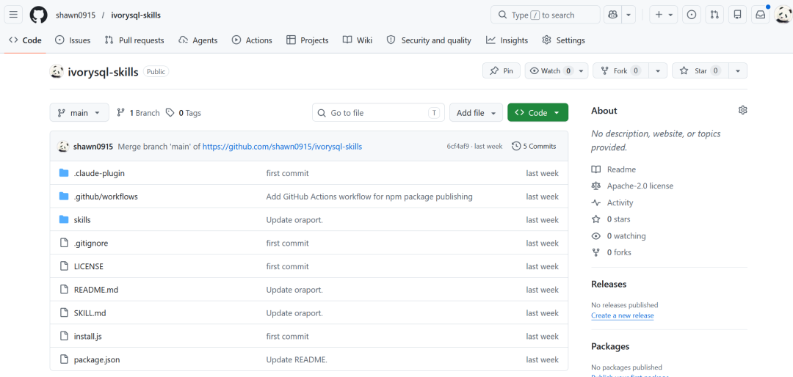
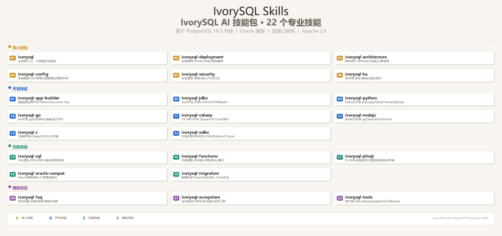

> This article is by Yan Shao'an, PostgreSQL ACE, IvorySQL Contributor, and IvorySQL Expert Advisory Committee member. He holds PGCM, PGCE, PGCA, HGCP, HGCA certifications and writes the WeChat blog "少安事务所" (Shawn's Office), focused on data & AI technology. This article is based on his talk at HOW 2026, originally published on his WeChat blog.

On April 27, HOW 2026 was held at the Shandong Mansion in Jinan. For a recap of the morning main forum, see:

[HOW 2026: PostgreSQL & AI Collide in the City of Springs](https://mp.weixin.qq.com/s/HTs41c_nKX2I83c8LAZ2vw)

As an IvorySQL Expert Advisory Committee member, I gave a talk in the afternoon session where I introduced **IvorySQL Skills** for the first time — a compilation of the IvorySQL operations and development techniques I've refined in my daily work, now open-sourced for everyone. Let's dive into what IvorySQL Skills is and why you need it.



## 01. In the Agentic AI Era, "Show Me How" Beats "Show Me Why"

I put three statements in my slides — they capture the motivation behind this project.

**First, AI is great at exploring, not decision-making.** Let AI draft an initial version, generate test cases, or explain execution plans — but the final decision for production must always be human-reviewed. The problem is: if you don't know "the right way," how can you judge if the AI's suggestion is good?

**Second, AI is an amplifier, not a replacement.** The stronger your own skills, the better AI amplifies them. If you have a shallow understanding of SQL optimization, you can't judge AI's suggestions either. So a solid foundational skill library must come first.

**Third, picking the right tool matters more than using many.** Not every AI tool is worth trying, but a production-verified, plug-and-play "tech cookbook" definitely belongs at your fingertips.


This is exactly the positioning of IvorySQL Skills — a "tech cookbook." It's not a repeat of official documentation but a collection of hands-on scripts and configuration templates that I've repeatedly refined and verified over the past two years while migrating from Oracle 19c to IvorySQL, deploying on domestic platforms (LoongArch + KylinOS), and conducting internal team training.

**Project repo**: https://github.com/shawn0915/ivorysql-skills

Feel free to give it a Star ⭐

If the access speed is slow, use the domestic mirror:

https://gitcode.com/mydb/ivorysql-skills


## 02. What's Inside IvorySQL Skills

The entire toolkit is organized into four major modules with **22 skills** total. Each skill is a standalone file containing scenario description, applicable versions, step-by-step instructions, and verification commands.



### Core Skills

| Skill                 | Description                                      |
| --------------------- | ------------------------------------------------ |
| ivorysql              | Main entry point, product overview               |
| ivorysql-deployment   | Installation & deployment (Docker/K8s/source)    |
| ivorysql-architecture | Architecture design (dual parser / dual port)    |
| ivorysql-config       | System configuration (GUC/parameters)            |
| ivorysql-security     | Security configuration (permissions/audit/TDE)   |
| ivorysql-ha           | High availability (backup/replication/monitoring)|

### Development Skills

| Skill                 | Description                               |
| --------------------- | ----------------------------------------- |
| ivorysql-app-builder  | End-to-end application development        |
| ivorysql-jdbc         | Java JDBC development                     |
| ivorysql-python       | Python development (psycopg/SQLAlchemy)   |
| ivorysql-go           | Go development (pgx/GORM)                 |
| ivorysql-csharp       | C#/.NET development (Dapper/EF Core)      |
| ivorysql-nodejs       | Node.js development (pg/Sequelize/Prisma) |
| ivorysql-c            | C language development (libpq/ECPG)       |
| ivorysql-odbc         | ODBC cross-platform development           |

### Feature Skills

| Skill                   | Description                                  |
| ----------------------- | -------------------------------------------- |
| ivorysql-sql            | SQL syntax (DDL/DML/queries)                 |
| ivorysql-functions      | Built-in functions (string/date/aggregate)   |
| ivorysql-plisql         | PL/iSQL stored procedures                    |
| ivorysql-oracle-compat  | Oracle compatibility features (21 items)     |
| ivorysql-migration      | Data migration (Oracle/MySQL → IvorySQL)     |

### Auxiliary Skills

| Skill               | Description          |
| ------------------- | -------------------- |
| ivorysql-faq        | Frequently asked questions |
| ivorysql-ecosystem  | Ecosystem integration |
| ivorysql-tools      | Client tools |

**Example: Oracle Compatible Function Quick Reference (Migration Adaptation)**

IvorySQL 5.0, based on PostgreSQL 18.0, added 21 Oracle compatibility features. But developers often get stuck on specific functions during actual migration. This skill doesn't list every compatible function — it focuses on the Top 20 most error-prone ones.

```
-- Scenario: Migrating from Oracle 19c to IvorySQL 5.3,
--            quickly verify commonly used function compatibility
-- Applicable versions: IvorySQL 5.0+ / PG 18.x

-- 1. Date handling: Oracle ADD_MONTHS
SELECT ADD_MONTHS('2026-04-27'::timestamp, 3);  -- Native IvorySQL support

-- 2. String concatenation: Oracle ||
SELECT 'HOW' || '2026' || 'Jinan';  -- Compatible, no rewrite needed

-- 3. NULL handling: Oracle NVL
SELECT NVL(NULL, 'default_value');  -- Compatible

-- 4. Row number: Oracle ROWNUM
SELECT * FROM (SELECT *, ROWNUM() OVER() AS rn FROM pg_tables) t WHERE rn <= 5;

-- Verification: Check the current IvorySQL compatibility mode
SHOW ivorysql.compatible_mode;  -- Returns 'oracle' or 'pg'
```

## 03. What Makes a Good Skill

During my HOW 2026 talk, I also shared the design standards for IvorySQL Skills. Nothing fancy — just four hard requirements that ensure every skill is "ready to use."

| Design Principle     | Requirement                                                      |
| -------------------- | ---------------------------------------------------------------- |
| Scenario-driven      | Title must include _scenario_ and _version_, e.g. "How to compile and install IvorySQL 5.3" |
| Plug-and-play        | Code blocks must be directly runnable; use `< >` for variables with comments explaining substitutions |
| Domestic platform fit| Any deployment skill must note supported domestic CPUs and OS    |
| Verifiable           | Every skill must end with a verification command or checklist    |

## 04. How to Install & Use: Three Ways, 30 Seconds

Beyond the three methods below, there's an even simpler path. Just tell your AI coding agent:

> Install this skills package: shawn0915/ivorysql-skills

**Method 1: npx one-click install (Recommended)**

```
# Install skills manager globally, then pull IvorySQL skills
npx skills add shawn0915/ivorysql-skills

# After install, list available skills
skills list | grep ivorysql
```

**Method 2: npm install**

```
npm i ivorysql-skills
```

**Method 3: Git clone (for customization & internal team use)**

```
git clone https://github.com/shawn0915/ivorysql-skills.git
```

Directory structure:

```
ivorysql-skills/
├── SKILL.md                      # Package-level entry (routing hub)
├── README.md                     # Documentation
│
├── ivorysql/                    # Main skill (product overview)
│   └── references/              # Reference docs
├── ivorysql-app-builder/        # End-to-end app dev
│   └── references/              # Reference docs
├── ivorysql-architecture/        # Architecture design
│   └── references/              # Reference docs
...
```

In an internal environment: fork the Git repo to your company's GitLab. DBAs and developers each contribute their verified skills, forming a team-level "private skill library." When a new hire joins — or when a new AI agent comes online — install this skill pack first, and it covers most daily operations.

## 05. Closing Thoughts

At the end of my talk, I shared this perspective: in the **Agentic AI era, Skills are not what AI replaces — they're the anchors that give AI its "factual baseline."**

What does that mean? If you tell AI to generate an IvorySQL backup script, it might give you a `pg_basebackup` command with parameters that work for PG 15 but not PG 18, or that ignore the domestic SSL environment. But if you've already installed IvorySQL Skills for your Agent, the model's output has boundaries — it stays grounded in verified practice.

My biggest takeaway from HOW 2026 — after a full morning of keynotes and an afternoon of hallway conversations — is: **China's PG ecosystem is shifting from "chasing open source" to "contributing to open source."** IvorySQL Skills is a tiny project. No complex code, just a bunch of Markdown docs. But at its core, it exists so that when you use AI coding agents, they understand IvorySQL better. Let your agent know your stack.

**Skills are distilled experience. They're agent playbooks. And they're the practical toolkit that levels up your efficiency.**

> **Postscript — May 2, 2026**

> This post was drafted on April 28, the day after HOW 2026. But on April 30, I saw that [Oracle Skills was open-sourced](https://mp.weixin.qq.com/s/GMqlICHS2dlmPQxPAx7cow), and I realized there's still much to improve in IvorySQL Skills. For instance, we need to better articulate the differences between IvorySQL and PostgreSQL. And we need more cases, scripts, workflows, and tools for Oracle-to-IvorySQL migration.

> To be continued.
