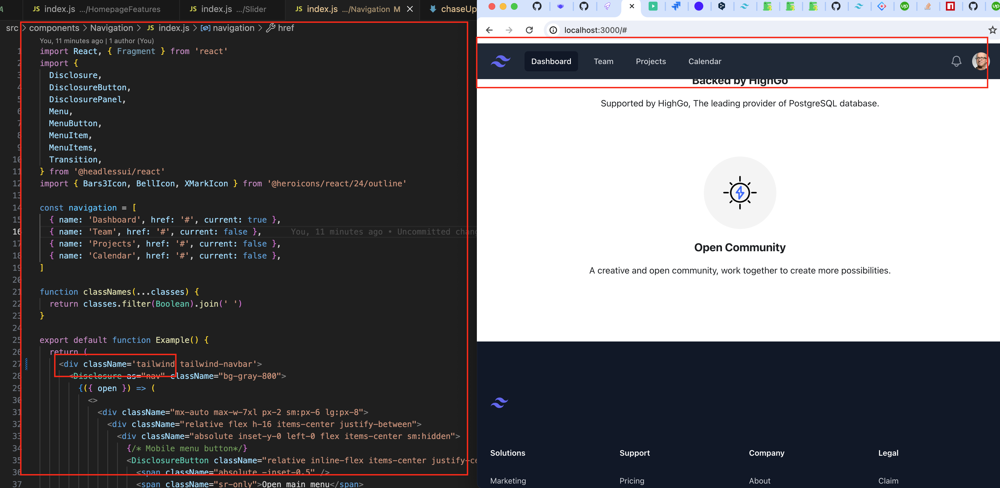
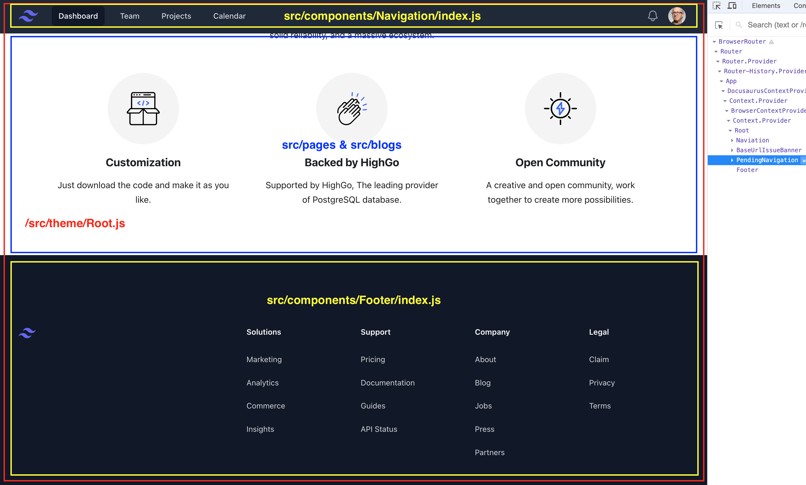

- [前言](#前言)
- [方案考虑](#方案考虑)
- [代码开发](#代码开发)
  - [结构调整](#结构调整)
  - [引入tailwind](#引入tailwind)
  - [组件复写](#组件复写)


# 前言
接到朋友的友情赞(bái)助(piáo)请求, 让我帮忙美化他们公司开源产品的前端UI. 长这样:


这是个[docusaurus](https://docusaurus.io/docs)框架产品. 我第一次接触. 浏览了一遍文档发现其实还挺方便的.

1. 提供了一个可以自定义展示的首页
2. 子页面可以直接提交markdown, 自带SEO.
3. navbar, footer等都是JSON配置, 支持响应式.

# 方案考虑
言归正传:
他木有设计搞, 木有想抄的风格倾向.

指望我一个干前端的出设计?


方案也就两个方向:

方案1:
> 看一些设计厉害的类似网站, 手抄覆写样式.

方案2:
> 直接换个UI框架, 比如[tailwind](https://tailwindui.com/).

我混合考虑了一下, 用`方案2`直接替换`navigation footer`这类大组件, 响应式也不用自己写.

局部的样式调整采用样式覆写, 目前看主要是`markdown`渲染显示这块, 以及`homepage`加点酷炫UE?

# 代码开发
## 结构调整
将`pages`下的一些组件移到`components`文件夹中.

之前结构:
```sh
./src
├── components
│   ├── HomepageFeatures.js
│   └── HomepageFeatures.module.css
├── css
│   └── custom.css
└── pages
    ├── ...
    ├── index.js
    ├── index.module.css
    ├── ...
    ├── releases-page.mdx
    ├── silder.css
    ├── slider-bug-phone.css
    ├── slider-bug-phone.js
    ├── slider-bug.css
    ├── slider-bug.js
    ├── slider-phone.css
    ├── slider-phone.js
    ├── slider.js
    └── webinars-page.mdx

```

新的结构:
```sh
./src
├── components
│   ├── HomepageFeatures
│   │   ├── index.js
│   │   └── index.module.css
│   ├── HomepageHeader
│   │   ├── index.js
│   │   └── index.module.css
│   ├── Slider
│   │   ├── index.js
│   │   └── silder.css
│   ├── SliderBug
│   │   ├── index.js
│   │   └── slider-bug.css
│   ├── SliderBugPhone
│   │   ├── index.js
│   │   └── slider-bug-phone.css
│   └── SliderPhone
│       ├── index.js
│       └── slider-phone.css
├── css
│   └── custom.css
└── pages
    ├── index.js
    ├── ...
    └── webinars-page.mdx
```

## 引入tailwind
目前[tailwind](https://tailwindui.com/)是比较主流的UI框架.

既然没有设计, 干脆就抄tailwind好了. 哪天看腻了, 其他维护人员复制粘贴一个tailwind差不多的组件, 替换就行.

按照[参考文章](https://farer.org/2021/10/08/docusaurus-with-tailwindcss/)
一顿操作.

参考文章涉及两个知识点, 一个是`tailwind`的本身config设置, 另一个是`docusaurus`的`plugin`参数设置, 反正我没深入读.

之后我们在页面里直接复制粘贴tailwind的组件, 可以看到直接就出来了:



左侧代码就是直接从[tailwind组件](https://tailwindui.com/components/application-ui/navigation/navbars)拷贝过来的.

右侧导航栏就渲染出来了. 是不是很简单, 这样代码交付后, 我的后端朋友应该也可以直接抄袭替(借鉴)换新tailwind组件了. 不懂react的也可以直接复制他的`html`代码, 一样的.

小插曲:
1. 担心tailwind的组件有全局样式冲突, 我加了一层tailwind的class外包裹
2. tailwind的亲儿子`@headlessui/react`组件库要求用react 18大版本, 不然编译报错. 我顺便就可以代码库`react`和`react-dom`升了个级.

## 组件复写
https://docusaurus-archive-october-2023.netlify.app/zh-CN/docs/2.0.1/swizzling#what-is-safe-to-swizzle

文档提供了一个方法可以把框架通过`docusaurus.config`的这种配置出来的`footer`和`navigation`组件暴露出来覆写.

至于哪些组件可以暴露出来, 他说可以了`npm run swizzle -- --list`. 我这里失败了, 可能是`docusaurus`版本太老的原因.

或者自己直接去[这里](https://github.com/facebook/docusaurus/tree/main/packages/docusaurus-theme-classic/src/theme)查看

文档也提供了另一个思路, 配置一个顶级入口, 他会是`pages`目录下所有组件的外层包裹. 我选择了这么干.
```sh
./src
...
├── theme
    └── Root.js
...
```
然后我们把默认的`footer`和`navitaion`从`docusaurus.config`注释掉. 再加上我们自己的新组件. 现在前端组件结构结和对应代码应该如下:




