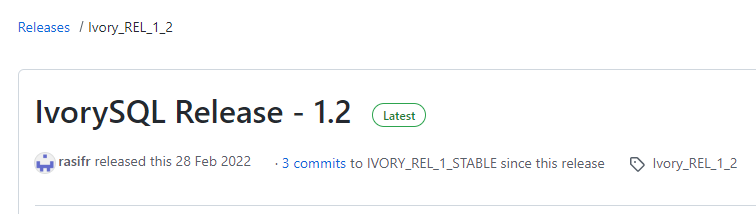

 
# Compiling and Installing IvorySQL on Linux

IvorySQL can be built on Linux, OSX, Unix, and Windows platforms, and is basically the same as PostgreSQL compiled and installed. This article describes the steps for compiling source code on a Linux-based system.


## Preparation


### 1.1 Obtaining the IvorySQL source code

For Windows or Linux, if you have Git installed, you can use git to download:

git clone https://github.com/IvorySQL/IvorySQL.git

git clone https://gitee.com/IvorySQL/IvorySQL.git


Or go directly to Github or Gitee to download:

https://github.com/IvorySQL/IvorySQL

https://gitee.com/IvorySQL/IvorySQL

Github can be a bit slow, use it if it works, and switch to Gitee if it doesn't.


As of this writing, the latest release of IvorySQL is 1.2, released on February 28, 2022.



The source version used in this article is also IvorySQL 1.2.


### 1.2 Installing the dependency packages

To compile IvorySQL from source, you must ensure that a prerequisite packages are available on your system.

Run the following command to install related packages:

```
sudo yum install -y bison-devel readline-devel zlib-devel openssl-devel wget
sudo yum groupinstall -y 'Development Tools'
```

**Note: "Development Tools" includes GCC, make, Flex, bison.**


## Compilation and installation

The source code obtained in front of the folder IvorySQL, next we will enter this folder for operation.


### 2.1 configuration

Run the following command as the Root user:

```
./configure
```

**Note: Since --prefix is not provided, /usr/local/pgSQL will be used as default installation path.**


To use a different installation path, such as "/ usr/local/ivorysql/ivorysql - 1.2" :

```
./configure --prefix=/usr/local/ivorysql/ivorysql-1.2
```


For more configure parameters, try ./configure --help. Also check out the PostgreSQL manual.

 

### 2.2 Compilation and Installation

After the configuration is complete, run make to compile:

```
make
```


To test the newly compiled service using regression tests before installing it, use either of the following commands:

```
make check
make check-world
```


Then install:

```
make install
```


## Initialize the database service

We only have a simple configuration here, can be local and remote connection is ok.


### 3.1 Creating an OS User

In the root session, create user ivorysql:

```
/usr/sbin/groupadd ivorysql
/usr/sbin/useradd -g ivorysql ivorysql -c "IvorySQL1.2 Server"
passwd ivorysql
```


### 3.2 Creating a Data Directory

Next you need to create the data directory and change the permissions. Run the following command in the root session.

```
mkdir -p /ivorysql/1.2/data
chown -R ivorysql.ivorysql /ivorysql/1.2/
```

**Note: The data directory is not placed in "/var/lib/ivorysql/ivorysql-1/data" when you do installation using the RPMs.

 

### 3.3 Environment Variables

Switch to ivorysql user, modify the /home/ivorysqL/. bash_profile file, and configure environment variables:

```
umask 022
export LD_LIBRARY_PATH=/usr/local/pgsql/lib:$LD_LIBRARY_PATH
export PATH=/usr/local/pgsql/bin:$PATH
export PGDATA=/ivorysql/1.2/data
```


Make environment variables take effect in the current IVorysQL user session:

```
source .bash_profile
```

You can also log in again or start a session with a new user ivorysQL.

 

### 3.4 Configuring the Firewall

If the firewall is enabled, port 5333 needs to be opened:

```
firewall-cmd --zone=public --add-port=5333/tcp --permanent
firewall-cmd --reload
```

**Note: The default port is 5333. If this port is disabled, external clients will not be able to connect to the IP address.**

 

### 3.5 the initialization

In user ivorysql, simply execute initdb to complete the initialization:

```
initdb
```

**Note: InitDB operates in the same way as PostgreSQL, and can be initialized in the same way as PG.**

 

### 3.6 Starting the Database

Use pg_ctl to start the database service:

```
pg_ctl start
```


Check the status, the startup is successful:

```
pg_ctl status
```

pg_ctl: server is running (PID: 29549)

/usr/local/pgsql/bin/postgres


## Configure services

Here is a simple configuration, can be local and remote connection is ok


### 4.1 Client Authentication

Add the following information to /ivorysql/1.2/data/pg_hba.conf:

```
host    all             all             0.0.0.0/0               trust
```

**Note: this is trust, which means you can log in without secret.**


Run the following command to load the configuration:

```
pg_ctl reload
```

 

### 4.2 Basic Parameters

Connect to database through PSQL:

```
psql
```


Modify listening address:

```
alter system set listen_addresses = '*';
```

**Note: By default the server does not allow connections from external hosts.**


Restart the service for the Settings to take effect:

```
pg_ctl restart
```

 

### 4.3 Daemon Service

Create service file:

```
touch /usr/lib/systemd/system/ivorysql.service
```


The edited content is as follows:

```
[Unit]
Description=IvorySQL 1.2 database server
Documentation=https://www.ivorysql.org
Requires=network.target local-fs.target
After=network.target local-fs.target

[Service]
Type=forking

User=ivorysql
Group=ivorysql

Environment=PGDATA=/ivorysql/1.2/data/

OOMScoreAdjust=-1000

ExecStart=/usr/local/pgsql/bin/pg_ctl start -D ${PGDATA}
ExecStop=/usr/local/pgsql/bin/pg_ctl stop -D ${PGDATA}
ExecReload=/usr/local/pgsql/bin/pg_ctl reload -D ${PGDATA}

TimeoutSec=0

[Install]
WantedBy=multi-user.target
```

**Note: There are many ways to write service. Be careful when using it in the production environment. Repeat the test several times.**


Stop the database service started by pg_ctl, enable the systemd service, and start:

```
systemctl enable --now ivorysql.service
```


IvorSQL Database service operation commands:

```
systemctl start ivorysql.service			--启动数据库服务
systemctl stop ivorysql.service				--停止数据库服务
systemctl restart ivorysql.service			--重启数据库
systemctl status ivorysql.service			--查看数据库状态
systemctl reload ivorysql.service			--可以满足部分数据库配置修改完后生效
```


## Database Client

The IvorySQL client is the same as the PostgreSQL client.


### 5.1 PSQL connection

Connecting from ivorysql OS user:

```
[ivorysql@Node02 ~]$ psql
psql (15devel)
Type "help" for help.

ivorysql=#
```

 

### 5.2 DBeaver connection

DBeaver is a powerful open source tool with the following connectivity configurations:


### 5.3 Connect using HighGo Developer

HighGo Developer is a tool independently developed by Highgo, which supports not only Highgo database, but also PostgreSQL and IvorySQL database. The connection configuration is as follows:


## Uninstall

If required IvorySQL can be uninstalled by compiling and uninstalling.


### 6.1 Backing Up Data

The data directory is under "/ ivorysQL /1.2/data", so we can protect the directory, It is recomended to stop the database service and make a backup.


### 6.2 Compilation and Uninstallation

Switch to the source directory and run the following commands:

```
make uninstall
make clean
```


Delete residual directories and files:

```
systemctl disable ivorysql.servicemake					--Disable the service
mv /usr/lib/systemd/system/ivorysql.service /tmp/		--delete or move the service file to /tmp
rm -fr /usr/local/pgsql									--Remove the installed files
```

The ivorysql user and the corresponding environment variables can be cleared according to the situation.

The rest is the data directory "/ ivorysQL /1.2/data", please be sure to take a backup before processing.

There are installed dependency packages, you can decide whether to uninstall according to the situation.

 

 

## Postscript


- For more detailed operations, see PostgreSQL.

- You can also refer to the IvorySQL source code under the documentation: /root/ivorysql/readme.md.

- You can also open a link to the website:

  https://gitee.com/IvorySQL/IvorySQL/blob/master/README.md。

- If you have any question, welcome to the official community IvorySQL warehouse: **github.com/IvorySQL/IvorySQL**  submit issue.

 

---

>Join the IvorySQL community by subscribing to mailing lists:  
>- **[Hackers List](https://lists.ivorysql.org/postorius/lists/hackers.ivorysql.org/)**  
>- **[Users List](https://lists.ivorysql.org/postorius/lists/general.ivorysql.org/)**  
>  
>***Also, don't forget to give us a :star: on [Github](https://github.com/IvorySQL/IvorySQL)***
