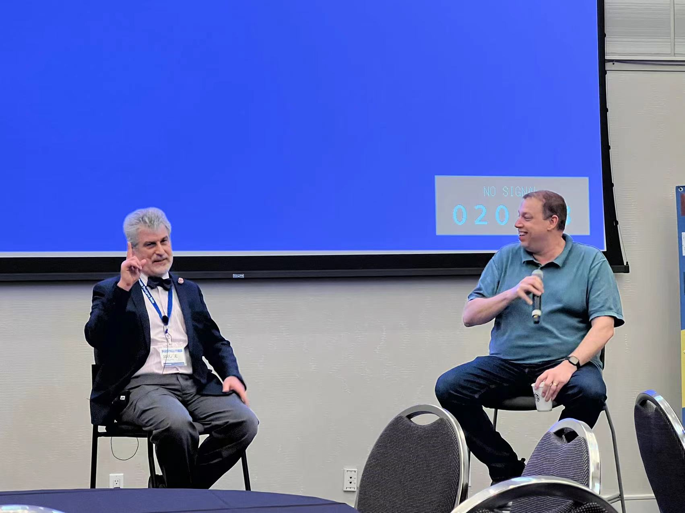
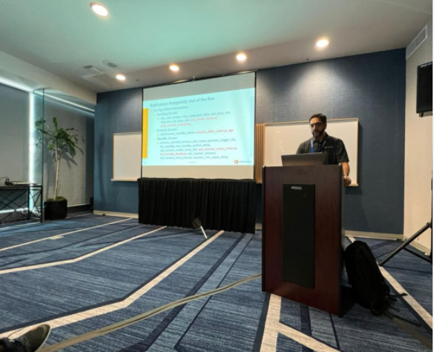

> 硅谷Postgres会议是西海岸最大的PG会议，也是美国乃至全球Postgres年度重要会议之一，于2022年4月7日至8日（PDT）在美国加利福尼亚州圣何塞希尔顿酒店召开。作为面向全球PostgreSQL技术专家、从业者、爱好者的年度技术交流活动，硅谷会议致力于汇集和讨论关于人、Postgres和数据间的关系！会议与主办地硅谷一样极具包容和公平精神，这里汇集了最优秀的演讲者、听众和赞助商，所有人努力为全球Postgres生态系统创造发展机会。
>
> 会议现场人数大概有200多人，是疫情以来聚集人数最多的一次线下会议。
>
> **社区核心人员Bruce Momjian出席**，会议由PostgresConf,Joshua D.Drake, Jim Mlodgenski 等组织。来自中国、美国、加拿大、巴西、西班牙、德国、印度、巴基斯坦等多个国家的人员参与。

**瀚高北美研究院兼中国PostgreSQL分会国际顾问委员会秘书长Grant Zhou作为唯一中国代表，将携IvorySQL项目亮相本次会议。**

以下是由**IvorySQL开源数据库社区**为您带来的硅谷Postgres两日会议简报。

## 部分演讲议题

**IvorySQL--一个基于PostgreSQL的兼容Oracle的开源数据库 --by GRANT ZHOU**

有很多用户需要将他们的应用程序从Oracle迁移到开放源码的Postgres，但是为了支持新的数据库，用户经常需要重新开发应用程序，这很不方便。如果有一个基于Postgres的数据库，并且兼容大多数Oracle语法和函数，对客户来说就太方便了。然而官方的Postgres项目不接受这种代码提交。毕竟，Postgres是Postgres, Oracle是Oracle。因此，IvorySQL项目团队创建一个Oracle兼容的数据库。

本演讲中介绍了如何基于PG实现与Oracle语法兼容的数据库，并介绍IvorySQL项目。这个项目是一个开源项目(Apache 2.0)，由Highgo软件领导，目前已经发布了基于PostgreSQL 14.2版本的IvorySQL 1.2。

同时欢迎大家为这个开源的侧重Oracle兼容性的数据库——IvorySQL做出贡献。

 

**非关系型Postgres --by Bruce Momjian**

Postgres一直对关系存储提供强大的支持。然而，在许多情况下，关系存储要么效率低下，要么限制过度。这个演讲展示了Postgres扩展到支持非关系存储的许多方式，特别是在一个数据库字段中存储和索引多个值(甚至是不相关的值)的能力。这种存储可以提高效率和访问的简单性，还可以避免实体-属性-值(eav)存储的缺点。演讲涵盖多个字段多值存储的例子，包括数组、范围类型、几何图形、全文搜索、xml、json和记录。

 

**数字权力和隐私：21世纪的关注--by Andres Arrieta**

30多年来，电子前沿基金会一直在保护和争取我们的公民自由。在这30年里发生了很多事情:我们与互联网的关系从根本上发生了改变，然而，在很多方面，我们对互联网如何运作的理解仍然停滞不前。如今，互联网已经成为我们生活中不可或缺的核心部分，我们越来越依赖互联网。虽然我们比以往任何时候都更容易接触到互联网提供的众多礼物，但决策者和执法机构对互联网如何运作的理解仍然滞后。在此期间，电子前沿基金会及其使命已经涵盖了技术带来的好或坏的许多方面，并帮助保护那些受其影响的人，同时确保一个光明的未来，通过创新改善我们的生活。

Andres Arrieta向大家介绍了我们的一些工作、一些关切的领域以及Andres Arrieta认为将有助于我们朝着更美好的未来努力的一些事情。主要是关于数据隐私和消费者权利的理论视角。讨论了隐私的不同方面以及保护个人隐私的选项。

 

**逻辑复制的过去、现在和未来--by Amit Kapila**

在这次演讲中，Amit Kapila讲述了逻辑复制在PostgreSQL中是如何发展的。这将解释最近的一些最近的主要增强，比如促进两阶段和正在进行的大型事务的逻辑复制。并分享了Amit Kapila对如何利用该技术为大型企业构建高度可伸缩和可用的数据库解决方案的看法。在那之后，还讨论了在PostgreSQL未来版本中在这个技术领域中讨论的一些重要增强。并且介绍如何增强这项技术，以便将数据从PostgreSQL迁移到其他数据库。

 

**现代原生云应用的传记--by Karthik Ranganathan**

 

现代云原生应用程序过着令人兴奋的生活 - 从它们在云中诞生，到处理巨大的计划外成功，再到在云中断中幸存下来并处理全球客户。在本次演讲中，Yugabyte 首席技术官 Karthik Ranganathan 从数据层的角度介绍了Yugabyte 如何处理双向表级复制和高可用性。

 

**Aurora的亚马逊Babelfish--by chandra pathivada**

现在奥罗拉的Babelfish已经上市了。这个演示是关于Babelfish如何帮助客户迁移SQL Server工作负载到Postgres。在这个演示中，chandra pathivada演示了什么是Babelfish, Aurora的内部结构，使用Babelfish的SQL Server dba的Aurora，以及应用程序迁移实验室。

## 现场照片

## 更多详情内容

**2022年硅谷Postgres会议官方网址：**
https://postgresconf.org/conferences/SV2022

## 关于IvorySQL

IvorySQL项目是一个具有广泛生态基础和中国特色的PG开源衍生项目，是**瀚高公司**设计研发的一款具备强大Oracle兼容能力的开源数据库。
具备高兼容性和高可用性，并致力于遵守open-source ways。
IvorySQL社区欢迎并赞赏所有类型的贡献，期待您的加入！

---

>通过订阅邮件列表加入IvorySQL社区： 
>- **[Hackers List](https://lists.ivorysql.org/postorius/lists/hackers.ivorysql.org/)**  
>- **[Users List](https://lists.ivorysql.org/postorius/lists/general.ivorysql.org/)**  
>- 官方微信公众号：IvorySQL开源数据库社区
>
>***还有，别忘了在[Github](https://github.com/IvorySQL/IvorySQL)给我们一个 :star: ***
