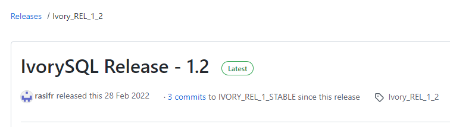

# Linux环境源码编译安装IvorySQL


IvorySQL可以在Linux, OSX, Unix和Windows平台上构建，与PostgreSQL的编译安装基本上是一样的。本文对基于Linux的系统上编译源代码的步骤进行说明。


## 一、准备工作


### 1.1 获取 IvorySQL 源码

Windows或Linux，只要安装了git，都可以使用git下载：

git clone https://github.com/IvorySQL/IvorySQL.git

git clone https://gitee.com/IvorySQL/IvorySQL.git

 

或者直接去github或gitee下载都可以：

https://github.com/IvorySQL/IvorySQL

https://gitee.com/IvorySQL/IvorySQL

github会有点慢，能用则用，不行就改用gitee。

 

截至本稿，IvorySQL的最新发布版本是1.2，于2022年2月28日发布。



本文使用的源码版本也是IvorySQL 1.2。


### 1.2 安装依赖包

要从源代码编译IvorySQL，必须确保系统上有可用的先决条件包。
执行以下命令安装相关包：

```
sudo yum install -y bison-devel readline-devel zlib-devel openssl-devel wget
sudo yum groupinstall -y 'Development Tools'
```

**说明：“Development Tools”包含了gcc，make，flex，bison。**


## 二、编译安装

前面通过获取的源码在文件夹IvorySQL里，接下来我们就进入这个文件夹进行操作。


### 2.1 配置

Root用户执行以下命令进行配置：

```
./configure
```

**说明：由于没有提供--prefix，默认安装在/usr/local/pgsql。**


指定安装路径，如“/usr/local/ivorysql/ivorysql-1.2”：

```
./configure --prefix=/usr/local/ivorysql/ivorysql-1.2
```

**注意：我们要记住指定的目录，因为系统查不出已经编译安装的程序在哪。**


更多configure参数通过“./configure --help”查看。还可以查看PostgreSQL手册。


### 2.2 编译安装

配置完成后，执行make进行编译：

```
make
```


要在安装新编译的服务之前使用回归测试测试一下，以下命令均可：

```
make check
make check-world
```


然后安装：

```
make install
```


## 三、初始化数据库服务

我们这里只是简单配置一下，能本地和远程连接就可以了。


### 3.1 创建操作系统用户

用户root会话下，新建用户 ivorysql：

```
/usr/sbin/groupadd ivorysql
/usr/sbin/useradd -g ivorysql ivorysql -c "IvorySQL1.2 Server"
passwd ivorysql
```


### 3.2 创建数据目录

接下来需要创建数据目录并修改权限。在root会话下执行以下命令。

```
mkdir -p /ivorysql/1.2/data
chown -R ivorysql.ivorysql /ivorysql/1.2/
```

**注意：这里没按RPM安装将数据目录放置到“/var/lib/ivorysql/ivorysql-1/data”。**


### 3.3 环境变量

切换到用户ivorysql，修改文件“/home/ ivorysql /.bash_profile”，配置环境变量：

```
umask 022
export LD_LIBRARY_PATH=/usr/local/pgsql/lib:$LD_LIBRARY_PATH
export PATH=/usr/local/pgsql/bin:$PATH
export PGDATA=/ivorysql/1.2/data
```


使环境变量在当前ivorysql用户会话中生效：

```
source .bash_profile
```

也可以重新登录或开启一个新的用户ivorysql的会话。


### 3.4 设置防火墙

如果开启了防火墙，还需要将端口5333开放：

```
firewall-cmd --zone=public --add-port=5333/tcp --permanent
firewall-cmd --reload
```

**说明：默认端口是5333，如果不开放该端口，外部客户端通过ip连接会失败。**


### 3.5 初始化

在用户ivorysql下，简单执行initdb就可以完成初始化：

```
initdb
```

**说明：initdb操作与PostgreSQL一样，可以按照PG的习惯去初始化。**


### 3.6 启动数据库

使用pg_ctl启动数据库服务：

```
pg_ctl start
```


查看状态，启动成功：

```
pg_ctl status
```

pg_ctl: server is running (PID: 29549)

/usr/local/pgsql/bin/postgres


## 四、配置服务

这里只是简单配置一下，能本地和远程连接就可以了


### 4.1 客户端验证

修改 /ivorysql/1.2/data/pg_hba.conf，追加以下内容：

```
host    all             all             0.0.0.0/0               trust
```

**注意：这里是trust，就是说可以免密登录。**


执行以下命令加载配置：

```
pg_ctl reload
```


### 4.2 基本参数

通过psql连接数据库：

```
psql
```


修改监听地址：

```
alter system set listen_addresses = '*';
```

**说明：默认是监听在127.0.0.1，主机外是连不上服务的。**


重启服务使设置生效：

```
pg_ctl restart
```


### 4.3 守护服务

创建service文件：

```
touch /usr/lib/systemd/system/ivorysql.service
```


编辑内容如下：

```
[Unit]
Description=IvorySQL 1.2 database server
Documentation=https://www.ivorysql.org
Requires=network.target local-fs.target
After=network.target local-fs.target

[Service]
Type=forking

User=ivorysql
Group=ivorysql

Environment=PGDATA=/ivorysql/1.2/data/

OOMScoreAdjust=-1000

ExecStart=/usr/local/pgsql/bin/pg_ctl start -D ${PGDATA}
ExecStop=/usr/local/pgsql/bin/pg_ctl stop -D ${PGDATA}
ExecReload=/usr/local/pgsql/bin/pg_ctl reload -D ${PGDATA}

TimeoutSec=0

[Install]
WantedBy=multi-user.target
```

**说明：service的写法有很多，在生产环境使用时需谨慎，请多次重复测试。**


停止pg_ctl启动的数据库服务，启用systemd服务并启动：

```
systemctl enable --now ivorysql.service
```


IvorSQL数据库服务操作命令：

```
systemctl start ivorysql.service			--启动数据库服务
systemctl stop ivorysql.service				--停止数据库服务
systemctl restart ivorysql.service			--重启数据库
systemctl status ivorysql.service			--查看数据库状态
systemctl reload ivorysql.service			--可以满足部分数据库配置修改完后生效
```


## 五、客户端链接数据库

连接IvorySQL数据库服务的客户端工具和PostgreSQL的一样。


### 5.1 psql 连接

操作系统用户ivorysql会话下连接：

```
[ivorysql@Node02 ~]$ psql
psql (15devel)
Type "help" for help.

ivorysql=#
```


### 5.2 DBeaver 连接

DBeaver是一个功能比较强大的开源工具，连接配置如下：


### 5.3 瀚高 developer 连接

瀚高developer是瀚高自主研发的一个工具，除了可以支持瀚高数据库，还支持PostgreSQL以及IvorySQL数据库。连接配置如下：


如果想使用该工具，请关注公众号加入微信群“IvorySQL中国技术交流群”咨询。


## 六、卸载

编译安装就用编译卸载的方式卸载。


### 6.1 备份数据

数据目录在“/ivorysql/1.2/data”下，所以我们将该目录保护好就可以，最好停止数据库服务后做备份。


### 6.2 编译卸载

Root会话下切到源码目录下，分别执行以下命令：

```
make uninstall
make clean
```


删除残余目录和文件：

```
systemctl disable ivorysql.servicemake					--禁用服务
mv /usr/lib/systemd/system/ivorysql.service /tmp/		--服务文件移到/tmp，删除也可以
rm -fr /usr/local/pgsql									--删除残留安装目录
```

还有用户ivorysql以及对应的环境变量，可以根据情况是否清理。

剩下的就是数据目录“/ivorysql/1.2/data”了，请务必做好备份再做处理。

还有安装的依赖包，可根据情况决定是否卸载。


## 七、后记

- 更细化的操作，可参照PostgreSQL的相关内容。

- 大家还可以参考IvorySQL源码下自带文档：/root/IvorySQL/README.md。

- 也可以打开网站链接：https://gitee.com/IvorySQL/IvorySQL/blob/master/README.md。

- 有任何问题，欢迎大家到IvorySQL官方社区仓库：github.com/IvorySQL/IvorySQL 提交issue。


## 关于IvorySQL

IvorySQL项目是一个具有广泛生态基础和中国特色的PG开源衍生项目，是瀚高公司设计研发的一款具备强大Oracle兼容能力的开源数据库。具备高兼容性和高可用性，并致力于遵守open-source ways。

**社区仓库**：[github.com/IvorySQL/IvorySQL](https://github.com/IvorySQL/IvorySQL)

**CSDN**: IvorySQL

**开源中国**：IvorySQL  

**墨天轮**：IvorySQL

---

>通过订阅邮件列表加入IvorySQL社区： 
>- **[Hackers List](https://lists.ivorysql.org/postorius/lists/hackers.ivorysql.org/)**  
>- **[Users List](https://lists.ivorysql.org/postorius/lists/general.ivorysql.org/)**  
>- **官方微信公众号：IvorySQL开源数据库社区**
>
>***还有，别忘了在[Github](https://github.com/IvorySQL/IvorySQL)给我们一个 :star: ***
