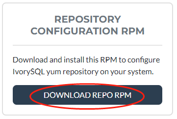
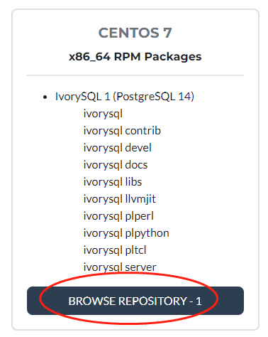
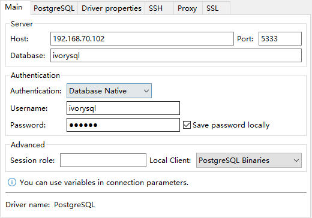

## 通过 YUM 源安装软件


下面我们以操作系统Centos7.9环境为例，看看如何安装IvorySQL数据库。先介绍最简单的YUM源安装。


### 1.1 安装 YUM 源


下载地址：https://yum.highgo.ca/ivorysql.html

点击图中按钮【DOWNLOAD REPO RPM】下载ivorysql-release-1.0-1.noarch.rpm并传到Centos7.9：



或者在Centos7上使用wget下载：

```
wget https://yum.highgo.ca/dists/ivorysql-rpms/repo/ivorysql-release-1.0-1.noarch.rpm
```


安装ivorysql-release-1.0-1.noarch.rpm：

```
rpm -ivh ivorysql-release-1.0-1.noarch.rpm
```

安装后，将创建YUM源配置文件：/etc/yum.repos.d/ivorysql.repo。


搜索查看相关安装包：

```
yum search ivorysql
```


搜索结果说明见表1：

​                                                                                                         表1 YUM源说明

| **序号** | **包名**                                                     | **描述**                                   |
| -------- | ------------------------------------------------------------ | ------------------------------------------ |
| 1        | [ivorysql1.x86_64](https://yum.highgo.ca/dists/ivorysql-rpms/1/redhat/rhel-7-x86_64/ivorysql1-1.2-1.rhel7.x86_64.rpm) | IvorySQL 客户端程序和库文件                |
| 2        | [ivorysql1-contrib.x86_64](https://yum.highgo.ca/dists/ivorysql-rpms/1/redhat/rhel-7-x86_64/ivorysql1-contrib-1.2-1.rhel7.x86_64.rpm) | 随IvorySQL发布的已贡献的源代码和二进制文件 |
| 3        | ivorysql1-devel.x86_64                                       | IvorySQL开发头文件和库                     |
| 4        | ivorysql1-docs.x86_64                                        | IvorySQL的额外文档                         |
| 5        | [ivorysql1-libs.x86_64](https://yum.highgo.ca/dists/ivorysql-rpms/1/redhat/rhel-7-x86_64/ivorysql1-libs-1.2-1.rhel7.x86_64.rpm) | 所有IvorySQL客户端所需的共享库             |
| 6        | ivorysql1-llvmjit.x86_64                                     | 对IvorySQL的即时编译支持                   |
| 7        | ivorysql1-plperl.x86_64                                      | 用于IvorySQL的过程语言Perl                 |
| 8        | ivorysql1-plpython3.x86_64                                   | 用于IvorySQL的过程语言Python3              |
| 9        | ivorysql1-pltcl.x86_64                                       | 用于IvorySQL的过程语言Tcl                  |
| 10       | [ivorysql1-server.x86_64](https://yum.highgo.ca/dists/ivorysql-rpms/1/redhat/rhel-7-x86_64/ivorysql1-server-1.2-1.rhel7.x86_64.rpm) | 创建和运行IvorySQL服务器所需的程序         |
| 11       | ivorysql1-test.x86_64                                        | 随IvorySQL发布的测试套件                   |
| 12       | ivorysql-release.noarch                                      | 瀚高基础软件股份有限公司的Yum源配置RPM包   |

**说明：1、2、5、10是RPM包安装需要的，超链接可以单独下载。**


### 1.2 安装 IVORYSQL


要安装数据库服务，需要安装ivorysql1-server。
在用户root会话下执行以下命令：

```
yum install -y ivorysql1-server
```


**安装清单：**

 ivorysql1-server.x86_64 0:1.2-1.rhel7                                                                                


**依赖安装：**

-   ivorysql1.x86_64 0:1.2-1.rhel7			ivorysql1-contrib.x86_64 0:1.2-1.rhel7

-   ivorysql1-libs.x86_64 0:1.2-1.rhel7		libicu.x86_64 0:50.2-4.el7_7

-   libtirpc.x86_64 0:0.2.4-0.16.el7			libxslt.x86_64 0:1.1.28-6.el7

-   python3.x86_64 0:3.6.8-18.el7			python3-libs.x86_64 0:3.6.8-18.el7

-   python3-pip.noarch 0:9.0.3-8.el7		python3-setuptools.noarch 0:39.2.0-10.el7

  

### 1.3 已安装目录


表2对YUM安装过程产生的文件目录进行说明。
                                                        

​                                                                 表2 安装目录文件说明

| **序号** | **文件路径**                               | **描述**                               |
| -------- | ------------------------------------------ | -------------------------------------- |
| 1        | /usr/local/ivorysql/ivorysql-1             | 软件安装目录                           |
| 2        | /var/lib/ivorysql/ivorysql-1/data          | 数据目录（默认）                       |
| 3        | /usr/bin/ivorysql-1-setup                  | 帮助系统管理员进行基本的数据库集群管理 |
| 4        | /usr/lib/systemd/system/ivorysql-1.service | 守护服务                               |


### 1.4 RPM安装


顺便说一下RPM安装，需要按这个顺序安装：

```
yum install -y libicu libxslt python3					--先安装依赖
rpm -ivh ivorysql1-libs-1.2-1.rhel7.x86_64.rpm
rpm -ivh ivorysql1-1.2-1.rhel7.x86_64.rpm
rpm -ivh ivorysql1-contrib-1.2-1.rhel7.x86_64.rpm --nodeps
rpm -ivh ivorysql1-server-1.2-1.rhel7.x86_64.rpm
```

所以，使用YUM安装还是很方便的。如果没条件，就单独下载按这个顺序安装吧。

下载地址：https://yum.highgo.ca/ivorysql.html



点击【BROWSE REPOSITORY-1】找到对应的包下载即可（注意：官网没提供依赖包）。


## 初始化数据库


IvorySQL数据库默认初始化以及启停等操作比较简单。


### 2.1 默认初始化


我们可以在root用户下，执行以下命令使用系统默认参数来初始化：

```
/usr/local/ivorysql/ivorysql-1/bin/ivorysql-1-setup initdb
```

**说明：由于没有提供SERVICE_NAME，默认会读ivorysql-1。**


启用并启动服务：

```
systemctl enable --now ivorysql-1.service
```


ivorysql-1-setup的用法：

```
ivorysql-1-setup {initdb|check_upgrade|upgrade} [SERVICE_NAME]
```

**说明：该命令的详细用法，执行命令“ivorysql-1-setup --help”查看。**


### 2.2 自定义初始化


假如我们有个需求，要制定数据文件路径（/ivorysql/1.2/data/）和端口号（5866），那我们就可以定制初始化。


根据默认的服务文件“/usr/lib/systemd/system/ivorysql-1.service”在相同目录下复制一个新的“ivorysql-5866.service”：

```
cp /usr/lib/systemd/system/ivorysql-1.service /usr/lib/systemd/system/ivorysql-5866.service
```


修改添加以下内容：

```
Environment=PGDATA=/ivorysql/1.2/data/
Environment=PGPORT=5866
```


指定SERVICE_NAME为ivorysql-5866来初始化：

```
/usr/local/ivorysql/ivorysql-1/bin/ivorysql-1-setup initdb ivorysql-5866
```


启用并启动服务：

```
systemctl enable --now ivorysql-5866.service
```


### 2.3 常用服务操作


IvorSQL数据库服务操作命令：

```
systemctl start ivorysql-1.service				--启动数据库服务
systemctl stop ivorysql-1.service				--停止数据库服务
systemctl restart ivorysql-1.service			--重启数据库
systemctl status ivorysql-1.service			--查看数据库状态
systemctl reload ivorysql-1.service			--可以满足部分数据库配置修改完后生效
```


## 配置数据库服务


我们这里只是简单配置一下，能本地和远程连接就可以了。


### 3.1 客户端验证


修改 /var/lib/ivorysql/ivorysql-1/data/pg_hba.conf，追加以下内容：

```
host    all             all             0.0.0.0/0               scram-sha-256
```


执行以下命令加载配置：

```
systemctl reload ivorysql-1.service
```


### 3.2 基本参数


切换到用户ivorysql：

```
su - ivorysql
```


通过psql连接数据库：

```
psql
```


修改监听地址，便于远程连接顺便改一下ivorysql的密码：

```
alter system set listen_addresses = '*';
alter user ivorysql password '666666';
```

**说明：用户ivorysql是没有密码的，如果不修改密码，可以修改客户端验证方式为trust，来免密登录。**


退回root用户，重启服务使设置生效：

```
systemctl restart ivorysql-1.service
```


## 防火墙


如果开启了防火墙，还需要将端口5333开放：

```
firewall-cmd --zone=public --add-port=5333/tcp --permanent
firewall-cmd --reload
```

**说明：刚初始化好的ivorysql服务默认端口是5333，如果不开放该端口，外部客户端通过ip连接会失败。**


## 客户端连接数据库


连接IvorySQL数据库服务的客户端工具和PostgreSQL的一样。


### 4.1 psql 连接


操作系统用户ivorysql会话下连接：

```
[root@Node02 ~]# su - ivorysql 
Last login: Wed Apr 27 23:58:57 CST 2022 on pts/0
-bash-4.2$ psql
psql (14.2)
Type "help" for help.

ivorysql=#
```


### 4.2 DBeaver 连接


DBeaver是一个功能比较强大的开源工具，连接配置如下：




### 4.3 瀚高 developer 连接


瀚高developer是瀚高自主研发的一个工具，除了可以支持瀚高数据库，还支持PostgreSQL以及IvorySQL数据库。连接配置如下：


如果想使用该工具，请关注公众号加入微信群“IvorySQL中国技术交流群”咨询。


## 卸载


由于我们是通过yum安装的，要卸载建议也使用yum，尽量不要使用rpm，可能会造成卸载不完整。当然了，也可以根据yum安装清单去卸载。


### 5.1 备份数据


数据目录在/var/lib/ivorysql/ivorysql-1/data下，所以我们将该目录保护好就可以，最好停止服务，做个备份。


### 5.2 YUM 卸载


首先停止数据库服务：

```
systemctl stop ivorysql-1.service
```


先使用“yum history list”确定yum安装的事务ID：

```
[root@Node02 ~]# yum history list
Loaded plugins: fastestmirror
ID     | Login user               | Date and time    | Action(s)      | Altered
-------------------------------------------------------------------------------
     5 | root <root>              | 2022-04-27 12:38 | Install        |   11  <
     4 | root <root>              | 2022-03-26 16:08 | Install        |   35 > 
     3 | root <root>              | 2022-03-26 16:07 | I, U           |   19   
     2 | root <root>              | 2022-03-26 16:07 | I, U           |   73   
     1 | System <unset>           | 2022-03-26 15:59 | Install        |  299   
history list
```


可以看到ID为5的是执行安装的事务。执行命令卸载（需将XX替换为“5”）：

```
yum history undo XX
```


也可以使用下面命令来卸载：

```
yum remove ivorysql-server
```


但该命令卸载并不彻底，只卸载了2个依赖，还有8个依赖未能卸载。可以根据是否保留这些依赖而决定是否使用这种方式卸载。


## 后记


- 更细化的操作，可以参照postgresql的操作。例如，用initdb直接初始化。

- 大家还可以参考IvorySQL自带文档： /usr/share/doc/ivorysql1-1.2/README.rpm-dist。

-  有任何问题，欢迎大家到IvorySQL官方社区仓库：github.com/IvorySQL/IvorySQL 提交issue。


## 关于IvorySQL

IvorySQL项目是一个具有广泛生态基础和中国特色的PG开源衍生项目，是瀚高公司设计研发的一款具备强大Oracle兼容能力的开源数据库。具备高兼容性和高可用性，并致力于遵守open-source ways。

**社区仓库**：github.com/IvorySQL/IvorySQL

**CSDN**: IvorySQL

**开源中国**：IvorySQL  

**墨天轮**：IvorySQL

---

>通过订阅邮件列表加入IvorySQL社区： 
>- **[Hackers List](https://lists.ivorysql.org/postorius/lists/hackers.ivorysql.org/)**  
>- **[Users List](https://lists.ivorysql.org/postorius/lists/general.ivorysql.org/)**  
>- **官方微信公众号：IvorySQL开源数据库社区**
>
>***还有，别忘了在[Github](https://github.com/IvorySQL/IvorySQL)给我们一个 :star: ***
