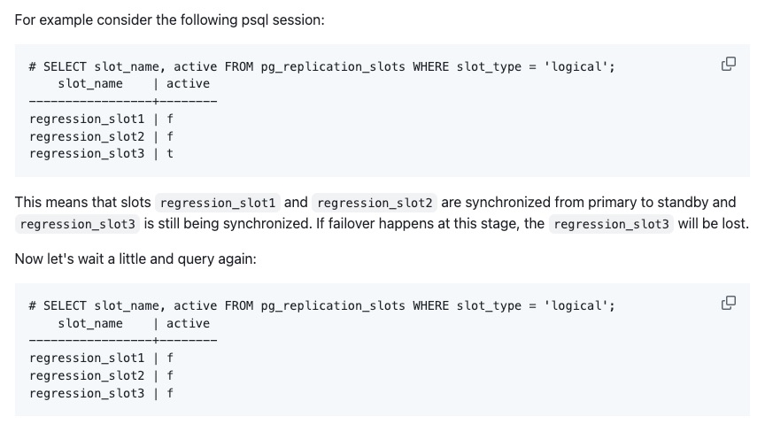
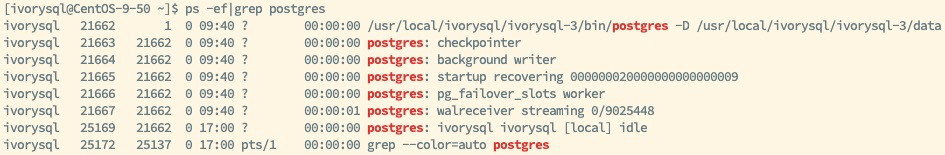
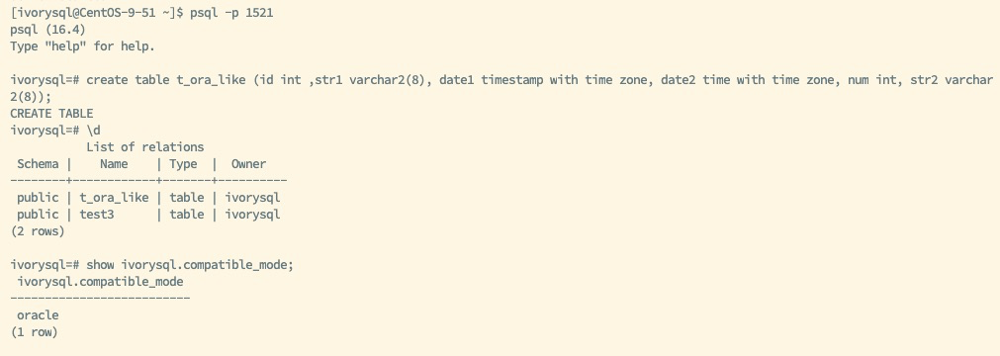
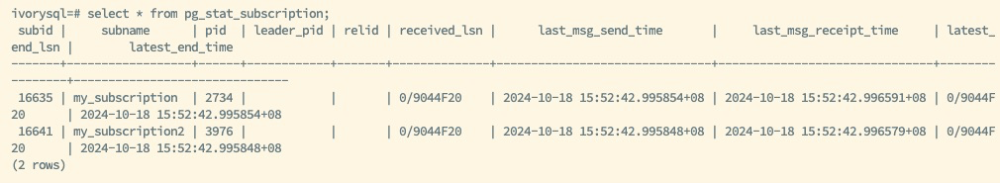
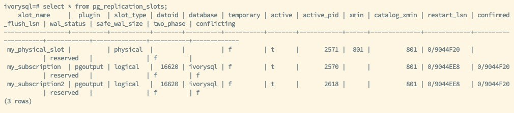
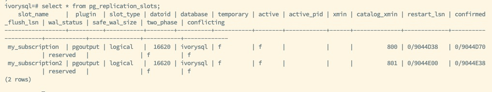
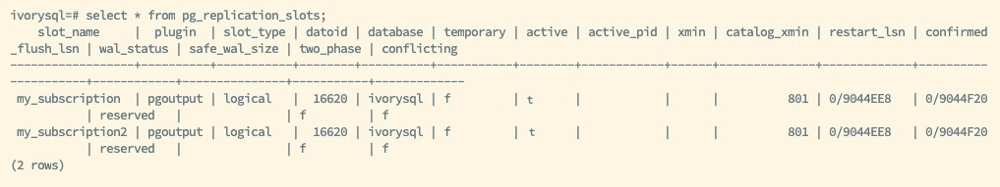
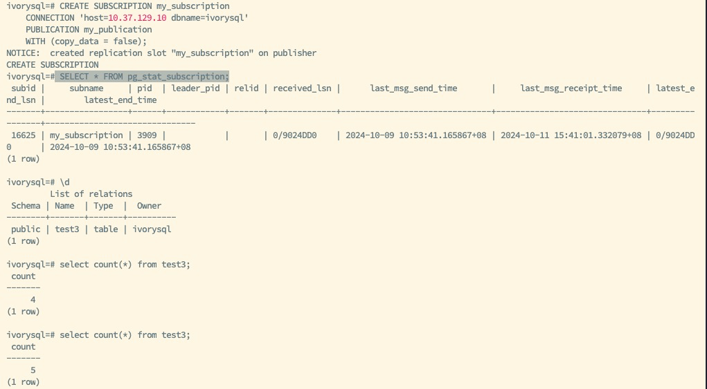

## 前言

在数据库高可用架构中，逻辑复制是实现数据同步和扩展的重要机制之一。通过逻辑复制，数据库管理员可以选择性地复制特定表的数据，而不必像物理复制那样进行全量数据库实例的复制。然而，逻辑复制槽的局限性在于它仅存在于主节点上，导致主备切换后新主节点无法继续向下游发送数据变更，直到重新创建或手动恢复逻辑复制槽。这种情况可能引发数据丢失，或者需要管理员手动干预，影响业务的连续性。

PostgreSQL 作为优秀的开源关系型数据库，提供了多种高可用性工具，其中 `pg_failover_slot` 插件专门解决了逻辑复制槽在主备切换时无法同步的问题，而 IvorySQL 作为一款基于 PostgreSQL 研发的兼容 Oracle 的数据库，同样适配该插件。

本文将详细介绍如何安装和配置 `pg_failover_slot` 插件，并说明它如何帮助 IvorySQL 实现无缝的逻辑复制槽同步。

## 逻辑复制槽的原理及局限性

在 PostgreSQL 中，逻辑复制与物理复制不同，它允许对特定表的数据变动进行行级别的精细化控制，并可以跨数据库版本和架构同步数据。逻辑复制的关键是通过逻辑复制槽记录并维护主节点上的数据变更，这些变更可以被下游的订阅者捕获和应用。

### 逻辑复制槽的工作原理

逻辑复制槽是 PostgreSQL 维护数据变更的缓冲机制，它存储了自上次传输以来的数据增量，直到下游订阅者成功接收这些数据。复制槽还记录了下游订阅者接收到的最后一个变更，以便在系统故障或网络问题时重新发送未完成的数据。

### 逻辑复制槽的局限性

逻辑复制槽仅在主节点上维护，因此在以下情况下会遇到问题：

- 故障转移后的数据丢失：当主节点宕机并且备节点被提升为主节点时，新的主节点没有复制槽的记录。此时，订阅者无法从新的主节点获取数据变更，直到管理员在新主节点上手动创建新的复制槽。
- 需要逻辑复制槽的手动创建及重新初始化：手动创建复制槽不仅繁琐，而且会造成数据同步的中断，可能需要重新初始化逻辑复制表，带来额外的负载和复杂度。

为了应对这些挑战，`pg_failover_slot` 插件能够自动同步主备节点之间的逻辑复制槽，确保故障转移时数据的连续性。

## pg_failover_slot 插件简介

`pg_failover_slot` 是专为 PostgreSQL 开发的一个插件，旨在解决逻辑复制槽无法在主备之间同步的问题。该插件通过在主节点和备节点之间同步逻辑复制槽，确保当备节点被提升为主节点时，它能够继续向下游订阅者发送数据变更，而不需要重新创建或手动干预。

插件的主要特性包括：

- 自动复制槽同步：`pg_failover_slot` 可以在主备节点之间同步逻辑复制槽，确保备节点具备相应的复制槽记录。
- 简化的故障转移流程：在主备切换后，无需手动创建新的逻辑复制槽，保证订阅者能够立即获取新主节点上的数据变更。
- 高可用性支持：槽的同步，`pg_failover_slot` 提高了系统的容错能力和可用性，减少了宕机时的管理负担。



## 安装和配置 pg_failover_slot 插件

为了在 IvorySQL 上使用 `pg_failover_slot` 插件，需要进行以下步骤。

### 系统环境准备

假设您已经在生产环境中部署了 IvorySQL，并且已经配置了主备节点环境：

- 主节点：primary_node

- 备节点：standby_node

确保 IvorySQL 主备架构运行正常，且已创建逻辑复制槽，并使用高可用工具来管理故障转移过程和 VIP 管理实现漂移。

### 下载并编译插件

首先，从 GitHub 下载并编译 `pg_failover_slot` 插件：

```
git clone

https://github.com/EnterpriseDB/pg_failover_slots.git

cd pg_failover_slots

make

make install
```

### 配置 IvorySQL

接下来，在主节点和备节点的 `postgresql.conf` 文件中添加 `pg_failover_slot` 插件到 `shared_preload_libraries`，并设置日志复制等级为 logical 或以上：

```
wal_level = logical
shared_preload_libraries = 'pg_failover_slots'
```

确保主库已创建物流复制槽，此为必要条件。

在备库配置：

```
hot_standby_feedback = on
primary_slot_name = ‘slot_name’
```

这一设置使数据库在启动时加载插件。完成配置后，重启主节点和备节点的 IvorySQL 实例：

`pg_ctl restart -D $PGDATA`



启动成功后，查看进程可看到 `pg_failover_slot worker` 的子进程，并且 `show shared_preload_libraries` 可查看到有 `pg_failover_slots` 的信息，即插件生效。

### 创建逻辑复制槽

使用 1521 端口进行 Oracle 模式连接，并主节点上创建带有兼容 Oracle 字段的表 `t_ora_like`、`test3`，下图显示模式为 Oracle 模式，显示 Oracle 属性字段 `varchar2` 的表 `t_ora_like`，作为基础测试表，旨在测试插件与 Oracle 兼容属性间的契合度。



然后在主节点上创建一个发布：

```
CREATE PUBLICATION my_publication FOR TABLE test3;
CREATE PUBLICATION my_publication2 FOR TABLE t_ora_like;
```

此时，当有订阅方通过 VIP 订阅此发布，会创建相应的逻辑复制槽，`pg_failover_slot` 插件将自动同步该复制槽到备节点。您无需手动在备节点上创建复制槽。





### 同步逻辑复制槽

备节点会同步相应的逻辑复制槽。



## 故障转移与复制槽恢复

`pg_failover_slot` 插件在主备节点上配置完成，它将自动管理逻辑复制槽的同步和故障转移。

### 故障转移流程

当主节点发生故障时，使用高可用工具进行故障转移，备节点将被提升为新的主节点，VIP 漂移到新节点。`pg_failover_slot` 插件会确保新主节点恢复并接管逻辑复制槽。

### 验证复制槽状态

在新的主节点上检查复制槽是否已经恢复：

`SELECT * FROM pg_replication_slots;`

新主节点上已经存在原先在旧主节点上创建的逻辑复制槽。这意味着下游订阅者可以继续从新主节点获取数据变更，确保逻辑复制的无缝衔接。



### 订阅者同步

下游订阅者无需任何额外操作，它们会通过 VIP 自动从新主节点接收更新，无需重新配置订阅。




## 最佳实践和注意事项

在使用 `pg_failover_slot` 插件时，以下最佳实践可以帮助您更好地管理和维护逻辑复制槽的高可用性：

- 合理配置复制槽上限：在高并发或大规模复制场景中，确保 `max_replication_slots` 参数配置合理。IvorySQL 的 `postgresql.conf` 文件中的这一参数需要根据工作负载的复杂性进行调整，以避免复制槽过载。
- 定期监控复制槽状态：使用 `pg_stat_replication_slots` 视图定期检查复制槽的状态，确保在主备节点之间的同步过程中没有出现延迟或丢失。结合高可用工具进行自动化故障转移，可以实现主备节点的自动化切换，VIP 的管理和漂移。`pg_failover_slot` 插件与高可用工具配合使用时，可以确保复制槽在故障转移过程中的无缝接管。
- 性能优化与监控：逻辑复制在高并发时可能会对系统性能造成一定压力，因此推荐定期监控系统的 I/O 性能和 CPU 利用率，必要时调优系统配置。

## 总结

IvorySQL 与 `pg_failover_slot` 插件为高可用环境中的逻辑复制提供了强大的支持。通过自动同步主备节点间的逻辑复制槽，`pg_failover_slot` 解决了故障转移后需要重新初始化复制槽的难题，显著提升了逻辑复制的稳定性和可用性。

对于需要无缝故障转移且不希望因复制槽问题导致下游订阅者丢失数据的用户来说，`pg_failover_slot` 是一种必不可少的工具。它简化了逻辑复制槽的管理流程，减少了数据库维护的复杂性，为高可用环境中的数据一致性保驾护航。

通过本文中的步骤，可以在 IvorySQL 中配置并使用 `pg_failover_slot` 插件，确保您的逻辑复制环境在主备切换时始终保持高效运行。