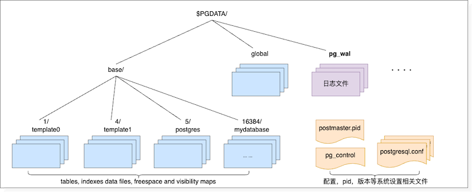
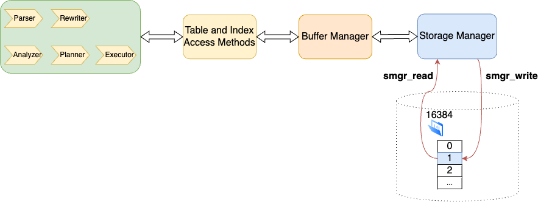
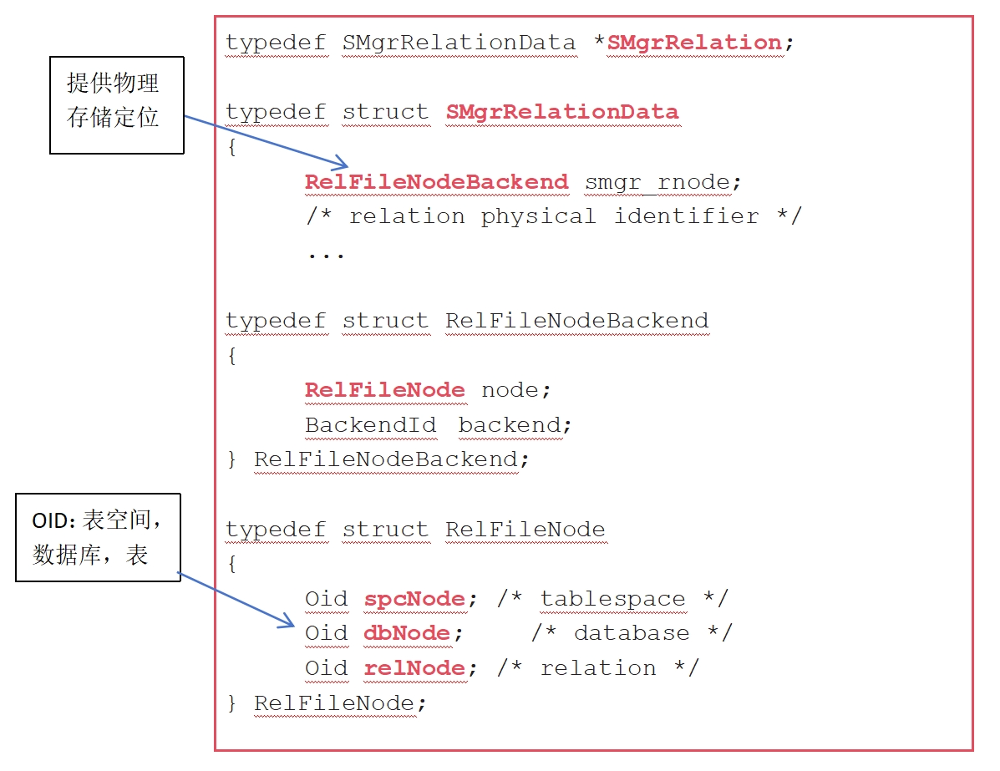

一般来说，数据库的存储系统分为内存和外存两个部分，而除了内存数据库之外，数据最终都是持久化存储的，持久化就要将数据从内存 buffer 落盘到外存，因此今天我们来聊聊 IvorySQL 中的外部存储管理器。

## 存储文件的分类

IvorySQL 数据库使用的存储管理器基本上与 PostgreSQL 相同，其文件目录及文件组织结构如下图：



从存储的角度看，文件管理分为 3 个主要部分：

- 配置相关的文件，比如 `pg_control`，`postgresql.conf`，`pg_hba.conf`，`PG_VERSION` 等；
- WAL 日志文件，`000000010000000000000001`， `000000010000000000000002` 等；
- 表，索引的数据记录文件，相应的剩余空间和可见性映射文件等。

配置相关的文件在 PostgreSQL 中使用标准文件读写函数处理，比如：记录数据库状态和操作的 `pg_control` 文件。其中后台模块通过 `ReadControlFile()`，`WriteControlFile()`，`UpdateControlFile()`  进行读写操作。前台工具通过 `get_controlfile()`，`update_controlfile()`  进行读写操作。无论前台还是后台，这些读写操作最终还是通过标准文件操作函数 `open()`，`read()`，`write()`  进行。这些对配置文件的直接操作不在 SMGR 管控范畴。

WAL 日志文件最终也是通过标准文件函数 `read()`，`write()` 等等完成读写（和配置文件类似）。但不同的是，文件名需要根据 LSN 动态计算获取。

表，索引数据记录存储在 base 目录下的相应数据库的子目录下。集群级别的 catalog（系统表）数据记录变化则反映在 global 目录下。系统表的管理与用户表类似，同样采用 OID 的命名方式。

## SQL 语句访问存储介质过程  

一条 SQL 语句通常按照如下路径访问一个磁盘上的数据记录：

- 首先语句先经过 5 阶段的查询处理：parse，rewrite，analyze，plan，execute。
- 再进到 Table/Index Access Method 层。
- Access Method 层通常会使用 Buffer Manager 服务，对数据条目进行操作，根据操作决定是否将数据块标记为“脏”。
- Buffer Manager 层会使用 Storage Manager 服务，根据 buffer tag 调用 `smgr_read()` 或 `smgr_write()` 来读取或写数据到存储介质。



## SMGR API 接口  

PostgreSQL 原本有许多 SMGR API 接口的实现，但目前只留下 Magnetic Disk（md.c）的实现（磁盘)。实际上，磁盘管理器可以支持任何类型的设备，只要操作系统为该设备提供了标准的文件系统操作接口。但是保留存储管理器（smgr.c）这个中间层，以防有人引入其他类型的存储管理器。删除中间层不会节省明显的开销，因为对存储介质的操作，比一层 c 语言函数调用昂贵的多的多。`f_smgr` 是一组函数指针结构，包含了 PostgreSQL 对存储所需要的函数。`smgr.c` 定义所有函数接口的 wrapper 函数，这些 wrapper 会最终调用实际注册的实现函数，也就是 `mdXXXX` 函数。

```c
static const f_smgr smgrsw[] = {
/* magnetic disk */
{
.smgr_init = mdinit,
.smgr_shutdown = NULL,
.smgr_open = mdopen,
.smgr_close = mdclose,
.smgr_create = mdcreate,
.smgr_exists = mdexists,
.smgr_unlink = mdunlink,
.smgr_extend = mdextend,
.smgr_prefetch = mdprefetch,
.smgr_read = mdread,
.smgr_write = mdwrite,
.smgr_writeback = mdwriteback,
.smgr_nblocks = mdnblocks,
.smgr_truncate = mdtruncate,
.smgr_immedsync = mdimmedsync,
}
};
```

SMgrRelation 是一个重要的结构体，几乎所有和 SMGR 相关的函数都需要这个结构。



## SMGR 关键接口函数  

- `Smgrread()` 根据 5 个参数：tablespace，database，relation，forknum 和 blocknum 定位一个 8K 数据块，并将其读入指定的内存中。

  `smgrread(SMgrRelation reln, ForkNumber forknum, BlockNumber blocknum, char * buffer)`

- `Smgrwrite()` 根据 5 个参数定位一个 8K 数据块，然后用指定内存中的值将其覆盖。根据 skipFsync 决定是否在返回前保证数据落盘成功。

  `smgrwrite(SMgrRelation reln, ForkNumber forknum, BlockNumber blocknum, char * buffer, bool skipFsync)`

- smgrextend 负责在当前文件中扩展一个新的 8K 块并写入指定内存中的数据，其他与 smgrwrite 相同。
    
   `smgrextend(SMgrRelation reln, ForkNumber forknum, BlockNumber blocknum, char * buffer, bool skipFsync)`

- smgrnblocks 返回指定表当前的 8K 数据块总数，这个值对语句处理的 planner 环节很重要。

  `smgrnblocks(SMgrRelation reln, ForkNumber forknum)`

- 对象共同存在。

  `smgropen(RelFileNode rnode, BackendId backend)`

- smgrclose 负责从哈希表中删除指定的 SMgrRelation 对象。

  `smgrclose(SMgrRelation reln)`

- smgrtruncate 用于从文件（数据，剩余空间，可见性）中从后往前去删除指定数量的 8K 数据块，可以一次对上述 3 个 fork 文件分别去除多个数据块，最终缩小文件尺寸。

  `smgrtruncate(SMgrRelation reln, ForkNumber *forknum, int nforks, BlockNumber *nblocks)`

- smgrprefetch 利用 POSIX_FADV_WILLNEED 提供的服务要求操作系统提前读取磁盘数据块到缓存中，这个动作可避免磁盘 I/O 瓶颈。

  `smgrprefetch(SMgrRelation reln, ForkNumber forknum, BlockNumber blocknum)`

smgrwrite 和 smgrextend 是写磁盘相关的重要函数，也是影响系统 I/O 性能的关键。它们在以下场景下被调用：

- smgrwrite：
  - 当一个缓冲区（Buffer）被修改（即脏数据）时，调用 smgrwrite 将数据写到磁盘上的对应文件中；
  - 当事务提交时，需要确保已经将所有的脏数据写回磁盘，这就需要调用 smgrwrite；
  - 在 VACUUM 操作中，当对表的可见性信息进行更新时，相应的缓冲区可能会变为脏数据，需要通过 smgrwrite 将其写进磁盘；
- smgrextend：
  - 当需要扩展一个文件（表或索引）时，调用 smgrextend 将文件扩展到所需的大小；
  - 创建一个新表或索引时，需要确定其初始大小，也会调用 smgrextend；
  - 执行 CLUSTER 操作时，需要将表重新组织，也可能会调用 smgrextend；
  - smgrwrite 和 smgrextend 用于确保数据的持久性，smgrwrite 用于将修改的数据写进磁盘，而 smgrextend 用于扩展文件大小。
