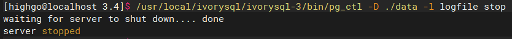
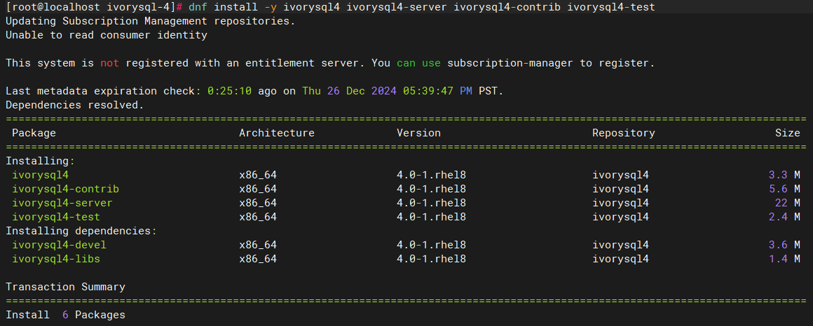
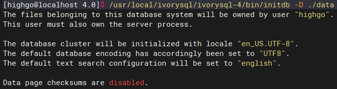
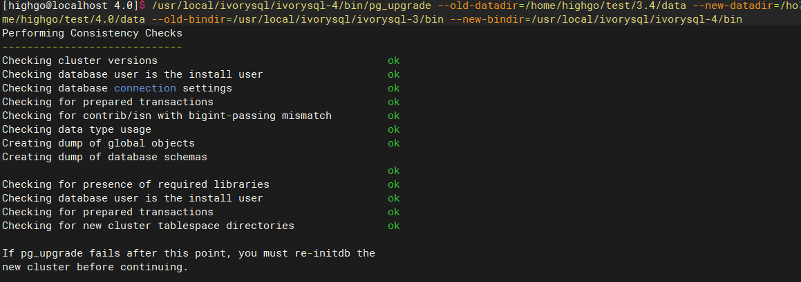
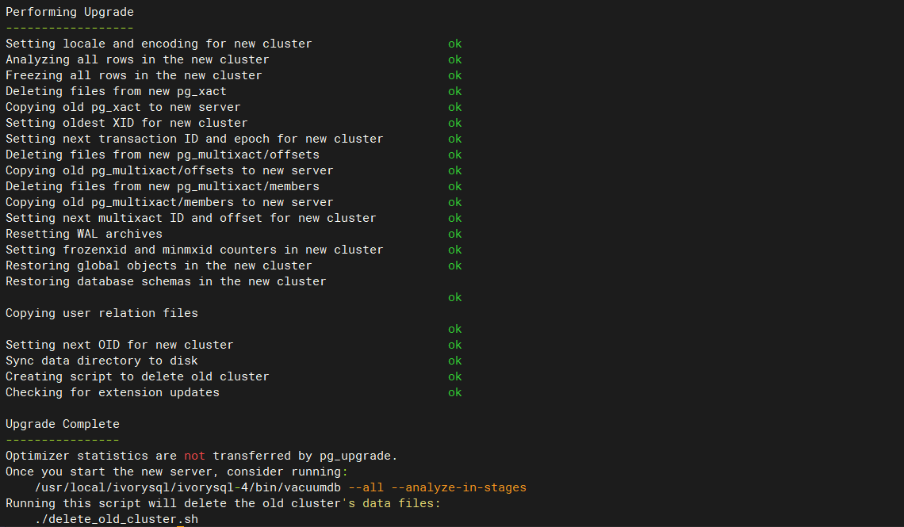
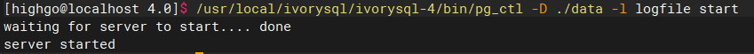

日前，IvorySQL 4.0 重磅发布，全面支持 PostgreSQL 17，并且增强了对 Oracle 的兼容性。

本篇文章将详细描述，如何从 IvorySQL 3.x 升级到 IvorySQL 4.0。

## `pg_upgrade` 工具介绍

`pg_upgrade` 工具是 PostgreSQL 内置的跨版本升级工具，能够对数据库就地升级，不需要执行导出和导入操作。IvorySQL 源自于 PG，因此也能够使用 `pg_upgrade` 工具进行大版本升级。

`pg_upgrade` 提供了升级前的兼容性检查（`-c` 或者 `--check` 选项）功能，可以发现插件、数据类型不兼容等问题。如果指定了 `--link` 选项，新版本服务可以直接使用原有的数据库文件而不需要执行复制，通常可以在几分钟内完成升级操作。

常用的参数包括：

* `-b bindir，--old-bindir=bindir`：旧的 IvorySQL  可执行文件目录
* `-B bindir，--new-bindir=bindir`：新的 IvorySQL 可执行文件目录
* `-d configdir，--old-datadir=configdir`：旧版本的数据目录
* `-D configdir，--new-datadir=configdir`：新版本的数据目录
* `-c，--check`：只检查升级兼容性，不更改任何数据
* `-k，--link`：硬链接方式升级

下面介绍一下在 CentOS 8 平台上如何使用 `pg_upgrade` 将 IvorySQL 升级到最新的 4.0 版本。

## 升级准备

首先停止旧版本的 IvorySQL 3.4 数据库：

然后安装新版本的 IvorySQL 4.0 数据库：

初始化新版 IvorySQL 4.0 数据目录：

检查版本兼容性：

最后出现 `Clusters are compatible` 表明两个版本之间的数据不存在兼容性问题，可以进行升级。

## 正式升级

看到 `Upgrade Complete` 说明升级已经顺利完成。

## 更新统计信息

`pg_upgrade` 会创建新的系统表，并重用旧的数据进行升级，统计信息并不会随升级过程迁移，所以在启用新版本之前，应该首先重新收集统计信息，避免没有统计信息导致错误的查询计划。

首先启动新版本数据库：

手动运行 `vacuum` 命令：

## 升级后的清理

确认没有问题后删除旧库：

至此，我们就完成了整个升级过程。

如果您在后续的升级过程中，遇到问题，可以在 GitHub 上提交 [issue](https://github.com/IvorySQL/IvorySQL/issues)，我们将及时为您解答。同时，如果您对 IvorySQL 后续的功能迭代有任何想法或者期待，也可以提交 issue 反馈给我们。
