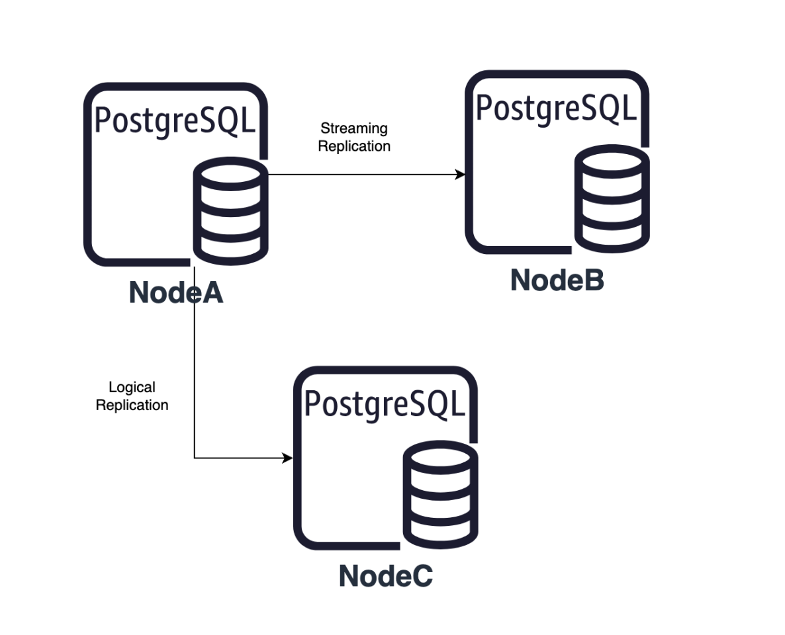
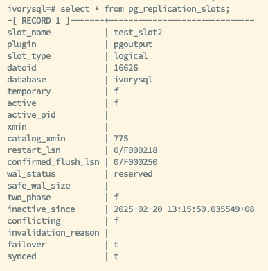
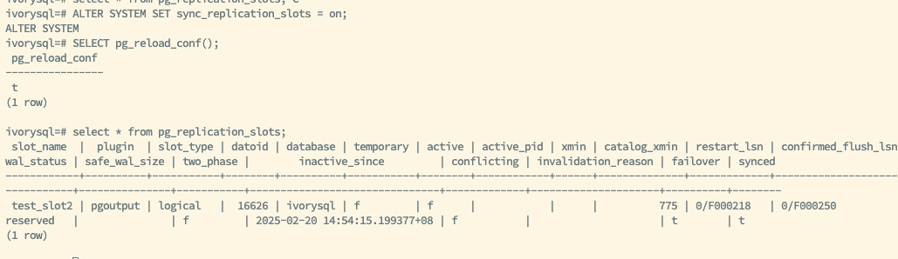
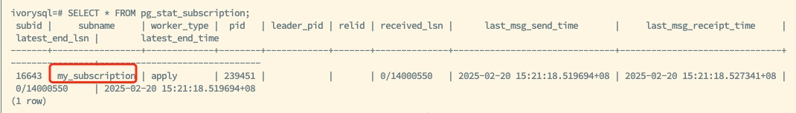

IvorySQL v4 基于 PostgreSQL 17，引入了逻辑复制槽同步至热备份数据库的功能。这一改进有效解决了旧版本中主数据库与备份数据库切换后逻辑复制中断的问题。对于那些追求数据高可用性和业务连续性的数据库来说，这无疑是一个重大的利好消息。它不仅提升了系统的整体稳定性，还确保了在故障发生时，数据复制过程能够无缝继续，从而最大程度地降低了业务中断的可能性。



## 复制槽同步机制

### 前提条件

1. **物理复制槽**：主数据库与备份数据库之间必须存在物理复制槽，作为逻辑复制槽同步的基础，确保数据在主备之间有效传输。。
2. **配置参数**：
   - 在备份数据库上配置 `primary_slot_name` 参数，并在使用 `pg_basebackup` 工具时指定复制槽。这一配置步骤确保了备份数据库能够正确接收主数据库数据。
   - 启用备份数据库的 `hot_standby_feedback` 功能，确保其能接收并反馈 WAL 日志。这一功能的启用保证了备份数据库在接收数据时的活跃性和反馈机制的完整性。
   - 在 `primary_conninfo` 参数中指定有效的数据库名称（`dbname`）。这一配置确保了复制过程中的目标数据库是明确且正确的。
3. **推荐配置**：在主数据库上配置 `standby_slot_names` 参数以保持复制槽同步的一致性。这一配置有助于维护主备数据库间复制槽的一致状态，从而提高复制过程的可靠性。

### 实现方式

1. **创建逻辑复制槽**：
   调用 `pg_create_logical_replication_slot` 函数时设置 `failover=true`，指定复制槽同步至备份数据库。这一设置至关重要，因为它决定了复制槽在主备切换时的行为。

2. **订阅配置**：
   使用 `CREATE SUBSCRIPTION` 语句时指定 `failover=true`，确保复制槽同步至备份数据库。这为数据库管理员提供了灵活的配置选项，使他们能够根据实际业务需求和环境特点定制复制策略。

3. **手动同步**：
   在备份数据库上执行 `pg_sync_replication_slots` 函数，手动同步复制槽。这种方法提供了一种即时同步的手段，特别适用于需要立即反映主数据库变更的场景。

4. **自动同步：**
   设置备份数据库的 `sync_replication_slots = on`，实现定期自动同步，无需重启数据库。这一自动化功能简化了数据库的维护工作，使管理员能够将更多精力投入到其他关键任务中。

下图是配置及创建同步逻辑复制槽的流程图，详细的顺序讲解了如何配置同步逻辑复制槽基础参数，以及如何创建一个同步逻辑复制槽。


## 函数与参数

1. `pg_create_logical_replication_slot`

- 新增了 failover 参数，其默认值为 false。若设置为 true，则表示该复制槽需同步至备份数据库。
- 示例语法：
  ```sql
  SELECT pg_create_logical_replication_slot('test_slot', 'test_decoding', false, false, true)
  ```
- 这一函数的引入，为数据库管理员提供了更精细的控制手段，使得逻辑复制槽的管理更加灵活和高效。

2. `pg_sync_replication_slots`

- 该函数用于手动同步复制槽至备份数据库。
- 示例语法：
  ```sql
  SELECT pg_sync_replication_slots()
  ```
- 通过这一函数，可以即时地将主数据库的变更同步到备份数据库，确保数据的一致性和完整性。

3. `sync_replication_slots`

- 在备份数据库上设置该参数为 on，可实现复制槽变更的定期自动同步，无需重启数据库。
- 这一自动化设置极大地减轻了数据库管理员的负担，使得复制槽的维护工作更加轻松和高效。




如上图所示，为主库和备库的复制槽的状态，主库创建了逻辑复制槽 `test_slots2`，并定义属性 failover 为 true，开启了这个槽的故障转移功能，通过手动或自动的方式，可以将逻辑复制槽 `test_slots2` 的状态及信息同步至备库，当发生主备切换或者故障转移时，备库被提升为新主时，逻辑复制槽 `test_slots2` 的信息将会保留，从而保证订阅端间断、不丢失数据。

## 操作步骤与验证

### 手动同步复制槽

搭建主数据库与备份数据库环境，确保主数据库和备份数据库的配置正确，包括物理复制槽和流复制用户。这一过程需要仔细规划和执行，以确保复制环境的稳定性和可靠性。

1. 创建复制槽：

- 执行
  ```sql
  SELECT pg_create_logical_replication_slot('test_slot2', 'test_decoding',false, false, true)
  ```
- 这一操作是逻辑复制槽同步的起点，它为后续的数据复制奠定了基础。

2. 在备份数据库上手动同步复制槽：

- 执行
  ```sql
  SELECT pg_sync_replication_slots()
  ```
- 这一操作确保了复制槽的变更能够及时反映到备份数据库上，从而保证了数据的同步性和一致性。

3. 验证复制槽同步：

- 在备份数据库上执行查询，以确保复制槽已同步至备份数据库。
- 执行
  ```sql
  SELECT \* FROM pg_replication_slots
  ```
- 这一验证步骤是确认复制槽同步成功的关键环节，它确保了复制过程的正确性和完整性。

### 自动同步复制槽

1. 在备份数据库上设置 `sync_replication_slots = on`：

- 执行
  ```sql
  ALTER SYSTEM SET sync_replication_slots = on
  ```
- 然后执行
  ```sql
  SELECT pg_reload_conf()
  ```
- 这一自动化设置使得复制槽的同步工作更加简便和高效，管理员无需手动介入即可完成同步任务。

2. 验证自动同步：

   在主数据库插入数据，观察备份数据库复制槽的变化，以确保主数据库复制槽的变更能够自动同步到备份数据库。这一验证步骤是确认自动同步功能正常工作的关键环节，它确保了复制过程的自动化和可靠性。



### 模拟主数据库与备份数据库的切换

1. 在备份数据库上执行主数据库提升操作：
- 模拟主数据库故障，将主数据库关机。
- 在备份数据库上执行
  ```sql
  pg_ctl -D data promote
  ```
- 这一操作模拟了主数据库发生故障时的应急切换，是测试复制槽同步功能在实际故障场景中表现的重要步骤。

2. 在新的主数据库上继续进行逻辑复制：

   在新的主数据库绑定 VIP，以确保逻辑复制能够继续进行。这一操作确保了在主数据库切换后，逻辑复制能够无缝地继续进行，从而保证了业务的连续性和数据的一致性。


上图为切换后的新主，保留了原有的逻辑复制槽 `my_subscription` 和发布信息 `my_publication`。并且配置其他必要参数后，恢复新备库的逻辑复制槽同步能力。

订阅端根据 VIP 路由至新主数据库，继续使用同步的逻辑复制槽，保证逻辑复制的正常数据复制。



## 总结

逻辑复制槽同步功能提升了 IvorySQL 在高可用性环境下的可靠性，解决了主数据库与备份数据库切换后逻辑复制槽丢失的问题。这一功能的引入，使得数据库面对主备切换时，保证逻辑复制槽的信息不丢失，确保了数据复制过程的连续性和一致性。

同步过程需满足以下条件：

- 设置 `failover=true` 的复制槽；
- 主数据库与备份数据库间配置物理复制槽；
- 备份数据库启用 `hot_standby_feedback`；
- 备份数据库的 `primary_conninfo` 参数配置正确的数据库名称；
- 推荐配置 `standby_slot_names` 参数以确保一致性；
- 通过 `pg_sync_replication_slots` 或 `sync_replication_slots` 参数，备份数据库可以手动或自动同步复制槽，确保逻辑复制能够无缝切换。

这一系列的措施和功能，共同构成了 IvorySQL 中逻辑复制槽同步功能的强大和灵活，为数据库管理员提供了强大的工具，以应对各种复杂和挑战性的数据复制场景。