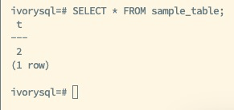
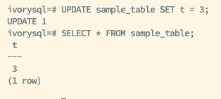
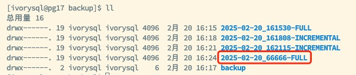
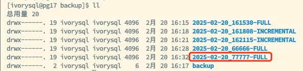
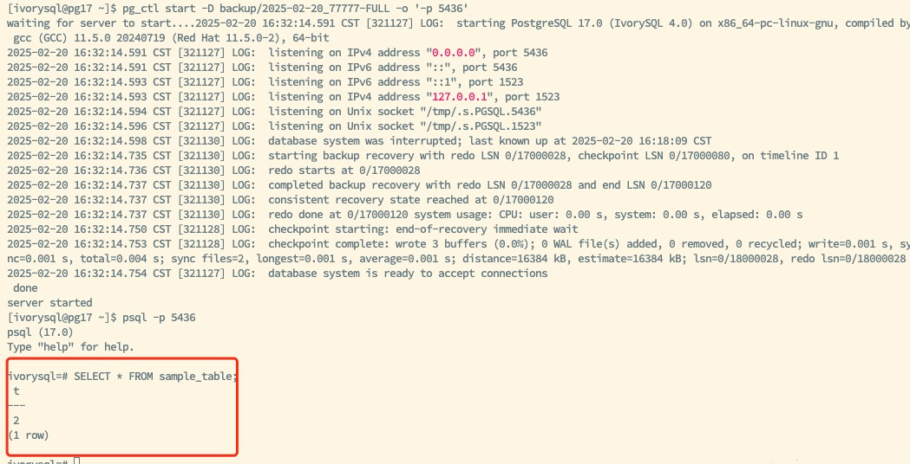

## 1. 概述

IvorySQL v4 引入了块级增量备份和增量备份合并功能，旨在优化数据库备份与恢复流程。通过 `pg_basebackup` 工具支持增量备份，显著降低了存储需求和备份时间。同时，`pg_combinebackup` 工具能够将多个增量备份合并为单个完整备份，提升了数据恢复的灵活性和效率。

## 2. 特性介绍

IvorySQL 的增量备份通过记录每个 checkpoint 周期内的数据变更，确保仅备份自上次备份以来发生变化的数据块。这种机制不仅减少了所需的存储空间，也缩短了备份过程中的 I/O 操作时间。此外，`pg_combinebackup` 工具支持将多个增量备份合并为一个完整备份，使得在数据恢复时不再需要逐个应用增量备份，大大简化了恢复流程。


### 2.1 启用增量备份特性

为启用增量备份功能，首先需要在数据库中配置相关参数并重新加载配置文件：

```sql
ALTER SYSTEM SET summarize_wal = ON;
SELECT pg_reload_conf();
``` 

接着，创建测试表并插入初始数据，以便后续进行备份操作：

```sql
CREATE TABLE sample_table(t INT);
INSERT INTO sample_table VALUES (1);
SELECT * FROM sample_table;
``` 


### 2.2 执行全量备份

使用 `pg_basebackup` 工具执行全量备份，并生成包含 `backup_manifest` 的备份文件，以便后续增量备份的基础：

```bash
pg_basebackup -Fp -D /backup/\$(date +%Y-%m-%d*%H%M%S-FULL)
``` 

此命令将全量备份数据保存至指定目录，并记录当前的备份状态。

### 2.3 进行增量备份

（1）在对数据进行修改后，执行增量备份以记录自上次全量备份或增量备份以来的变更。

修改表数据并执行第一次增量备份：

```sql
UPDATE sample_table SET t = 2;
SELECT * FROM sample_table;
```



执行增量备份：

```bash
pg_basebackup -Fp -D /backup/\$(date +%Y-%m-%d*%H%M%S-INCREMENTAL) -i /backup/2025-02-20_161530-FULL/backup_manifest
```

（2）再次修改表数据并执行第二次增量备份。

```sql
UPDATE sample_table SET t = 3;
SELECT * FROM sample_table;
```



然后执行第二次增量备份：

```bash
pg_basebackup -Fp -D /backup/\$(date +%Y-%m-%d*%H%M%S-INCREMENTAL) -i /backup/2025-02-20_161808-INCREMENTAL/backup_manifest
```


### 2.4 合并增量备份

合并全量备份和多个增量备份，创建新的完整备份，以便后续的恢复操作：

```bash
cd /backup
pg_combinebackup 2025-02-20_161530-FULL 2025-02-20_161808-INCREMENTAL 2025-02-20_162115-INCREMENTAL -o 2025-02-20_66666-FULL
```



> 注意事项：全量备份必须在参数列表的首位，增量备份需要按时间顺序排列，以确保数据恢复的完整性与一致性。

### 2.5 恢复合并后的备份

启动数据库并验证数据的完整性：

```sql
pg_ctl start -D /backup/2025-02-20_66666-FULL -o '-p 5435'
SELECT * FROM sample_table;
```


### 2.6 合并指定增量备份

如需恢复到特定的增量备份状态，可以选择合并到某个中间增量备份：

```sql
pg_combinebackup 2025-02-20_161530-FULL 2025-02-20_161808-INCREMENTAL -o 2025-02-20_77777-FULL
```



然后启动数据库并验证数据：

```sql
pg_ctl start -D /backup/2025-02-20_77777-FULL -o '-p 5436'
SELECT * FROM sample_table;
```


## 3. 注意事项

### 备份顺序

确保全量备份在合并命令的首位，增量备份按照时间顺序排列，以避免合并过程中的数据不一致性问题。

### 增量备份存储管理

虽然增量备份减少了存储空间的需求，但恢复操作依赖于完整的增量备份链，任何增量备份的丢失将直接导致恢复失败。因此，建议定期检查和合并增量备份，以确保备份链的完整性和可靠性。

### 性能监控

在执行增量备份和合并操作时，监控数据库的性能，确保操作对系统性能的影响在可接受范围内，避免在高负载时段进行备份操作。

## 4. 总结

IvorySQL 提供的块级增量备份与 `pg_combinebackup` 工具显著提升了数据库的备份与恢复效率。通过只备份变更的数据块，增量备份在减小存储占用和缩短备份时间方面展现出卓越性能，而合并增量备份功能则简化了恢复流程，提升了操作的便捷性。

这些先进的特性使得 IvorySQL 成为大规模数据库和对数据恢复要求严格的环境的理想选择，能够提供灵活而高效的备份与恢复解决方案，确保数据的安全与可用性。
