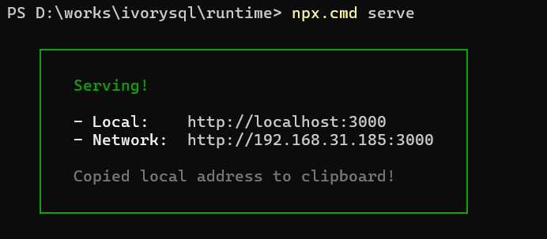
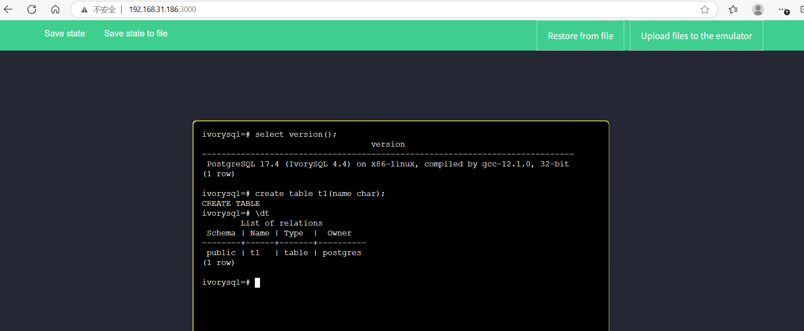
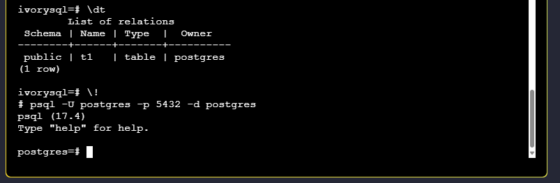

## 简介

为了降低社区用户的使用门槛，提升使用体验，IvorySQL 社区特别推出了 IvorySQL-WASM 项目，帮助用户快速在线 Demo。

IvorySQL-WASM 基于开源的 Postgres-WASM 框架开发。它允许用户直接在网页浏览器中体验 IvorySQL，无需本地安装或复杂部署。通过结合 WebAssembly 和虚拟化技术，IvorySQL-WASM 提供了一种简单、轻量且易于访问的方式，让开发者、测试人员和数据库爱好者能够轻松探索 IvorySQL 的强大功能。

## 技术分析

IvorySQL-WASM 核心技术：

- **V86**：x86 模拟器，用于模拟虚拟操作系统所需的硬件环境，包括 CPU、内存、VGA、BIOS 和串口等组件。

- **BuildRoot**：用于构建在 V86 上运行的精简 Linux 系统镜像，集成 IvorySQL 4.4 服务及其稳定运行环境。

- **WebAssembly (WASM)**：一种低级的类汇编二进制指令格式，通过 [Emscripten](https://emscripten.org/ "Emscripten") 等工具将 C/C++ 代码编译为 WASM 模块，从而将现有的 C 库生态系统移植到 Web 平台。WASM 具有紧凑的二进制格式和接近原生的运行性能，是 IvorySQL-WASM 项目运行数据库服务的核心技术。

## 快速部署

开发者若想在本地部署 IvorySQL-WASM 项目，可参考以下步骤：

### Linux 环境

1. 准备运行依赖工具：Node.js 和 npm。
2. 克隆项目：`git clone git@github.com:IvorySQL/ivorysql-wasm.git`
3. 进入 `package/runtime` 目录，启动 http 服务：`npx serve`
4. 在浏览器访问：`http://server_ip:3000`

### Windows 环境

1. 下载并安装 [Node.js](https://nodejs.org/dist/v22.15.0/node-v22.15.0-x64.msi "Node.js")。
2. 在 PowerShell 的相应目录下执行 `npx.cmd serve`，启动 http 服务器。



## 体验

通过访问 `http://192.168.31.186:3000/`，用户可以进行 IvorySQL 在线体验，例如创建 `t1` 表格并列出表格。



运行精简 Linux 虚拟机时，浏览器需先下载相关镜像系统文件（约 35MB）和状态快照（15MB）。因此，首次打开页面可能需要等待几秒至二十几秒，具体时长取决于 http 服务位于内网还是外网环境。状态快照用于快速加载预配置的数据库。

通过任务管理器可以观察到，IvorySQL 在浏览器中的运行对 CPU 和内存的占用较为理想。


### 注意事项

1. 数据库存储在内存中，刷新页面后数据库将被清空，系统恢复到初始状态。
2. IvorySQL 采用双端口设计，默认连接端口为 1521。若需从 5432 端口登录，请在 shell 终端退出 psql，然后执行：

   ```bash
   psql -U postgres -p 5432 -d postgres
   ```

   

3. 如果用户想保存当前的数据库怎么办？请点击“Save state to file”，浏览器会自动产生并下载 `v86state.bin` 文件；再次使用保持的数据库时，点击页面“Restore from file”，上传 `v86state.bin` 文件即可。
4. V86 系统最小内存配置 128 MB，即当前为配置。

### 开发者可以改动源码，满足实际需求。

1. BuildRoot 部分请参考 `package/buildroot/README.md`
2. V86 部分请参考https://github.com/copy/v86/releases/tag/latest
3. Web 页面部分请参考 `package/runtime/README.md`

## 社区版即将发布

IvorySQL-WASM 社区版将会伴随 IvorySQL 4.5 一起发布，详情请关注 [IvorySQL 官网](https://www.ivorysql.org/zh-CN/)信息。