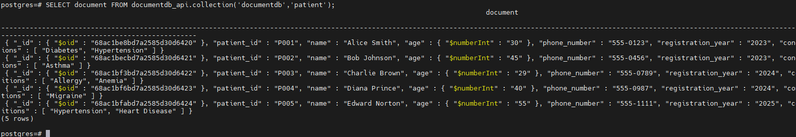

## 背景

MongoDB 诞生之初，便以**出色的易用性**与**详尽的驱动程序文档**脱颖而出，堪称对传统关系型数据库的一次重要革新，也正因如此，它迅速成为开发者社区的热门之选。

然而，随着其许可模式从开源转向 [SSPL 许可证](https://www.ferretdb.com/sspl)，MongoDB 的授权机制变得日趋复杂——这一变化直接导致它不再适配大量开源项目，同时也让许多处于早期阶段的商业项目难以将其纳入技术选型。

在此背景下，越来越多用户开始寻求 MongoDB 的文档数据库替代方案，其中，**FerretDB 与搭载 DocumentDB 插件的 PostgreSQL 组合**，凭借兼容特性与灵活的许可优势，成为了极具竞争力的优质选择。

DocumentDB 作为一个微软开发的引擎，用来驱动基于 vCore 的 Azure Cosmos DB for MongoDB，它引入了 BSON 数据类型，并提供 API 以便在原生 PostgreSQL 中无缝操作。

有不少人已经注意到，刚刚发布的 IvorySQL 4.6 有一个新特性是提供了兼容 MongoDB 的解决方案：使用 FerretDB 和 DocumentDB 提供兼容 MongoDB 的解决方案。这一解决方案使得 IvorySQL 4.6 除了兼容 Oracle 之外也兼容了 MongoDB。

`ivydocumentdb` 是基于微软 DocumentDB 并适配了 IvorySQL 的项目。它提供了面向文档的 NoSQL 数据库的原生实现，使用户能够在 IvorySQL 框架下，对 BSON（Binary JSON，二进制 JSON）数据类型进行无缝的 CRUD（创建、读取、更新、删除）操作。

本文将介绍如何使用 `ivydocumentdb`，在本地搭建一个含 DocumentDB 插件的 IvorySQL 环境，以平替 MongoDB。

## 安装方法

安装环境：CentOS Stream 9

### 下载源码

```
sudo dnf install -y git
git clone https://github.com/IvorySQL/ivydocumentdb.git
cd ivydocumentdb && git checkout IVYDOCDB_REL_4_STABLE
```

### 创建临时文件夹并复制安装脚本

```
sudo dnf install -y wget curl cmake unzip
sudo mkdir -p /tmp/install_setup
sudo cp ./scripts/* /tmp/install_setup
sudo chmod 777 /tmp/install_setup/*
```

### 准备编译环境

```
sudo dnf install -y epel-release
sudo dnf install -y bison readline-devel zlib-devel openssl-devel
sudo dnf groupinstall -y 'Development Tools'
sudo dnf config-manager --set-enabled crb
sudo dnf install -y perl-IPC-Run
sudo dnf install -y  gnupg2        tzdata pkgconf-pkg-config cmake       glibc-langpack-en     gcc     gdb      bison     flex     readline-devel     zlib-devel     krb5-devel     libtool     libicu-devel     openssl-devel perl-Test-Harness perl-core libxml2-devel
```

### 安装 IvorySQL 并编译相关插件

```
export MAKE_PROGRAM=cmake && sudo INSTALL_DEPENDENCIES_ROOT=/tmp/install_setup /tmp/install_setup/install_setup_libbson.sh

sudo INSTALL_DEPENDENCIES_ROOT=/tmp/install_setup /tmp/install_setup/install_setup_postgres.sh -d "/var/local/ivorysql/ivory-4" -v 4

sudo env "PATH=/var/local/ivorysql/ivory-4/bin:$PATH" IVORYVERSION=4 INSTALL_DEPENDENCIES_ROOT=/tmp/install_setup /tmp/install_setup/install_setup_rum_oss.sh

sudo env "PATH=/var/local/ivorysql/ivory-4/bin:$PATH" IVORYVERSION=4 INSTALL_DEPENDENCIES_ROOT=/tmp/install_setup /tmp/install_setup/install_setup_citus_core_oss.sh 12

sudo env "PATH=/var/local/ivorysql/ivory-4/bin:$PATH" IVORYVERSION=4 INSTALL_DEPENDENCIES_ROOT=/tmp/install_setup /tmp/install_setup/install_citus_indent.sh


sudo env "PATH=/var/local/ivorysql/ivory-4/bin:$PATH"  IVORYVERSION=4 INSTALL_DEPENDENCIES_ROOT=/tmp/install_setup /tmp/install_setup/install_setup_system_rows.sh

sudo env "PATH=/var/local/ivorysql/ivory-4/bin:$PATH"  IVORYVERSION=4 INSTALL_DEPENDENCIES_ROOT=/tmp/install_setup /tmp/install_setup/install_setup_pg_cron.sh

sudo INSTALL_DEPENDENCIES_ROOT=/tmp/install_setup /tmp/install_setup/install_setup_intel_decimal_math_lib.sh

sudo INSTALL_DEPENDENCIES_ROOT=/tmp/install_setup /tmp/install_setup/install_setup_pcre2.sh

sudo env "PATH=/var/local/ivorysql/ivory-4/bin:$PATH"  INSTALL_DEPENDENCIES_ROOT=/tmp/install_setup IVORYVERSION=4 /tmp/install_setup/install_setup_pgvector.sh

sudo dnf install -y proj-devel libxml2-devel json-c-devel geos-devel

sudo env "PATH=/var/local/ivorysql/ivory-4/bin:$PATH"  INSTALL_DEPENDENCIES_ROOT=/tmp/install_setup IVORYVERSION=4 /tmp/install_setup/install_setup_postgis.sh
```

### 编译并安装 ivydocumentdb

```
sudo env "PATH=/var/local/ivorysql/ivory-4/bin:$PATH" make
sudo env "PATH=/var/local/ivorysql/ivory-4/bin:$PATH" make install
env "PATH=/var/local/ivorysql/ivory-4/bin:$PATH" IVY_VERSION_USED=4 /tmp/install_setup/start_oss_server.sh -d ~/data
```

当看到如下图所示内容，DocumentDB 就安装成功了。


## 使用方法

### 连接数据库并测试

为检查 DocumentDB 插件是否正常工作，需要连接数据库进行增删改查操作。
`psql -U $USER -d postgres -p 9712`


创建文档并插入数据：

```
SELECT documentdb_api.create_collection('documentdb','patient');

select documentdb_api.insert_one('documentdb','patient', '{ "patient_id": "P001", "name": "Alice Smith", "age": 30, "phone_number": "555-0123", "registration_year": "2023","conditions": ["Diabetes", "Hypertension"]}');
select documentdb_api.insert_one('documentdb','patient', '{ "patient_id": "P002", "name": "Bob Johnson", "age": 45, "phone_number": "555-0456", "registration_year": "2023", "conditions": ["Asthma"]}');
select documentdb_api.insert_one('documentdb','patient', '{ "patient_id": "P003", "name": "Charlie Brown", "age": 29, "phone_number": "555-0789", "registration_year": "2024", "conditions": ["Allergy", "Anemia"]}');
select documentdb_api.insert_one('documentdb','patient', '{ "patient_id": "P004", "name": "Diana Prince", "age": 40, "phone_number": "555-0987", "registration_year": "2024", "conditions": ["Migraine"]}');
select documentdb_api.insert_one('documentdb','patient', '{ "patient_id": "P005", "name": "Edward Norton", "age": 55, "phone_number": "555-1111", "registration_year": "2025", "conditions": ["Hypertension", "Heart Disease"]}');
```


查询刚刚插入的数据：

```
SELECT document FROM documentdb_api.collection('documentdb','patient');
```



至此，用户就可以在 IvorySQL 上使用 `documentdb_api` 进行增删改查了。

## FerretDB

最后，我们需要使用 FerretDB 作为一个 Proxy，将 MongoDB 5.0+ wire 协议查询转换为 SQL，并使用带有 DocumentDB 扩展的 IvorySQL 作为数据库引擎，完成对 MongoDB 的平替。

```
wget https://github.com/FerretDB/FerretDB/releases/download/v2.5.0/ferretdb-amd64-linux && chmod 777 ferretdb-amd64-linux
ferretdb-amd64-linux --postgresql-url "postgres://<username>:<user_password>@localhost:9712/postgres"
```

FerretDB 具体介绍及使用方式，可以参考 [FerretDB 官网](https://docs.ferretdb.io/)。

此时，FerretDB 就完成了部署，MongoDB 客户端通过 FerretDB 的 `27017` 端口及 IvorySQL 数据库的用户名密码，连上含 DocumentDB 插件的 IvorySQL，就可以顺利完成增删改查等操作。

## 总结
通过本文的步骤，我们成功在 CentOS Stream 9 环境下搭建了含 DocumentDB 插件的 IvorySQL 环境，并结合 FerretDB 实现了对 MongoDB 的平替。该方案不仅解决了 MongoDB 因 SSPL 许可证带来的适配难题，还借助 IvorySQL 本身兼容 Oracle 的特性，为企业提供了更灵活、多元的数据库选择。

对于开源项目或早期商业项目而言，此方案无需担心复杂的许可机制，同时能通过熟悉的 SQL 操作与 MongoDB 客户端交互，降低了技术迁移成本。后续，开发者可基于该环境进一步探索数据备份策略、性能优化方案，或结合实际业务场景扩展更多功能，充分发挥 IvorySQL 与 FerretDB 组合的优势，为业务发展提供稳定可靠的数据库支撑。