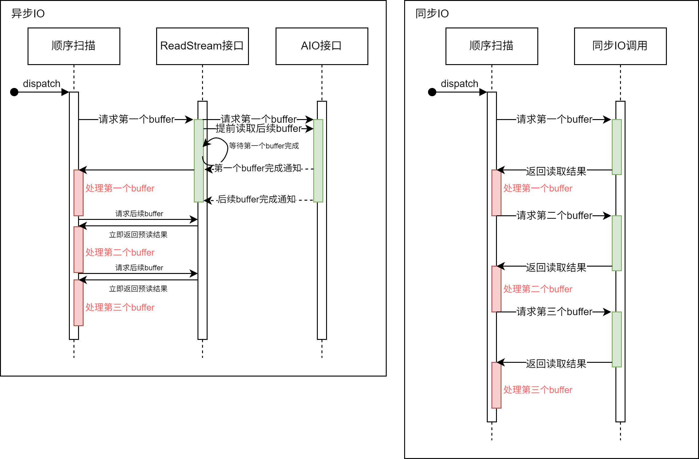
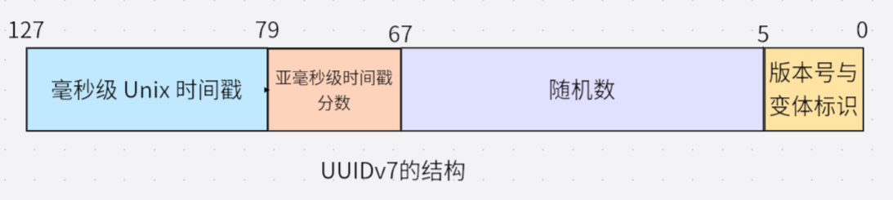

PostgreSQL 全球开发组于 2025 年 5 月 8 日发布了 PostgreSQL 18 的首个 Beta 版本，正式版也已于 9 月 25 日正式上线。本文 IvorySQL 社区将为大家拆解 PostgreSQL 18 的六大亮点特性。

## 一、PG 异步 I/O（AIO）框架：迈出打破同步阻塞瓶颈的第一步

PostgreSQL 18 全新引入异步 I/O 子系统。新机制允许**特定场景下**并行执行多个异步预读操作，CPU 无需等待数据返回即可继续推进查询，一定程度上降低了等待损耗。此框架为 PG 未来更深入更彻底的异步 I/O 性能优化奠定基础，迈出了第一步。

### 核心提升场景

**【当前仅实现异步读，没有实现异步写】** 所有 Seq Scan 场景下通过适配过异步 I/O 的 ReadStream 设施可实现并行化顺序预读，提升 Seq Scan 的性能，效果好于原有 `posix_fadvice` 的建议性预读。尤其在云存储场景下单次阻塞读 I/O 相比本地 I/O 所需时间更长，异步 I/O 加持下的并行化预读的优势更加明显。目前异步 I/O 已支持顺序扫描、位图堆扫描和 VACUUM 操作的异步读取，早期测试显示，读取密集型查询性能可提升 2-3 倍。

如图所示：



使用了异步 I/O 的 ReadStream 机制可以在收到读请求后异步地预读后续可能使用的 buffer。而在使用同步 I/O 方式在每次请求读取 buffer 时，都要等待 I/O 操作完成，这样降低了系统吞吐量。

### 使用方法

```
# - I/O -

#backend_flush_after = 0		# measured in pages, 0 disables
effective_io_concurrency = 300		# 1-1000; 0 disables issuing multiple simultaneous IO requests
maintenance_io_concurrency = 300	# 1-1000; same as effective_io_concurrency
io_max_combine_limit = 256kB		# usually 1-128 blocks (depends on OS)
                    # (change requires restart)
io_combine_limit = 256kB		# usually 1-128 blocks (depends on OS)

io_method = io_uring # worker, io_uring, sync
                    # (change requires restart)
io_max_concurrency = 128		# Max number of IOs that one process
                    # can execute simultaneously
                    # -1 sets based on shared_buffers
                    # (change requires restart)
#io_workers = 3				# 1-32;
```

用户可选择三种不同的 `io_method` 启用异步 I/O，分别是：

- `worker` 若干后台 I/O workers 接收处理后端进程的 I/O 请求。
- `io_uring` Linux 系统中 io_uring 子系统通过操作系统内核线程处理 PG 的 I/O 请求。
- `sync` 满足异步 I/O 框架接口要求的同步 I/O。

要启用异步 I/O，用户需要根据自身情况设定上述 GUC 参数。其中每个进程能够拥有的最大异步 I/O 句柄为 `io_max_concurrency`，用户可以将其置 `-1`，使数据库自行选择合适的值。若自行选择的值太大，则可能因为异步 I/O 所占空间太大而无法启动数据库；若自行选择的值太小则无法完全发挥出异步 I/O 性能。

启动数据库后，用户可通过 `pg_aios` 视图实时地获取当前系统异步 I/O 执行状况:

```
postgres=# select * from pg_aios;
-[ RECORD 1 ]---+-------------------------------------------
pid             | 85834
io_id           | 14208
io_generation   | 204
state           | SUBMITTED
operation       | readv
off             | 116252672
length          | 8192
target          | smgr
handle_data_len | 1
raw_result      |
result          | UNKNOWN
target_desc     | block 14191 in file "base/5/16427"
f_sync          | f
f_localmem      | f
f_buffered      | t
...
```

各列含义详见[官方文档](https://www.postgresql.org/docs/18/view-pg-aios.html)。

### 框架设计

PG 18 引入异步 I/O 框架，支持通过 GUC 参数灵活配置异步 I/O：包括实现方式（`io_method`，可选 worker、io_uring 或 sync）、并发规模（如 `*_io_concurrency`、`io_max_concurrency`）及实现相关参数（如 `io_workers`）。

该框架对 I/O 目标（当前支持 smgr，未来计划支持 WAL）和不同阶段、不同数据源(shared buffer/local buffer)的行为进行了抽象（通过 `PgAioHandleCallbacks` 结构），以支持后续扩展。相关内存于启动时在共享内存中分配，后续不再缩放。进程按编号访问所属异步 I/O 资源，句柄通过 generation 号标记复用。

目前该版本异步 I/O 主要提供对 smgr 的异步读支持，尚不支持 WAL 异步读写，smgr 的异步写入功能仍在开发中。

### 对原有设施的修改

1. **扩展 smgr 接口**：新增 `smgr_startreadv` 方法以支持异步读取。
2. **实现回调结构**：smgr 需实现 `PgAioTargetInfo` 和 `PgAioHandleCallBacks` 回调结构。
3. **适配现有模块**：smgr 和 buffer manager 等模块需填充异步 I/O 抽象结构以兼容框架。
4. **PG 临界区处理**：同步 I/O 可在 PG 临界区内发起；异步 I/O 因分段执行且带回调，需移除回调中可能失败的操作（临界区内一切操作不能失败，如用`RelPathStr`替代 palloc 的`char*`字符串）以确保安全。
5. **优化上层接口**：利用异步 I/O 改造 ReadStream 等接口，实现真预读，大幅提升顺序扫描、pg_prewarm 及 ANALYZE 等操作的 I/O 性能，效果优于原有 posix_fadvise 方案。

### 使用注意及未来展望

1. **io_uring 需要较新内核：**旧版 Linux Kernel 不支持 io_uring。某些早期版本内核虽然支持 io_uring，但功能和性能表现与新内核有一定差距。
2. **架构限制并发粒度**：受多进程架构所限，PG 异步 I/O 期间可并行运行的计算任务较少，难以实现更细粒度的任务级异步。当前主要性能收益集中于**ReadStream 顺序预读**及等并行 I/O 操作。
3. **未来可能的性能提升**：Linux io_uring 支持直接 I/O（DIO）特性，为在 PG 中启用 DIO 奠定基础。未来启用直接 I/O 可免除双重 buffer(OS 层面对 I/O 数据进行 buffer，PG 层面对 I/O 进行 buffer)以减少不必要的数据复制。在高速 NVMe 上还配合 DIO 启用**IORING_SETUP_IOPOLL**选项使用轮训方式检查 I/O 完成情况，还可以进一步提升性能。
4. **未来更多的异步 I/O 后端**：除了`sync`模式，正式版的 PostgreSQL 18 仅支持 `worker` 和 `io_uring` 两种异步 I/O 后端。目前异步 I/O 框架设计已基本完备，未来版本有望支持 Windows IORing，IOCP，以及 Posix 异步 I/O 等 I/O 后端，为用户提供更多选择。

### 小结

PostgreSQL 18 异步 I/O 框架提升数据库系统 I/O 能力，同时也增强了 PostgreSQL 架构的可扩展性，用户只需要根据自身情况修改 GUC 参数即可获取到异步 I/O 带来的好处。目前异步 I/O 框架设计基本完备，后期支持其他异步 I/O 后端也将非常方便。任意平台 Postgres 用户可以尝试 `io_method = worker`或者`sync` 若要在非官方适配 io_uring 的旧 Linux 内核发行版上使用 io_uring 后端，需要进行充分测试后再使用。

## 二、 跳跃式扫描：让 B 树索引 “提速换挡”

在 PostgreSQL 18 之前的版本中，多列 B 树索引可用于包含该索引中任意子集列的查询条件，在对起始（最左侧）列施加约束时最为高效。对前导列的等式约束，加上对第一个不带有等式约束的列的任何不等式约束，用于限制要扫描的索引部分。

例如，给定一个基于（a，b，c）非空字段的升序索引和查询条件 WHERE a = 5 AND b >= 42 AND c < 77，该索引将从具有 a = 5 和 b = 42 的第一个条目开始扫描，一直扫描到最后具有 a = 5 的条目。 具有 c >= 77 的索引条目将被跳过，但它们仍需扫描。

原则上，这种索引可以用于对 b 和/或 c 有约束条件而对 a 没有约束条件的查询——但必须扫描整个索引，所以在大多数情况下优化器更倾向于对表进行顺序扫描表，而非利用索引扫描。

### 核心提升场景

从 PostgreSQL 18 开始：

如果 B 树索引扫描能够应用跳跃式扫描（SKIP SCAN），在遍历索引时应用每个列的约束，可以减少索引的读取。跳跃式扫描的工作原理是内部生成一个动态等式约束，该约束与索引列中的每个可能值相匹配。

### 效果测试

对比版本：

**PostgreSQL 17 vs PostgreSQL 18**

#### 表结构与索引

```sql
CREATE TABLE t1
(
c1 int
c2 int,
c3 float
)
WITH (fillfactor=80);


CREATE INDEX idx_t1_c1c2 ON t1(c1, c2);
```

#### 数据生成

```sql
INSERT INTO t1
SELECT (random()*1000)::int, (random()*10000)::int, random()
FROM generate_series(1,1000000) g;
```

#### 通过 COPY 导入数据

```sql
COPY t1 FROM '/.../t1.csv' WITH (FORMAT csv);
```

#### 查询语句 使用复合索引的第二个列

```sql
EXPLAIN ANALYZE SELECT * FROM t1 WHERE c2=100;
```

#### PostgreSQL 17 执行计划 选择使用并行顺序扫描

```
                                                    QUERY PLAN
-------------------------------------------------------------------------------------------------------------------
 Gather  (cost=1000.00..12986.33 rows=100 width=16) (actual time=1.125..76.076 rows=90 loops=1)
   Workers Planned: 2
   Workers Launched: 2
   ->  Parallel Seq Scan on t1  (cost=0.00..11976.33 rows=42 width=16) (actual time=1.414..68.624 rows=30 loops=3)
         Filter: (c2 = 100)
         Rows Removed by Filter: 333303
 Planning Time: 0.792 ms
 Execution Time: 76.165 ms
(8 rows)
```

关闭顺序扫描强制选择索引扫描，并非最优计划，执行更慢。

```
                                                        QUERY PLAN
--------------------------------------------------------------------------------------------------------------------------
 Index Scan using idx_t1_c1c2 on t1  (cost=0.42..18773.42 rows=100 width=16) (actual time=1.846..100.758 rows=90 loops=1)
   Index Cond: (c2 = 100)
 Planning Time: 0.147 ms
 Execution Time: 100.806 ms
(4 rows)
```

#### PostgreSQL 18 执行计划选择使用索引扫描，可以看出跳跃式扫描执行效率提升幅度非常大

```
                                                        QUERY PLAN
---------------------------------------------------------------------------------------------------------------------------
 Index Scan using idx_t1_c1c2 on t1  (cost=0.42..3900.84 rows=100 width=16) (actual time=0.225..11.464 rows=90.00 loops=1)
   Index Cond: (c2 = 100)
   Index Searches: 1002
   Buffers: shared hit=3096
 Planning Time: 0.141 ms
 Execution Time: 11.522 ms
(6 rows)
```

关闭索引扫描和位图扫描强制选择顺序扫描。

```
postgres=# EXPLAIN ANALYZE SELECT * FROM t1 WHERE c2=100;
                                                      QUERY PLAN
----------------------------------------------------------------------------------------------------------------------
 Gather  (cost=1000.00..12986.33 rows=100 width=16) (actual time=1.486..86.881 rows=90.00 loops=1)
   Workers Planned: 2
   Workers Launched: 2
   Buffers: shared hit=6768
   ->  Parallel Seq Scan on t1  (cost=0.00..11976.33 rows=42 width=16) (actual time=2.758..78.712 rows=30.00 loops=3)
         Filter: (c2 = 100)
         Rows Removed by Filter: 333303
         Buffers: shared hit=6768
 Planning Time: 0.141 ms
 Execution Time: 86.926 ms
(10 rows)
```

### 使用注意

跳跃式扫描目前只能支持等值比较条件。

### 小结

PostgreSQL 18 的索引跳跃式扫描，使得多列 BTREE 索引能够被那些仅对第二个或之后的索引列进行等值引用的查询使用，大幅减少索引扫描需要访问的条目，使其效率得到明显提升。

## 三、 虚拟生成列：存储与计算的 “灵活平衡”

PostgreSQL 18 开发体验相关的特性，聚焦于简化开发流程、提升代码灵活性，让开发者更高效地利用 PostgreSQL 能力。

IvorySQL 数据库长期致力于 Oracle 特性兼容，其中包含了一项虚拟列的语法兼容：

`column [datatype][generated always] AS (column_expression)[VIRTUAL]`

这次 PostgreSQL 18 终于也带来了虚拟列功能。虚拟列是一种不存储数据的表列，其值在查询时通过动态计算得出。与存储列相比，虚拟列节省了列存储空间，查询虚拟列值时通过计算虚拟列表达式的值作为该列的值。

### 基本语法

PostgreSQL 18 中虚拟列的语法和存储列的语法相似，新增加关键字**VIRTUAL**，当省略 STORED 和 VIRTUAL 关键字时默认为虚拟列。其语法如下所示：

`GENERATED ALWAYS AS ( generation_expr ) [ STORED | VIRTUAL ]`

### 虚拟列用例

虚拟列的标识是在列的限制条件中表示的，通过虚拟列的限制语法标识列为虚拟列，以下为虚拟列表的创建、查询和新增虚拟列：

```sql
-- 创建包含虚拟列的表，其中price_with_tax为虚拟列
CREATE TABLE products (
    id SERIAL PRIMARY KEY,
    name TEXT NOT NULL,
    price NUMERIC(10,2) NOT NULL,
    tax_rate NUMERIC(5,2) DEFAULT 0.20,
    price_with_tax NUMERIC(10,2) GENERATED ALWAYS AS (price * (1 + tax_rate)) VIRTUAL
);

-- 插入数据
INSERT INTO products (name, price, tax_rate)
VALUES ('Laptop', 1000.00, 0.20);

-- 查询数据（虚拟列自动计算）
SELECT name, price, tax_rate, price_with_tax FROM products;
  name  |  price  | tax_rate | price_with_tax
--------+---------+----------+----------------
 Laptop | 1000.00 |     0.20 |        1200.00
(1 row)

--为表添加虚拟列
ALTER TABLE products ADD COLUMN selling_price NUMERIC(10,2)
GENERATED ALWAYS AS (
    price * (1 - 0.2) * (1 + tax_rate)
) virtual;
```

### 实现原理浅析

#### 虚拟列的创建

创建的表中虚拟列的存储方式和普通列的存储方式类似，其列信息都存储在 pg_attribute 系统表中，其中 attgenerated 列存储生成列信息，如果该列的值为's'，表示该列为存储列。PostgreSQL 18 新增的虚拟列在该字段中的标识符为'v'，并且将虚拟列的表达式存储于 pg_attrdef 系统表中。

```sql
--查看虚拟列信息，其attgenerated为v表示该列为虚拟列
postgres=# select * from pg_attribute where attname='price_with_tax';
-[ RECORD 1 ]--+---------------
attrelid       | 16388
attname        | price_with_tax
atttypid       | 1700
attlen         | -1
attnum         | 5
atttypmod      | 655366
attndims       | 0
attbyval       | f
attalign       | i
attstorage     | m
attcompression |
attnotnull     | f
atthasdef      | t
atthasmissing  | f
attidentity    |
attgenerated   | v
attisdropped   | f
attislocal     | t
attinhcount    | 0
attcollation   | 0
attstattarget  |
attacl         |
attoptions     |
attfdwoptions  |
attmissingval  |

--查看虚拟列表达式存储，可以看到以下表达式为虚拟列表达式
postgres=# select pg_get_expr(adbin, adrelid) from pg_attrdef where adnum = 5;
             pg_get_expr
-------------------------------------
 (price * ((1)::numeric + tax_rate))
(1 row)
```

#### 虚拟列的插入或更新

由于虚拟列的数据不占据存储空间，所以任何指定更新或插入虚拟列的操作都将被限制。

```sql
--指定插入虚拟列
INSERT INTO products (name, price, tax_rate, price_with_tax) VALUES ('Laptop', 1000.00, 0.20, 1);
ERROR:  cannot insert a non-DEFAULT value into column "price_with_tax"
DETAIL:  Column "price_with_tax" is a generated column.

--指定更新虚拟列
update products set price_with_tax = 1 where name = 'Laptop';
ERROR:  column "price_with_tax" can only be updated to DEFAULT
DETAIL:  Column "price_with_tax" is a generated column.
```

#### 虚拟列的查询

PostgreSQL 18 中查询虚拟列的实现是在生成执行计划阶段完成。在逻辑重写优化阶段，判断查询的范围表中是否包含虚拟列，如果包含虚拟列，则将该虚拟列的表达式从 pg_attrdef 中获取出来并替换原虚拟列名。这样查询虚拟列的值就相当于计算其表达式的值，即 `select price_with_tax` 相当于 `select (price \* ('1'::numeric + tax_rate)) as price_with_tax`。可以看到以下虚拟列被替换成了其表达式：

```sql
postgres=# explain verbose SELECT name, price, tax_rate, price_with_tax
FROM products;
                              QUERY PLAN
----------------------------------------------------------------------
 Seq Scan on public.products  (cost=0.00..23.12 rows=750 width=76)
   Output: name, price, tax_rate, (price * ('1'::numeric + tax_rate))
(2 rows)
```

### 适用场景

- 当考虑存储空间时，可以使用虚拟列，因为虚拟列不占用磁盘空间。
- 当列的值需要根据依赖的列变化而变化时，需要使用虚拟列。因为虚拟列的值是动态获取的。
- 当虚拟列表达式简单时，可以使用虚拟列。因为查询虚拟列需消耗 CPU 资源，表达式复杂会消耗太多 CPU 资源。
- 因为 Oracle 中有虚拟列功能，更加方便 Oracle 的虚拟列迁移至 PostgreSQL 中。

### 待完善部分

一些功能目前尚不支持，但可能会作为增量功能在后续的版本中添加：

- 在虚拟列上创建索引或使用虚拟列。
- 虚拟列上也没有唯一约束。
- 虚拟列上的扩展统计信息。
- 虚拟列上的外键约束。
- 虚拟列上的非空约束（支持检查约束）。
- ALTER TABLE / DROP EXPRESSION。
- 虚拟列不能具有域类型。
- 逻辑复制不支持虚拟列。

### 小结

虚拟列与普通列和存储列有着本质的不同，因为虚拟列的值不占磁盘空间，其获取值的方式也与普通列和存储列不同，普通列或存储列需要从磁盘获取数据，而虚拟列是通过动态计算获取虚拟列的值。

## 四、UUID 功能增强：有序性与易用性提升

### 传统 UUID 的无序性是其用作主键的主要痛点：

传统 UUID（尤其是 v4）的完全随机性是其作为数据库主键的痛点：

- UUID 随机生成，插入位置不确定，导致索引树频繁分裂和重组，大幅降低写入性能。
- 破坏聚簇索引（如 InnoDB）的物理存储顺序，增加磁盘 I/O。
- 范围查询和排序效率低下，性能低下。

### UUIDv7 的关键突破：时间有序性架构设计

UUIDv7 通过在 UUID 的高位部分引入时间戳来解决生成 UUID 完全随机的问题，使新生成的 UUID 能够按照创建时间自然排序。这样，B 树索引可以像自增整数一样进行顺序插入，同时仍然保持 UUID 的全局唯一性和分布式生成优势。

该特性使 UUIDv7 作为主键具备以下突出优势：

- 严格按照创建时间先后顺序递增。
- 减少索引碎片。
- 提高缓存命中率。
- 适合高并发插入和高效查询的场景。

### UUIDv7 的结构设计



| 字段                               | 位数  | 说明                  |
| ---------------------------------- | ----- | --------------------- |
| 毫秒级 Unix 时间戳                 | 48 位 | Unix 时间戳（毫秒）   |
| 亚毫秒级时间戳分数（用于额外排序） | 12 位 | 时间戳的微秒精度扩展  |
| 随机数                             | 62 位 | 随机数或计数器        |
| 版本号                             | 4 位  | 固定为 0111（v7）     |
| 变体                               | 2 位  | 固定为 10（RFC 4122） |

**设计关键点解析：**

- **高精度时间前缀(48 位):** 精确到毫秒的 Unix 时间戳，确保 ID 严格按时间递增（需 NTP 时钟同步）。
- **尾部随机位(62 位):** 保证分布式唯一性，避免 v1 版本的 MAC 地址泄漏风险。

**有序性如何解决性能问题？**

- **B-Tree 索引优化:** 新生成的 UUIDv7 总是大于之前的值，因此被追加到索引尾部，避免中间节点分裂。
- **缓冲池友好:** 顺序写入使新记录集中在少数数据页。当页写满时，数据库只需分配新页追加，减少旧页淘汰与磁盘 I/O。
- **范围查询加速:** 时间有序性使 WHERE id > '2025-06-01' 可转化为时间戳范围过滤，大幅降低扫描范围。

### 如何在 PostgreSQL18 中应用 UUIDv7

PostgreSQL 18 引入了多个新函数来支持 UUIDv7，方便生成、操作和提取 UUID 信息。

1. `uuidv7()`函数：用于生成新的 UUIDv7 值

```sql
-- 使用当前时间戳生成 UUIDv7
SELECT uuidv7();
-- 输出示例: 0197f96c-b278-7f64-a32f-dae3cabe1ff0

-- 生成 1 小时前的 UUIDv7
SELECT uuidv7(INTERVAL '-1 hour');
-- 生成 30 分钟后的 UUIDv7
SELECT uuidv7(INTERVAL '30 minutes');
```

2. `uuidv4()`函数：作为已有函数 `gen_random_uuid()` 的别名 ，便于和 uuidv7 一起使用

```sql
-- 两者等价
SELECT gen_random_uuid();
SELECT uuidv4();
```

3. `uuid_extract_timestamp()`函数 : 该函数现在支持 UUIDv7（原本只支持 UUIDv1）

```sql
-- 从 UUIDv7 提取时间戳
SELECT uuid_extract_timestamp(uuidv7());
-- 示例输出: 2025-09-18 12:20:49.409+00
```

4. `uuid_extract_version()`函数：用于检测 UUID 的版本：

```sql
-- 检查 UUID 版本
SELECT uuid_extract_version(uuidv7());  -- 返回 7
SELECT uuid_extract_version(uuidv4());  -- 返回 4
```

PostgreSQL 数据库中使用 UUIDv7 作为主键：

```sql
--创建带 UUIDv7 主键的表
CREATE TABLE users (
    id UUID PRIMARY KEY DEFAULT uuidv7(),
    username VARCHAR(50) UNIQUE NOT NULL,
    email VARCHAR(100) NOT NULL,
    created_at TIMESTAMP WITH TIME ZONE DEFAULT CURRENT_TIMESTAMP
);
```

这样，每条新记录的 `id` 都会自动分配一个按时间戳排序的 UUID。

```sql
--插入数据
INSERT INTO users (username, email)
VALUES ('alice', 'alice@example.com');
INSERT INTO users (username, email)
VALUES ('bob', 'bob@example.com');

-- 按 UUID 时间顺序查看
SELECT id, username, uuid_extract_timestamp(id) as uuid_timestamp
FROM users
ORDER BY id;
```

### 性能优势：

1. UUIDv7 的时间戳顺序能显著减少页分裂和缓存失效，有效提升 B 树索引效率。

```sql
--创建性能测试表
CREATE TABLE performance_test (
    id_v4 UUID DEFAULT uuidv4(),
    id_v7 UUID DEFAULT uuidv7(),
    data TEXT DEFAULT 'sample data'
);
--使用UUIDv7作为索引
CREATE INDEX idx_v4 ON performance_test (id_v4);
CREATE INDEX idx_v7 ON performance_test (id_v7);
```

批量插入后，你可以用 `pg_statio_user_indexes` 查看索引命中情况，UUIDv7 通常表现更优。

2. UUIDv7 自带时间排序，大部分场景下显著提升排序性能。

```sql
-- 利用 UUIDv7 自然排序
SELECT id_v7, data
FROM performance_test
ORDER BY id_v7
LIMIT 10;
```

相比 UUIDv4 的随机顺序，UUIDv7 查询结果按创建顺序返回，更直观。

### UUIDv7 最佳实践


适合使用 UUIDv7 的场景：

- **多租户应用**：可用 UUIDv7 做主键，并为 `(tenant_id, id)` 创建复合索引，既保持唯一性又能按时间排序。

- **分布式系统**：多个服务可独立生成 UUIDv7，并且在全局范围内仍能保持时间顺序。

### 限制与注意事项

- **依赖系统时钟**：需启用 NTP 等时间同步机制，避免时钟漂移。
- **时间戳精度**：UUIDv7 以毫秒为单位，在同一毫秒内生成多个 UUID，顺序可能无法完全反映真实创建顺序，但仍保持唯一性。
- **迁移规划**：从 UUIDv4 迁移到 UUIDv7 时，需要检查应用逻辑、索引和外部依赖。

### 小结

PostgreSQL 18 对 UUIDv7 的支持，解决了 UUID 作为主键的性能瓶颈。UUIDv7 在保持全局唯一性的同时，具备类似自增整数的顺序性，使 B 树插入更高效，查询更快。

对于需要分布式、高并发和高性能的现代应用，UUIDv7 提供了一种兼顾唯一性和性能的实用解决方案。

## 五、EXPLAIN 增强：直观呈现执行细节

PostgreSQL 18 对 EXPLAIN 命令进行了重大升级，通过提供更丰富、更直观的执行计划信息，让数据库开发者和 DBA 能够更加轻松地进行查询性能分析与优化。

### 自动缓冲区分析

EXPLAIN ANALYZE 现在默认包含 BUFFER 统计信息，无需手动添加 BUFFERS 选项：

- **共享命中(Shared Hits)**：显示从缓存中读取的数据块数量，反映内存使用效率。
- **共享读取(Shared Reads)**：标识必须从磁盘读取的数据块，帮助识别 I/O 瓶颈。
- **共享脏块(Shared Dirtied)**：针对数据修改操作，显示被更改的块数量。

### 精细化索引监控

新增索引扫描次数统计，让开发者能够精确了解索引使用效率：

```sql
-- 示例输出显示索引使用情况
Index Scan using orders_pkey on orders
Index Searches: 1  -- 明确显示索引查找次数
Buffers: shared hit=2 read=2
```

### 增强的统计信息

- 支持小数行（ fractional row counts），提供更精确的行数估计。
- 为 Material、Window Aggregate、CTE 节点输出内存和磁盘使用详情。
- 在窗口函数中显示详细的参数信息。
-  为 Parallel Bitmap Heap Scan 显示 worker 缓存统计。
-  输出禁用节点。
-  输出 WAL 缓冲区信息。

### 基础查询分析

```sql
-- 创建测试表
CREATE TABLE orders (
    order_id SERIAL PRIMARY KEY,
    customer_id INTEGER NOT NULL,
    order_date DATE NOT NULL,
    total_amount DECIMAL(10, 2) NOT NULL
);
CREATE INDEX idx_orders_customer_id ON orders(customer_id);

-- 插入测试数据
INSERT INTO orders (customer_id, order_date, total_amount)
SELECT
    (n % 10) + 1,
    CURRENT_DATE - (n % 365),
    (50 + (random() * 950))::decimal(10,2)
FROM generate_series(1, 50000) n;

-- 查看增强的执行计划
EXPLAIN ANALYZE
SELECT *,sum(total_amount) OVER (PARTITION BY customer_id)
FROM orders WHERE order_id>49900;
```

执行计划：

```sql
QUERY PLAN
----------------------------------------------------------------------------------------------------------------------------------------
 WindowAgg  (cost=13.46..15.04 rows=99 width=50) (actual time=0.630..0.745 rows=100.00 loops=1)
   Window: w1 AS (PARTITION BY customer_id)
   Storage: Memory  Maximum Storage: 17kB
   Buffers: shared hit=5 read=2
   ->  Sort  (cost=13.30..13.55 rows=99 width=18) (actual time=0.307..0.333 rows=100.00 loops=1)
         Sort Key: customer_id
         Sort Method: quicksort  Memory: 28kB
         Buffers: shared hit=5 read=2
         ->  Index Scan using orders_pkey on orders  (cost=0.29..10.02 rows=99 width=18) (actual time=0.089..0.174 rows=100.00 loops=1)
               Index Cond: (order_id > 49900)
               Index Searches: 1
               Buffers: shared hit=2 read=2
 Planning:
   Buffers: shared hit=64 read=22
 Planning Time: 2.080 ms
 Execution Time: 1.343 ms
```

执行计划输出洞察：

- 缓冲区使用情况（缓存命中 vs 磁盘读取）：生成执行计划时从缓存中访问了 64 个共享缓冲区，从磁盘中读取了 22 个缓冲区，执行时从缓冲区访问了 5 个共享缓冲区，从磁盘读取了 2 个缓冲区。
- 索引效率统计：执行了 1 次 orders_pkey 索引扫描，并从缓存中访问了 2 个共享缓冲区，清晰地显示了索引的使用效率。
- 窗口函数内存使用详情：使用的 17kB 磁盘空间。
- 精确的行统计信息。
- 窗口函数的详细参数。

### WAL 日志分析

```sql
EXPLAIN (ANALYZE, WAL)
INSERT INTO orders (customer_id, order_date, total_amount)
SELECT
    (n % 10) + 1,
    CURRENT_DATE - (n % 365),
    (50 + (random() * 950))::decimal(10,2)
FROM generate_series(1, 50000) n;
```

执行计划：

```sql
QUERY PLAN
---------------------------------------------------------------------------------------------------------------------------------------------
 Insert on orders  (cost=0.00..2000.00 rows=0 width=0) (actual time=767.116..767.118 rows=0.00 loops=1)
   Buffers: shared hit=299156 read=2 dirtied=500 written=501
   WAL: records=152158 bytes=10427828 buffers full=139
   ->  Subquery Scan on "*SELECT*"  (cost=0.00..2000.00 rows=50000 width=28) (actual time=5.742..336.699 rows=50000.00 loops=1)
         Buffers: shared hit=50013
         WAL: records=1516 bytes=150084 buffers full=2
         ->  Function Scan on generate_series n  (cost=0.00..1750.00 rows=50000 width=24) (actual time=5.460..227.650 rows=50000.00 loops=1)
 Planning Time: 0.114 ms
 Execution Time: 767.179 ms
```

WAL 统计：

- 监控写入负载的日志生成量：WAL 缓冲区生成 1516 条日志，共 150084 个字节的数据。
- 诊断写入性能瓶颈：缓冲区被写满了 2 次。

### 并行查询优化

```sql
EXPLAIN (ANALYZE)
SELECT * FROM orders WHERE customer_id IN (1, 2, 3, 4, 5, 6);
```

执行计划：

```sql
QUERY PLAN
-------------------------------------------------------------------------------------------------------------------------------------------------------
 Gather  (cost=2752.40..10357.99 rows=327855 width=18) (actual time=22.375..121.296 rows=330000.00 loops=1)
   Workers Planned: 2
   Workers Launched: 2
   Buffers: shared hit=3810
   ->  Parallel Bitmap Heap Scan on orders  (cost=2751.40..10029.13 rows=136606 width=18) (actual time=12.868..88.329 rows=110000.00 loops=3)
         Recheck Cond: (customer_id = ANY ('{1,2,3,4,5,6}'::integer[]))
         Rows Removed by Index Recheck: 53967
         Heap Blocks: exact=170 lossy=566
         Buffers: shared hit=3810
         Worker 0:  Heap Blocks: exact=387 lossy=957
         Worker 1:  Heap Blocks: exact=369 lossy=1055
         ->  Bitmap Index Scan on idx_orders_customer_id  (cost=0.00..2669.44 rows=327855 width=0) (actual time=21.219..21.220 rows=330000.00 loops=1)
               Index Cond: (customer_id = ANY ('{1,2,3,4,5,6}'::integer[]))
               Index Searches: 1
               Buffers: shared hit=266
 Planning:
   Buffers: shared hit=30
 Planning Time: 0.510 ms
 Execution Time: 158.523 ms
```

并行执行效率洞察：

- 每个工作进程的缓存统计详情：worker 0 命中 387 个精确块和 957 个有损块，worker 1 命中 369 个精确块和 1055 个有损块。
- 精确块与有损块分析：出现有损块说明可能 work_mem 太小导致 bitmap 无法精准定位元组。

### 技术优势与价值

#### 即时性能诊断

- **降低门槛**：自动化的缓冲区统计让初学者快速识别 I/O 问题。
- **深度洞察**：为专家级用户提供更细粒度的性能数据。
- **全面覆盖**：单条命令获取执行计划、缓存使用、索引效率等多维信息。

#### 优化指导

- **索引优化**：通过精确的索引使用统计，避免过度索引或索引不足。
- **内存调优**：根据有损块出现频率指导 work_mem 参数调整
- **查询重写**：基于详细的执行成本数据优化 SQL 语句结构

### 功能未来展望

尽管 PostgreSQL 18 的 EXPLAIN 增强带来了显著改进，但仍有一些方面可以进一步完善：

1. **输出可读性**：随着信息量的增加，输出变得更加复杂，可能需要更好的格式化或可视化工具支持
2. **历史对比**：缺乏直接与历史执行计划对比的内置机制，使得性能回归分析仍需依赖外部工具
3. **阈值警报**：没有内置机制对异常值（如异常高的缓冲区读取）发出警告，需要手动分析
4. **执行计划可视化**：文本形式的输出在复杂查询中仍难以直观理解，需要第三方工具补充

### 小结

PostgreSQL 18 的 EXPLAIN 增强代表了数据库可观测性的重大进步。通过自动化收集关键性能指标并提供更深入的执行洞察，它显著降低了查询优化的门槛，同时为经验丰富的 DBA 提供了更强大的分析能力。

## 六、OAuth 2.0 认证支持：筑牢数据防护壁垒

在安全方面，IvorySQL 致力于加入多种国密认证功能来保障数据安全。而这次 PostgreSQL18 在身份认证方面继续加强，引入对 OAuth 2 的支持。这是一种开放标准的授权协议，用于授权一个应用程序或服务访问用户在另一个应用程序中的资源，而无需提供用户名和密码。

该特性主要包含以下几个核心要素：

- **OAuth2 验证器框架**：提供了一个可扩展的框架，使 PostgreSQL 能够与 OAuth 2.0 提供程序集成。PostgreSQL 本身不实现具体的令牌验证算法（如 JWT 验证），而是将这项工作委托给一个外部共享库 (`*.so` 文件)。
- **客户端认证支持**：libpq（PostgreSQL 的 C 客户端库）现在支持 OAuth 2.0 认证流程。
- **自定义验证逻辑**：通过回调机制允许实现自定义的令牌验证和用户映射逻辑。

### 配置 OAuth 认证方式

#### 服务端配置

1. 选择 OAuth 认证的方式与瀚高数据库选择国密认证的方式类似，需要通过在 pg_hba.conf 文件中指定 METHOD 为 oauth，开启 OAuth 认证。

   同时 OPTIONS 必须指定 issuer 和 scope 参数，除此之外还有几个可选参数：validator、map、delegate_ident_mapping，以下是一个最简配置示例：

   ```
   local all test oauth issuer="http://127.0.0.1:9000" scope="openid postgre"
   ```

2. 指定外部 OAuth 验证器，在 postgresql.conf 文件中配置新提供的 oauth_validator_libraries 参数，配置内容为 OAuth 验证器提供的库文件。

#### 客户端配置

客户端在连接时需要指定以下连接参数从而实现连接：

- oauth_issuer：必要参数，HTTPS URL，是授权服务器的颁发者标识符。
- oauth_client_id：必要参数，由授权服务器颁发的 OAuth 2.0 客户端标识符。
- oauth_client_secret：可选参数，访问 OAuth 授权服务器时要使用的客户端密码。
- oauth_scope：可选参数，发送到授权服务器的访问请求的范围，指定为 OAuth 范围标识符的空格分隔列表。

### 认证实现原理

oauth 整体认证流程大致如下图所示：


#### 客户端（libpq）

PostgreSQL 实现了一个**非阻塞的、基于状态机的异步网络客户端**。状态机包含 `OAUTH_STEP_INIT`、`OAUTH_STEP_DISCOVERY`、`OAUTH_STEP_DEVICE_AUTHORIZATION`、`OAUTH_STEP_TOKEN_REQUEST`、`OAUTH_STEP_WAIT_INTERVAL` 这几个状态。其核心原理包含以下几个部分：

- **DISCOVERY**：客户端从用户请求中获取授权服务器元信息。
- **DEVICE_AUTHORIZATION**：客户端向授权服务器发送请求，授权服务器返回 device_code 和 verification_uri。客户端输出信息"Visit xxxxxx and enter the code: xxxxxx"，提示用户进行操作。
- **TOKEN_REQUEST 和 WAIT_INTERVAL**：轮询访问授权服务器，直到用户完成授权，授权服务器返回 access_token 给客户端。
- 将获取到的 `access_token` 设置到连接对象中。`libpq` 会将它作为密码发送给 PostgreSQL 服务器，服务器端的 OAuth 验证器会负责校验这个令牌。

#### 服务端

以下 PostgreSQL 服务端处理 OAuth 认证流程，同样通过状态机实现，但要比客户端简单得多，总共分为 `OAUTH_STATE_INIT`、`OAUTH_STATE_ERROR`、`OAUTH_STATE_FINISHED` 三个状态。以下是核心步骤：

- 首先解析客户端发送的消息，该消息格式遵循 RFC 7628 第 3.1 节部分。
- 从客户端消息中提取出纯粹的 Bearer Token，并验证其格式（是否为合法的 Base64 字符串）。
- 将提取出的令牌传递给验证器模块进行实质性的验证。
  - 验证成功：状态转为 `OAUTH_STATE_FINISHED`，返回 `PG_SASL_EXCHANGE_SUCCESS`。进行建立连接的后续操作。
  - 验证失败：生成一个符合 RFC 7628 第 3.2.2 节的 JSON 错误响应，告知客户端所需的 `scope` 和到哪里获取令牌。状态转为 `OAUTH_STATE_ERROR`，并返回 `PG_SASL_EXCHANGE_CONTINUE`，等待客户端发送最终的 `KVSEP` 来结束失败的握手。

#### 外部验证器

外部验证器通常需要处理以下事项：

- 令牌验证：可以通过在线验证和本地验证两种方式，由验证器自行决定。在线验证下验证器通常将令牌发送到授权服务器专门的 `Introspection Endpoint`，授权服务器会返回一个 JSON 响应，告知令牌是否有效。本地验证则需要验证器内部实现一套验证流程，本地验证令牌的签名和有效期。本地验证的好处在于能够快速响应，但缺点是无法实时检测令牌撤销。
- 身份映射：在验证通过后，验证器需要提取令牌中的唯一用户标识，并转换为数据库可理解的身份标识，也就是数据库用户。
- 连接决策：如果令牌处于有效期并且存在相应的数据库用户映射关系，则以该用户的身份创建会话连接。

### 优缺点剖析

**优点：**

1. OAuth2 提供了现代、标准化的身份验证机制，提高了安全性。通过 OAuth2 认证，规避了传统密码认证在数据传输过程中暴露密码导致的安全风险。
2. 简化了数据库用户管理，支持统一的身份策略和访问控制，提高了管理效率。

**缺点：**

1. 相较于传统的密码认证，实现更加复杂，需要额外的配置和维护工作，包括 OAuth2 提供程序的设置和管理，提高了运维的复杂度。比如瀚高数据库的国密认证功能，同样在保障口令安全的同时仅需要通过非常简单的配置即可使用。
2. 依赖于外部 OAuth 提供程序的可用性和可靠性，若 OAuth 提供程序出现问题，可能会影响数据库访问。
3. 每次连接可能需要额外的网络请求来验证令牌，可能会增加连接建立的时间，特别是在高并发场景下。

### 小结

PostgreSQL 18 引入的 OAuth2 支持是一个重要的安全增强功能，它允许组织使用现代的身份验证机制来保护数据库访问。通过提供灵活的验证器框架和回调机制，PostgreSQL 18 可以适应各种 OAuth2 部署场景和业务需求。

虽然 OAuth2 认证增加了系统的复杂性，但它提供了显著的安全优势，特别是在集中式身份管理和单点登录方面。对于希望采用现代安全最佳实践的组织来说，这是一个值得考虑的新功能。OAuth 认证并不与已有的认证方式冲突，在不希望进行繁琐的配置时，仍然可以选择类似于瀚高数据库提供的国密认证等方式。

在实施 OAuth2 认证时，组织应该仔细评估其需求、现有基础设施和技术能力，以确保成功部署和运维。同时应该考虑到性能、可用性和兼容性等因素，以提供最佳的用户体验和系统可靠性。

## 总结

PostgreSQL 18 凭借六大核心特性实现了性能、功能与安全性的全方位升级：
* 异步 I/O 突破了同步阻塞瓶颈，提升读取密集型场景的吞吐量。
* 跳跃式扫描让多列 B 树索引在非前导列查询中发挥高效作用。
* 虚拟生成列在存储与计算间找到了灵活平衡，优化了开发体验。
* UUIDv7 解决了传统 UUID 无序性带来的性能痛点，兼顾唯一性与顺序性。
* EXPLAIN 增强为查询优化提供了更直观、细致的执行洞察。
* OAuth 2.0 认证则为数据安全筑牢了现代防护屏障。

这些特性不仅满足了当前数据库在高性能、高并发、易开发、强安全等方面的需求，也为未来在跨平台适配、功能扩展等方向奠定了坚实基础，进一步巩固了 PostgreSQL 在开源数据库领域的领先地位，为各类应用场景提供了更强大、更灵活的技术支撑。