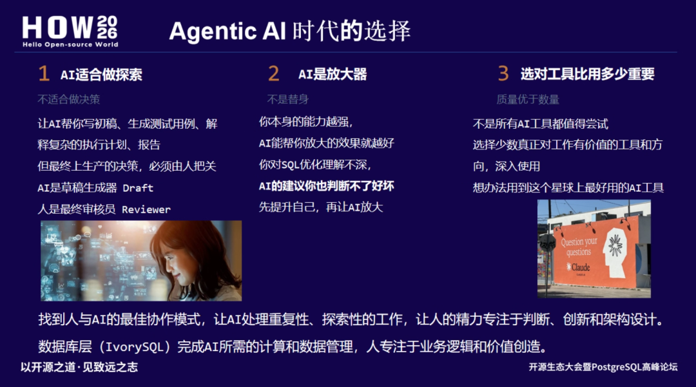
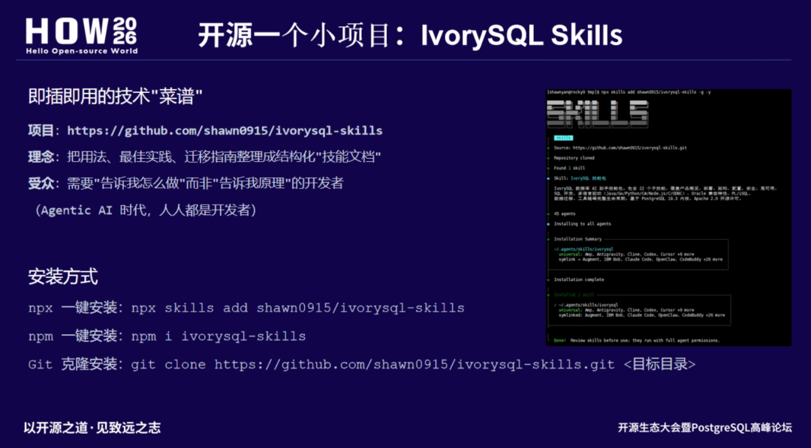

> 本文作者严少安，PostgreSQL ACE, IvorySQL 贡献者，IvorySQL 专家顾问委员。持有 PGCM, PGCE, PGCA, HGCP, HGCA 等认证。主笔公众号「少安事务所」，专注于数据 & AI 领域技术传播。本文为 HOW 2026 严少安老师的演讲内容，首发于公众号【少安事务所】。

4 月 27 日，HOW 2026 大会在济南山东大厦召开。上午主论坛的内容回顾戳这里:

[HOW2026 大会：PostgreSQL 与 AI 在泉城济南的硬核碰撞](https://mp.weixin.qq.com/s/HTs41c_nKX2I83c8LAZ2vw)

笔者作为 IvorySQL 专家顾问委员，在当天下午分论坛进行了一次分享，期间首次介绍了 **IvorySQL Skills**。这是我把自己日常工作中沉淀的 IvorySQL 运维和开发技巧做了一次梳理，并开源出来分享给大家。下面来具体聊聊这套 IvorySQL-Skills 是什么，为什么需要它。


## 01. Agentic AI 时代，"告诉我怎么做"比"告诉我原理"更值钱

我在 PPT 里放了三句话，这也是我做这个项目的初衷。

**第一，AI 适合做探索，不适合做决策。** 让 AI 帮你写初稿、生成测试用例、解释执行计划都可以，但最终上生产的决策必须人把关。可问题是，如果你连"正确的做法"都不知道，你怎么判断 AI 给的建议好不好？

**第二，AI 是放大器，不是替身。** 你本身能力越强，AI 放大效果越好。你对 SQL 优化理解不深，AI 的建议你也判断不了好坏。所以基础技能库必须先行。

**第三，选对工具比用多少重要。** 不是所有 AI 工具都值得尝试，但一套经过生产环境验证的、即插即用的技术"菜谱"，绝对值得放在手边。



IvorySQL Skills 的定位就是这个"技术菜谱"。它不是官方文档的重复，而是我在过去两年从 Oracle 19c 迁移到 IvorySQL、在信创环境（龙芯 LoongArch + 麒麟 OS）做部署、给团队做内部培训过程中，反复打磨验证过的实操脚本和配置模板。

**项目地址**：https://github.com/shawn0915/ivorysql-skills

欢迎大家点点 Star ⭐

如果访问速度慢，可以访问国内镜像：

https://gitcode.com/mydb/ivorysql-skills



## 02. IvorySQL-Skills 里都有什么

目前整个套件按照使用场景拆成了四大模块，共 **22 个技能**。每个 skill 都是一个独立文件，包含场景描述、适用版本、操作步骤和验证命令。


### 核心技能

| 技能                  | 说明                         |
| --------------------- | ---------------------------- |
| ivorysql              | 主技能入口，产品概览         |
| ivorysql-deployment   | 安装部署（Docker/K8s/源码）  |
| ivorysql-architecture | 架构设计（双 Parser/双端口） |
| ivorysql-config       | 系统配置（GUC/参数）         |
| ivorysql-security     | 安全配置（权限/审计/TDE）    |
| ivorysql-ha           | 高可用（备份/复制/监控）     |

### 开发技能

| 技能                 | 说明                                |
| -------------------- | ----------------------------------- |
| ivorysql-app-builder | 端到端应用开发                      |
| ivorysql-jdbc        | Java JDBC 开发                      |
| ivorysql-python      | Python 开发（psycopg/SQLAlchemy）   |
| ivorysql-go          | Go 开发（pgx/GORM）                 |
| ivorysql-csharp      | C#/.NET 开发（Dapper/EF Core）      |
| ivorysql-nodejs      | Node.js 开发（pg/Sequelize/Prisma） |
| ivorysql-c           | C 语言开发（libpq/ECPG）            |
| ivorysql-odbc        | ODBC 跨平台开发                     |

### 功能技能

| 技能                   | 说明                                |
| ---------------------- | ----------------------------------- |
| ivorysql-sql           | SQL 语法（DDL/DML/查询）            |
| ivorysql-functions     | 内置函数（字符串/日期/聚合）        |
| ivorysql-plisql        | PL/iSQL 存储过程                    |
| ivorysql-oracle-compat | Oracle 兼容特性（21 项）            |
| ivorysql-migration     | 数据迁移（Oracle/MySQL → IvorySQL） |

### 辅助技能

| 技能               | 说明       |
| ------------------ | ---------- |
| ivorysql-faq       | 常见问题   |
| ivorysql-ecosystem | 生态集成   |
| ivorysql-tools     | 客户端工具 |

**示例：Oracle 兼容函数速查（迁移适配类）**

IvorySQL 5.0 基于 PostgreSQL 18.0 内核，新增了 21 个 Oracle 兼容特性。但开发者在实际迁移时，经常卡在一些具体函数上。这个 skill 不是罗列所有兼容函数，而是只放"最容易踩坑"的 Top 20 对照表。

```
-- 场景：从Oracle 19c迁移到IvorySQL 5.3，快速验证常用函数兼容性
-- 适用版本：IvorySQL 5.0+ / PG 18.x

-- 1. 日期处理：Oracle的ADD_MONTHS
SELECT ADD_MONTHS('2026-04-27'::timestamp, 3);  -- IvorySQL直接支持

-- 2. 字符串拼接：Oracle的||
SELECT 'HOW' || '2026' || 'Jinan';  -- 兼容，无需改写

-- 3. 空值处理：Oracle的NVL
SELECT NVL(NULL, 'default_value');  -- 兼容

-- 4. 行号：Oracle的ROWNUM
SELECT * FROM (SELECT *, ROWNUM() OVER() AS rn FROM pg_tables) t WHERE rn <= 5;

-- 验证命令：查看当前IvorySQL兼容级别
SHOW ivorysql.compatible_mode;  -- 返回 oracle 或 pg
```

## 03. 一个好的 Skill 应该是什么样子

在 HOW 2026 现场，我也分享了 IvorySQL Skills 的设计规范。这不是什么高大上的方法论，就是四个硬性要求，确保每个 skill 都是"拿到就能用"的水平。

| 设计原则 | 具体要求                                                      |
| -------- | ------------------------------------------------------------- |
| 场景驱动 | 标题必须包含"场景"和"适用版本"，如"如何编译安装 IvorySQL 5.3" |
| 即插即用 | 代码块必须能直接复制运行，变量用 `<>` 标注，注释说明替换内容  |
| 信创适配 | 凡是涉及安装部署的 skill，必须标注支持的国产 CPU 和 OS        |
| 可验证   | 每个 skill 最后必须跟一个验证命令或检查清单，确保操作成功     |

## 04. 怎么安装使用：三种姿势，30 秒上手

除了下面介绍的三种常规方法外，还有更简单的方式。直接告诉你的 AI 编程助手：

> 帮我安装这个 skills：shawn0915/ivorysql-skills

**方式一：npx 一键安装（推荐，适合快速体验）**

```
# 全局安装skills管理器后，一键拉取IvorySQL技能包
npx skills add shawn0915/ivorysql-skills

# 安装完成后，查看可用skill列表
skills list | grep ivorysql
```

**方式二：npm 一键安装**

```
npm i ivorysql-skills
```

**方式三：Git 克隆（适合二次开发和团队内部定制）**

```
git clone https://github.com/shawn0915/ivorysql-skills.git
```

目录结构：

```
ivorysql-skills/
├── SKILL.md                      # 包级入口（路由中心）
├── README.md                     # 说明文档
│
├── ivorysql/                    # 主技能（产品概览）
│   └── references/              # 参考文档
├── ivorysql-app-builder/        # 端到端应用开发
│   └── references/              # 参考文档
├── ivorysql-architecture/        # 架构设计
│   └── references/              # 参考文档
...
```

在内部环境可以这样用：把 Git 仓库 fork 到公司内网 GitLab，DBA 和开发各自贡献自己验证过的 skill，形成团队级的"私有技能库"。新人入职第一天，或者当一个新的 Agent 上线，先装这个技能包，基本能覆盖大部分日常操作。

## 05. 结语

在分享的最后，我聊了一个观点：**Agentic AI 时代，Skills 不是被 AI 替代的东西，而是给 AI 提供"事实基准"的锚点。**

什么意思呢？你让 AI 直接生成一条 IvorySQL 的备份脚本，它可能给你一条 pg_basebackup 的命令，参数可能适用于 PG 15 但不适用于 PG 18，或者没考虑国密 SSL 环境。但如果你已经让 Agent 安装了 IvorySQL Skills，那么大模型生成的内容就有了边界。

一上午听完 HOW 2026 主论坛，下午又和各位同行交流，最大的感受是：**中国 PG 生态正在从"追逐开源"走向"贡献开源"。** IvorySQL Skills 这个项目很小，没有复杂代码，就是一堆 Markdown 文档，但它本质上是为了让大家在使用 AI 编程助手时，更加容易上手，让 Agent 更懂你，让 Agent 更懂 IvorySQL。

**Skills 是经验的"蒸馏"品，是 Agent 的行动指南，也是你提升工作效率的"硬菜"。**

> **2026-05-02 批注**

> 本文是在 HOW 2026 第二天写的，也就是 4 月 28 日，但是我在 4 月 30 日看到了 [Oracle Skills 开源了](https://mp.weixin.qq.com/s/GMqlICHS2dlmPQxPAx7cow)，然后意识到 IvorySQL-Skills 还有很多需要改进的地方。比如，IvorySQL 和 PostgreSQL 的差异点，是否需要再梳理一下。再如，IvorySQL 在 Oracle 兼容性上，以及从 Oracle 迁移到 IvorySQL 还有哪些案例、脚本、流程、工具等都需要补充优化。

> 未完待续。
