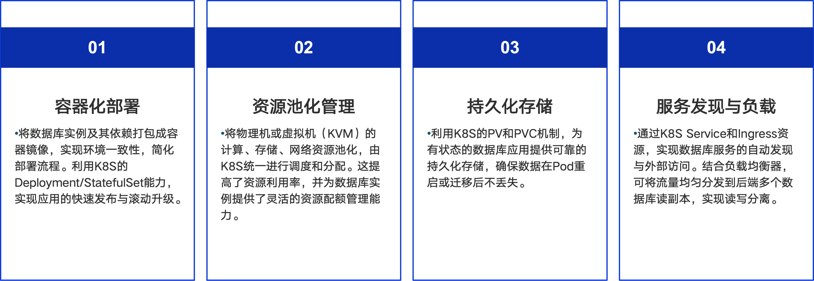
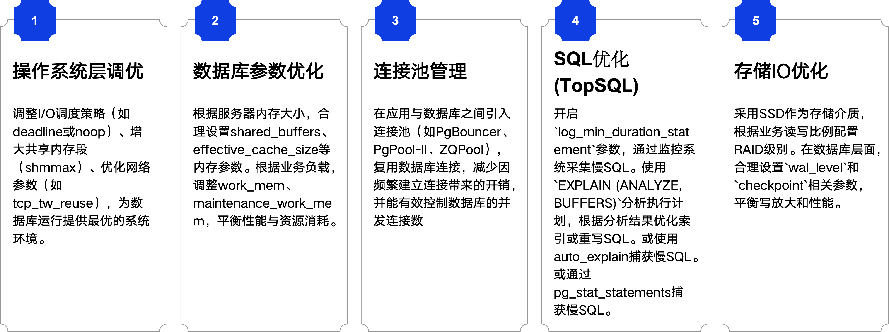
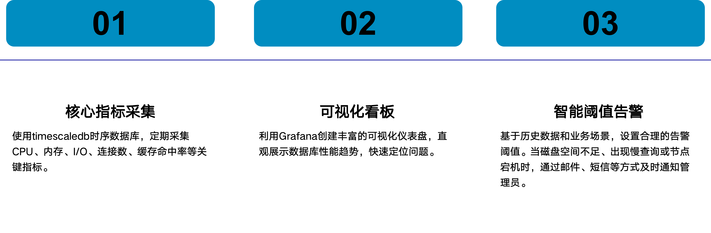
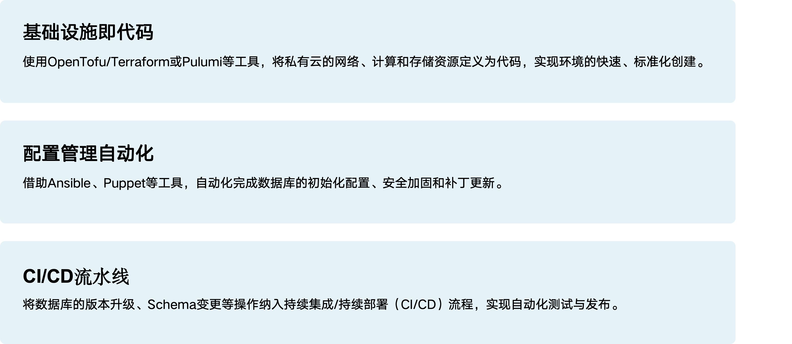

> 本文整理自 HOW 2026 中国数据库开源发展峰会暨 PostgreSQL 高峰论坛的演讲分享，演讲嘉宾：唐成，资深数据库架构师，中启乘数科技创始人及 CTO，《PostgreSQL修炼之道：从小工到专家》作者。

[HOW 2026 演讲 PPT 下载方式](https://mp.weixin.qq.com/s/PVPEjr4lagmWleBnN34dpw)

该演讲录屏：https://www.bilibili.com/video/BV1jaLx63EZw/

过去几年，"全面上云"一度成为数据库建设的主流方向。但随着核心业务规模不断扩大，越来越多企业开始重新关注私有云架构。尤其在金融、政企、运营商等场景下，数据库不仅需要云化能力，同时还要兼顾数据安全、资源可控、成本优化、国产化适配、高可用与稳定性。数据库私有云，也逐渐从"资源虚拟化平台"演变为完整的数据基础设施平台。

## 为何选择 PostgreSQL / IvorySQL 构建私有云

### 业务发展的挑战

伴随业务场景复杂化、数据体量爆发式增长，传统数据库架构在业务快速增长过程中，逐渐暴露出多个问题：

1. **弹性能力不足**：传统数据库架构扩容周期长，资源利用率低，难以适配业务高峰与低谷之间的动态变化。
2. **运维复杂度持续提升**：随着数据库实例规模扩大，人工部署、人工扩容、人工切换等传统运维方式已经难以支撑大规模数据库集群管理。
3. **安全与合规压力增加**：核心业务数据对数据主权、访问控制、审计监管提出更高要求，越来越多行业开始强调数据本地化与资源可控。
4. **数据库成本持续增长**：商业数据库授权费用、高端存储成本以及 DBA 运维成本不断增加，企业开始更加关注数据库总体拥有成本（TCO）。

### 私有云的优势与数据库选型考量

相比传统数据库部署模式，私有云更强调资源统一管理与平台化能力建设。在这一背景下，PostgreSQL 与 IvorySQL 成为了数据库私有云的重要选择。PostgreSQL 依靠成熟稳定的开源生态、丰富扩展能力以及企业级可靠性，已经成为当前最主流的开源数据库之一。而 IvorySQL 则在兼容 PostgreSQL 生态基础上，进一步增强 Oracle 兼容能力，更适合国产化替代与数据库迁移场景。

### IvorySQL 的优势

作为基于 PG 的开源数据库，100% 兼容 PG 并高度兼容 Oracle，为云原生而生，是企业构建私有云数据库的理想选择：

1. **100% 兼容 PostgreSQL**：IvorySQL 基于最新的 PostgreSQL 版本进行研发，继承了 PG 的所有核心功能与优势。
2. **高度兼容 Oracle**：提供包括 PL/iSQL 语法、数据类型、函数及存储过程等的 Oracle 兼容性，大幅降低企业从 Oracle 迁移的成本与风险。
3. **遵循 Apache 2.0 协议**：采用宽松的开源协议，允许用户自由使用、修改和分发，提供了最大的技术自主权。
4. **丰富的云原生生态**：提供全套云原生工具链，支持在 K8s 等容器平台上快速部署、弹性伸缩和自动化运维。
5. **全面的 Oracle 兼容性**：新增对 ROWID、%ROWTYPE、%TYPE、NLS 参数、大小写敏感等 21 个 Oracle 关键特性的支持。
6. **性能与稳定性提升**：基于 PG 18.0 的异步 IO、跳跃扫描等新特性，提供卓越的性能和高并发处理能力。

## 私有云架构设计

数据库私有云的核心，本质上是基础设施能力的构建。

### 基础设施规划——裸金属服务器

对于高并发、高 IO 的核心业务，裸金属依然是数据库部署的重要方案。数据库直接运行在物理机上，可以绕过虚拟化层，获得更低的性能损耗。

在实际部署中，通常会重点关注 NVMe SSD、本地高性能存储、万兆 / 25G 网络、RDMA 网络。

尤其是在 PostgreSQL 主备复制场景中，网络时延会直接影响同步效率。

### 基础设施规划——容器

对于要求极致资源利用率的系统，采用 Kubernetes（K8S）作为容器编排平台，为 IvorySQL 实例提供一个弹性的运行基座。

其中 `Operator` 是实现数据库高可用部署的核心组件。IvorySQL 适配自身数据库特性：

- Operator：https://github.com/IvorySQL/ivory-operator/
- IvorySQL Cloud 前端：https://github.com/IvorySQL/ivory-cloud-web
- IvorySQL Cloud 后端：https://github.com/IvorySQL/ivory-cloud

### 高可用体系

PostgreSQL 的高可用体系主要建立在流复制基础之上。在生产环境中，通常采用一主多备、同步复制、自动故障切换等方式保障数据库稳定运行。

### 数据库性能优化

数据库性能优化并不是简单"调几个参数"。真正影响数据库性能的，通常包括操作系统、数据库参数、连接池管理、SQL 执行效率、存储 IO。

存储 IO 是数据库性能短板高发区，从 RAID 选型、文件系统、内核调度、磁盘分区四个维度落地优化：

- RAID 配置：机械盘配缓存 RAID 卡，优选 RAID10；NVMe 采用软 RAID
- 文件系统：生产环境统一使用 XFS，适配高并发与大文件 IO 场景
- I/O 调度器：NVMe 配置 noop，普通磁盘选用 deadline，压低 IO 延迟
- 预读与对齐：分区对齐物理扇区，合理调控预读参数，削减冗余 IO 损耗

## 智能监控与运维

### 实时监控与告警

数据库私有云环境中，监控体系的核心目标是快速发现问题、定位问题。

### 构建智能监控

依托开源工具实现监控从被动告警到主动预判的升级：

- **Metrics 采集与告警**：使用 Prometheus Operator 部署 Prometheus 和 Alertmanager，通过 node_exporter 和 pg_exporter 采集指标
- **日志平台化管理**：利用 EFK 或 Loki 等日志系统，集中收集和存储所有数据库实例的日志
- **链路追踪一体化**：将数据库监控与 APM 系统打通，实现从应用端到数据库端的全链路追踪
- **异常检测与预测**：利用机器学习算法对历史监控指标建模，实现基线预测和异常点检测

### 关键指标监控

全面精准地采集数据库各项指标，重点关注：

- 主机层指标：CPU、内存、磁盘 IO、网络吞吐量
- 实例层指标：活跃连接数、缓存命中率、TPS、QPS、锁等待数量
- 对象层指标：表的增删改查频次、索引使用率、表索引膨胀率、WAL 日志产生速度
- 会话与 SQL 指标：慢查询数量、长事务数量、空闲事务数量

### 获取数据库指标

PostgreSQL 依靠内置系统视图采集细分性能指标：

- 会话等待：`pg_wait_events`、`pg_stat_activity`
- WAL 运行：`pg_stat_wal`
- 检查点：`pg_stat_checkpointer`
- 异步 IO：`pg_aios`
- 内存与 NUMA：`pg_stat_memory_usage`、`pg_shmem_allocations_numa`
- 向量运算：`pg_stat_vector_ops`
- 并行查询：`pg_stat_parallel_queries`

### 自动化运维实践

随着数据库规模不断扩大，自动化运维已经成为数据库私有云的重要组成部分。目前常见实践包括基础设施即代码、配置管理自动化、CI/CD 流水线。

## 总结

随着企业核心业务持续向云化演进，数据库私有云建设已经不再只是简单的"数据库上云"。从基础设施规划到高可用体系建设，从性能优化到监控与自动化运维，数据库平台正在逐渐向云原生化、平台化、智能化方向发展。

PostgreSQL 凭借稳定性、扩展能力与成熟开源生态，已经成为数据库私有云的重要技术底座。而 IvorySQL 在兼容 PostgreSQL 生态的基础上，进一步增强 Oracle 兼容能力与云原生适配能力，也为企业数据库国产化与平滑迁移提供了更多可能。

从人工运维转向自动化运维，从被动告警转向智能预警，从单实例管理转向统一平台化管理，数据库运维体系正在发生深刻变化。

未来，随着 AI 运维、自助式数据库服务以及多模数据能力持续发展，数据库私有云也将逐渐演变为完整的数据基础设施平台。
