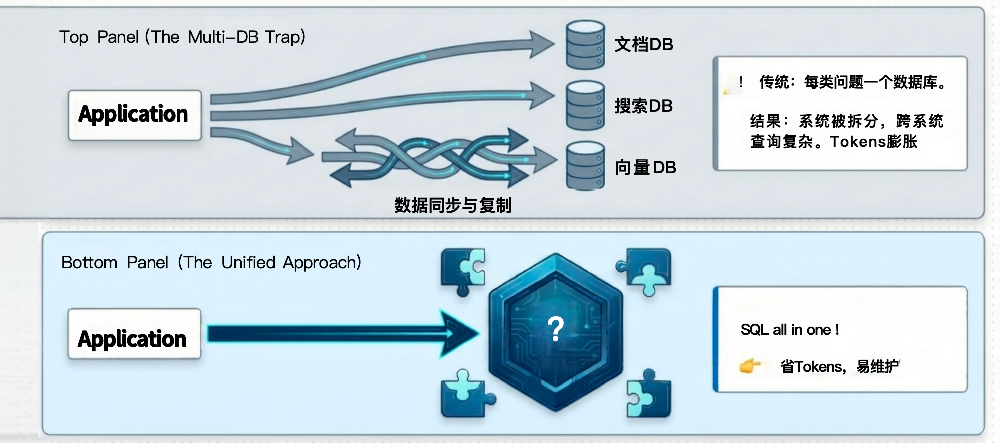
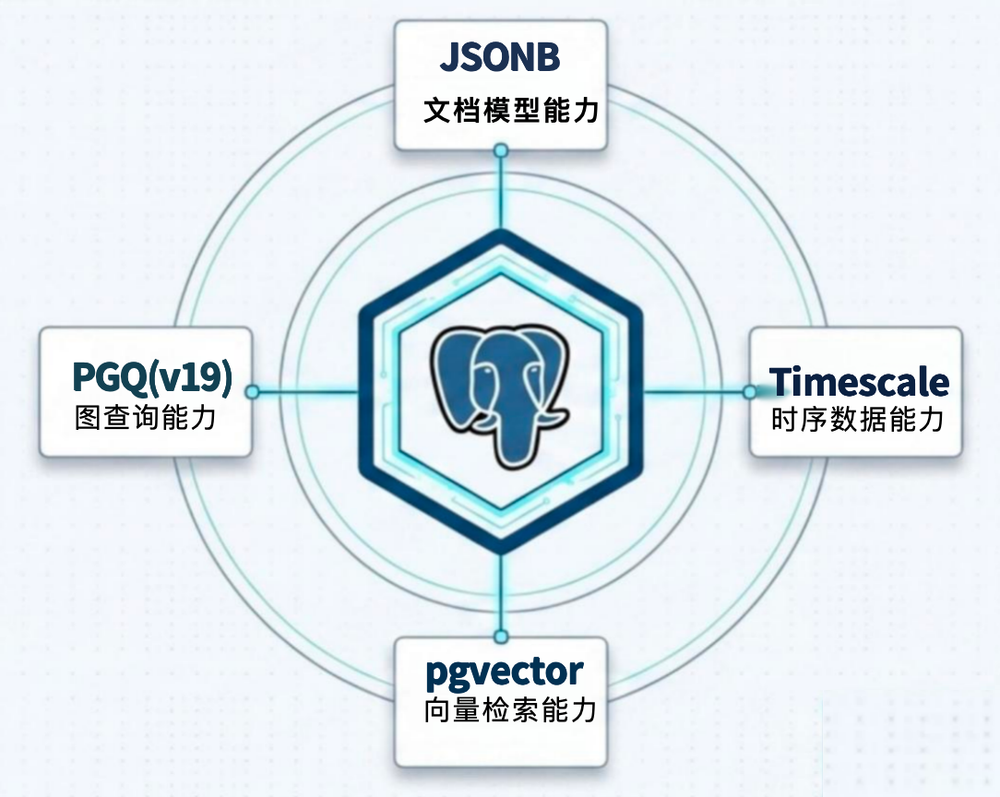
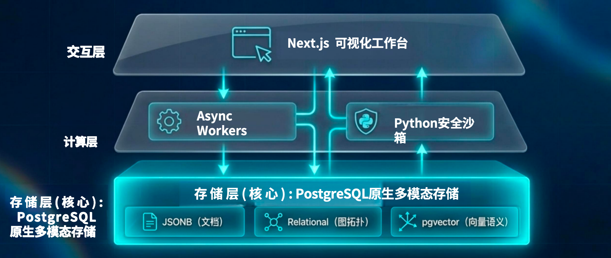
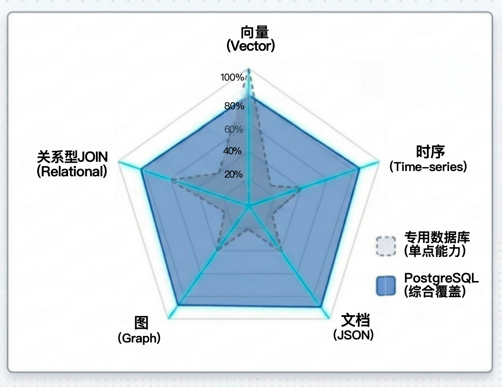
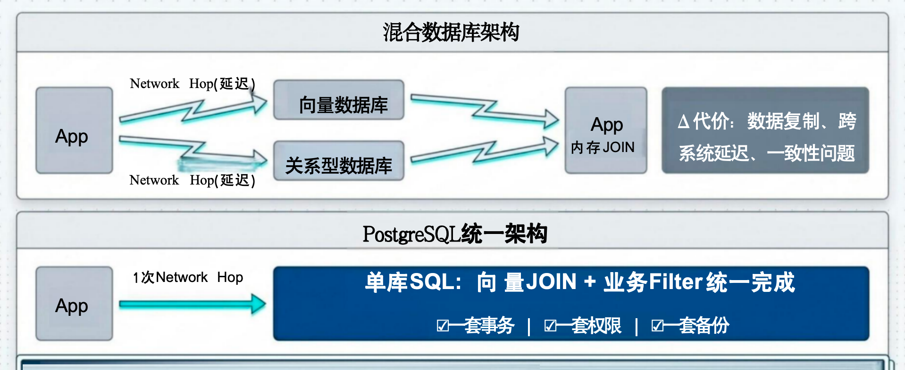
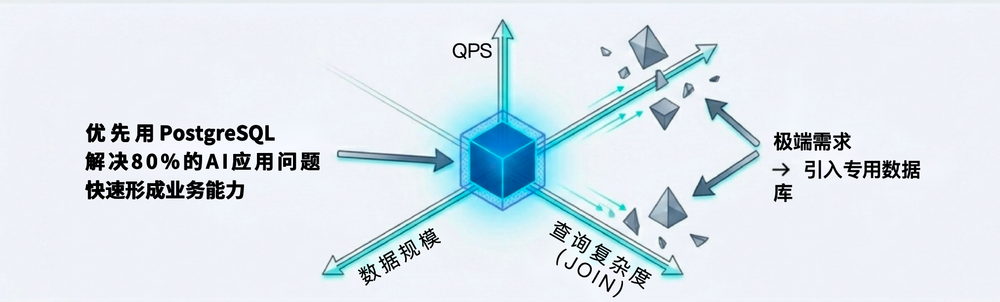

<!-- truncate -->

# PG 成为 Vibe Coding 的首选搭配：AI Agent 开发的"大道至简"

> 本文整理于 HOW 2026 演讲内容，演讲者：萧少聪，前 PostgreSQL 分会会长及中文社区主席、IvorySQL 专家顾问委员。

过去的两年里，我一直坚信一个判断：在我们现在用 AI 方法、用大语言模型进行开发的模式下，PostgreSQL 一定会成为任何一个 AI 项目的**首选搭配**。当然，我不是说 PG 可以包打天下、做永远的底座——到了某个时间点，某些工作负载、某些业务场景，确实可能需要把特定形态的数据迁移到专用的数据库上。但作为**起点**，PG 毋庸置疑是最佳选择。

今天我会分四个话题来展开：第一是我们的烦恼——Token 焦虑；第二是"One SQL"如何让你事半功倍；第三是统一数据面如何让 AI"无死角"地工作；第四是讨论一下 PG 作为 AI 首选的边界在哪里。

## 一、Vibe Coding 的烦恼：系统复杂度带来的"Token 焚化炉"

我们通常开发一个系统的时候，一开始一个数据库就足够了，业务不会那么复杂。但在应用过程中——不管你是开发 AI 应用还是其他应用——你会发现，我需要 JSON 功能，我需要搜索功能，我需要 AI 相关的各种能力。每一次增加都是一种新的业务形态，每一个决策在当下看起来都是非常正确和合理的。

但结果是什么？你的系统会从 1 个数据库变成 5 个，甚至更多。

你引入了 MongoDB 处理文档，引入了 Elasticsearch 处理搜索，引入了 Milvus 处理向量——看上去你很负责任，为团队选择了业界最好的产品。但大家要想一个问题：**你的业务上去了吗？** 项目可能才刚刚开始，你一下子就拿了一个最复杂的架构，这其实并不合适。

更重要的是，在 Vibe Coding 的过程中，多数据库带来的代价是**Token 的急剧膨胀**：

- 不同数据库有不同的语法，AI 要学习多套查询语言
- 数据需要在多个系统间同步，AI 要编写和维护 ETL 逻辑
- 跨系统的查询被拆分成多个步骤，每一步都要消耗 Token
- 上下文窗口被撑爆，模型直接"降智"变傻

这哪里是 Vibe Coding？这简直是**Token 焚化炉**。

**解决方案是什么？** 在一个边界之内，用同一个数据库去解决所有问题。而这个数据库，就是 PostgreSQL。



## 二、One SQL，事半功倍：10 天 5 万行的实战验证

去年 11 月，我做了一个实验：用纯 AI 辅助开发的方式，在 10 天内完成了一个名为 OntologyAlpha 的项目，总共生成了约 5.4 万行代码，最终上线有效代码约 1.13 万行。

这个项目是个"本体论"（Ontology）相关的系统，底层需要处理四类数据：



- **JSON**：AI 的输入输出，前后端交互信息
- **向量**：文本的语义化表达，用于相似搜索
- **图**：知识点上下游的关联追踪和分层管理
- **时序**：上下文沟通的前后顺序记录



项目架构上，存储层就是**PostgreSQL 原生多模态存储**，上面是 Async Workers 和 Python 安全沙箱，再上面是 Next.js 可视化工作台——全部代码由 AI 生成，我自己没有写一行。

**开发方式**：我用 Google AI Studio 的 Gemini 模型担任"首席数据官/CTO"，负责架构规划和任务拆分；然后用 Cursor（免费默认模型）进行具体代码实现。总投入 82 个工时，大约 10 个人天。

**实现效果**：

- CPU/内存设备监控，支持精准搜索和模糊语义搜索
- 小学数学课本知识向量化，形成知识图谱（没有用专用图数据库，而是用两张关系表模拟图结构）
- PDF 文档（如新加坡人才政策）自动抽取关键词和业务关联关系，形成上下游链路
- Python 沙箱联动：CPU 过热时自动触发上游链路状态变更

**关键的 SQL 长这样**：

```sql
-- 一条SQL同时完成：JSON提取 + 关系型图遍历 + 向量相似度搜索
SELECT ...
FROM ...
WHERE name->>'xxx' = '...'   -- JSON字段提取
  AND relation_type = '...'   -- 关系型图逻辑
  AND embedding <-> '...'     -- 向量相似度
```

一条 SQL，搞定三种数据模型的联合查询。在 PG 里面，事务、权限、备份全是一套体系，不用操心跨系统的数据一致性问题。

整个开发过程，我用的都是最基础的 AI 套餐——Google Gemini 20 美元/月，Cursor 免费套餐。Token 消耗非常可控。

## 三、统一数据面，快人一步：AI 的"无死角"覆盖

很多人吐槽说 PostgreSQL 做向量不行——内存消耗太大，难以扩展到亿级数据。

这里我要推荐一个项目：**pgvectorscale**，由 TimescaleDB 团队开发。它把向量索引放到磁盘上，通过 DiskANN + 量化技术，突破了内存限制，支持超大规模向量检索的同时大幅降低成本。

但我想强调的是：**PG 的优势不在于单项做到最强**。你的系统如果必须处理超过 1 亿级别的向量、超高 QPS，那确实要选专用向量数据库。但当你的业务需要对关系型、向量、JSON、时序、图等多种数据模型进行组合管理时，**PG 是一个各项能力都在 80 分左右的全能选手**。



组合后的优势是什么？**极大地减少系统拆分，显著降低开发与运维复杂度。**

在多数据库混合架构下，你的应用程序要自己管理：

- 关系库用 SQL，向量库可能根本写不了 SQL
- 两个系统之间要不要事务？怎么保证一致性？
- 引入 ETL 后，应用程序要关注 ETL 延迟，哪些数据可信、哪些已过期？
- 权限怎么统一？备份怎么统一？

这套东西全部管起来，Vibe Coding 的消耗量、准确度、产出效果都会变得非常糟糕。



而在 PG 里面，统一数据面的价值在于：

- **1 次 Network Hop**：应用只访问一个数据库
- **1 套事务**：所有操作在同一事务中完成
- **1 套权限**：统一的数据访问控制
- **1 套备份**：统一的容灾体系

**系统复杂度带来的损耗，往往大于纯粹的单点性能收益。很多时候，你是在为多系统架构买单。**

## 四、PG 是 AI 的"爱"的首选：有边界，更放心

我这么喜欢 PG，那什么时候应该考虑引入专用数据库？

我自己的建议是这样的——**先用 PG 解决 80%的问题，快速形成业务能力。等赚到第一块钱了，再考虑要不要迁移。**

具体来说：

| 数据类型 | PG 能撑到什么程度    | 何时考虑迁移                       |
| -------- | -------------------- | ---------------------------------- |
| **向量** | 亿级以下、中等 QPS   | 向量规模爆发至亿级且 QPS 极高时    |
| **时序** | 常规的日志/埋点/监控 | 数据量巨大且有特殊压缩需求时       |
| **JSON** | 绝大多数场景         | 遇到数千行的超大 JSON 或高频更新时 |
| **图**   | 3~4 层深度的浅层关联 | 图的深度和复杂度超出 PG 处理能力时 |

**明确边界，反而更敢用。**



PG 19 会原生支持更好的图查询。现阶段你也可以用 AGE 插件，或者像我一样用几张关系表把图结构"糊"出来——对于大多数 AI 应用场景，这完全够用。

## 结语：更少的系统，而不是更强的系统

在 AI 时代，我觉得每个人都应该是一个架构师。但从架构的思维来看，**目标应该是更少的系统，而不是更强的系统。**

以前有一种想法：我把架构做得越复杂，老板越不敢开掉我。但今天 AI 来了，老板想开你也不是因为 AI，而是因为经营不善。

我们不要有这种负担。真正有价值的是：

> **PostgreSQL 是默认的起点，而不是终点。**

用 PG 起步，快速验证商业模式，节省 Token，节省管理时间，把精力放在业务变现上。等到业务稳定盈利了、遇到明确的技术瓶颈了，再谨慎地评估是否引入专用数据库。

干净简洁的架构，才是未来弹性最大的架构。
