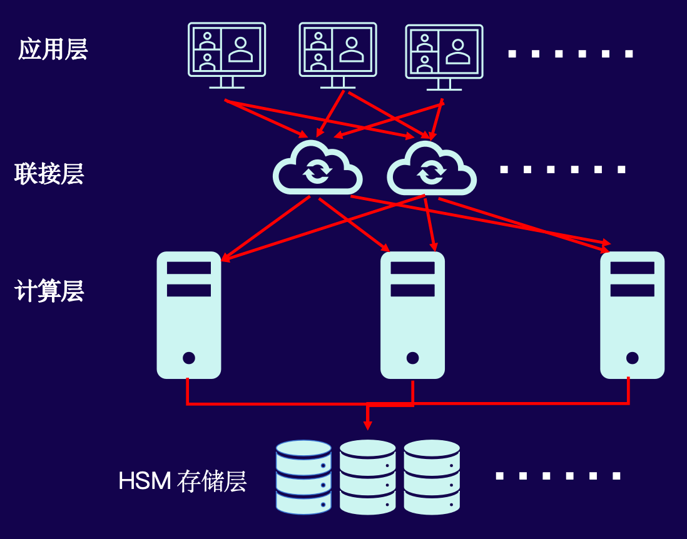
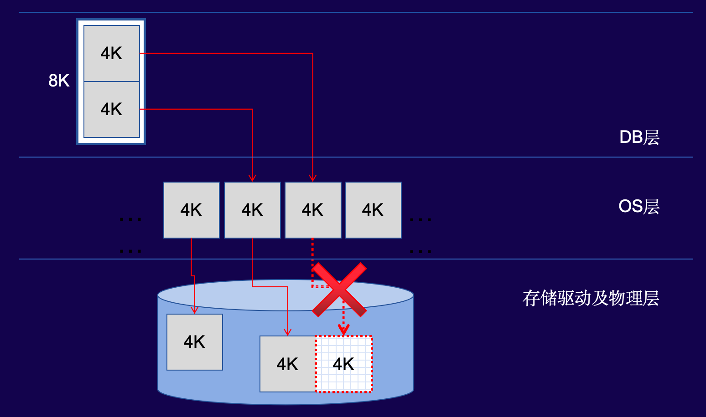

<!-- truncate -->

# 增量检查点的"困"与"难"

> 本文整理于 HOW 2026 演讲内容，演讲者：吕海波，易景科技首席研究员，PG ACED，北京大学企业导师。

## 一、增量检查点的引入背景

在基于PostgreSQL开发共享存储集群架构（类似Oracle RAC）的过程中，一个现实问题浮出水面：完全沿用PG原有的全量检查点机制时，各节点间脏页会持续累积，导致压力测试下的性能表现始终上不去。为了解决这个问题，我们引入了增量检查点。

增量检查点的核心思想并不复杂：增加一个位于共享内存中的检查点队列（ckptq），按脏块变脏的顺序排列所有脏块，然后以高频次、小批量的方式沿队列定期刷新脏页。相比全量检查点一次性遍历所有脏页，这种方式理论上能更平滑地控制I/O负载。

但真正落地实现时，有两个关键问题比预想中棘手：一是ckptq共享内存锁的管理机制，二是增量检查点与FPW（全页写）之间的耦合关系。下文逐一展开。

## 二、ckptq共享内存锁管理：自旋锁竞争的隐藏成本

ckptq放在共享内存中，多进程并发连接脏块必然涉及锁管理。我们最初采用的是PG自带的SpinLock自旋锁，但在高竞争场景下暴露出严重的性能问题。

### 2.1 自旋锁的本质

自旋锁本质上就是一个内存变量——1字节、2字节、4字节或8字节。进程A持有锁时把值从0改成1；进程B发现值不为0，就不停地循环检查，直到值变回0。这种"忙等待"的目的是不让出CPU，避免上下文切换和Cache污染。

问题在于：当多个进程同时竞争同一把自旋锁时，后果远不止是CPU空转。

### 2.2 CPU核间通信风暴

假设16个核，Core 0持有锁，另外15个核在同时自旋等待。当Core 0要释放锁（将1改为0）时，会发生以下连锁反应：

1. Core 0需要向其他15个核广播**Invalidate消息**，通知它们自己L1/L2 Cache中该锁变量的副本已失效
2. 等待所有核确认后，Core 0才能将变量修改为0
3. 15个等待的核立即向Core 0发送**Write Update消息**，请求获取最新的变量值
4. CPU内部仲裁后，某个核（如Core 9）获得修改权限，再向其他15个核广播**Write Invalidate消息**
5. 待全部确认后，Core 9将变量改为1，持有锁

一轮锁释放与重新获取，涉及数十次核间消息广播。在16核规模下尚且如此，当代CPU动辄几十乃至上百核，这种开销会急剧放大。**一轮轮消息同步，足以让i9的性能"退化"到386水平。** 这就是所谓的"锁风暴"——热点竞争造成的阻塞被核间通信延迟进一步加剧。

这个问题并非增量检查点独有。PG中所有使用自旋锁的地方，一旦产生竞争，都可能触发同样的核间通信风暴，造成性能抖动。

### 2.3 改进思路

解决方案的灵感其实来自于CPU自身的缓存一致性协议和RAC的缓存融合机制。核心思路很简单：为每个核分配独立的锁变量，自旋时每个核只轮询自己的变量，互不干扰，因此无需广播消息。

释放锁时，持有者只需要向获得锁的目标核的私有变量发送一次修改消息，完成所有权转移。这从O(n²)量级的核间通信降到了O(1)。相关学术研究可参考论文《Non-scalable locks are dangerous》——传统自旋锁在大规模多核系统中的可扩展性问题早有定论，只是实践中容易被忽视。

## 三、增量检查点与FPW：页分裂问题的实测对比

在PG中，完全检查点和FPW是强绑定的。引入增量检查点后，完全检查点的频率被大幅拉长，这会对FPW保护页分裂的能力产生什么影响？要回答这个问题，得先搞清楚FPW到底在解决什么问题，以及其他数据库是如何处理的。

### 3.1 什么是页分裂（Partial Write）
 
数据库的页（如PG的8KB）在操作系统层面通常由多个OS页（如4KB）组成。当数据库发起一个8KB的写操作时，在存储层实际上是两次4KB写入。如果写入中途断电或系统崩溃，可能出现前4KB写入成功、后4KB未写入的情况——这个数据库页就变成了"一半新一半旧"的损坏状态，这就是**页分裂**。

### 3.2 如何模拟页分裂

长期以来，页分裂问题难以验证，因为真实场景下除了拔电源几乎无法复现。但通过eBPF/systemtap等内核动态跟踪工具，可以拦截`pwrite`系统调用，将写入长度参数从8KB篡改为4KB，操作系统就会乖乖地只写一半——完美模拟页分裂，且完全排除其他干扰因素。

我们分别对Oracle、PostgreSQL和MySQL执行了相同的测试。

### 3.3 Oracle：软件层面不处理

拦截`pwrite`后，Oracle在检查点刷脏时检测到I/O错误，直接崩溃。重启后开始实例恢复，定位到检查点位置，识别出需要恢复的脏块——然后恢复失败。

测试结论很明确：Oracle在软件层面并不解决页分裂问题。它既不依赖文件系统的原子写，也不在代码中做特殊处理。Oracle的策略是检测到损坏后依赖备份进行介质恢复，并提供了BlockRecover工具用于单块恢复。**将问题转移给运维，本身就是一种选择。**

### 3.4 PostgreSQL：彻底解决

同样流程下，PG在I/O错误后并没有崩溃，仅报告错误。我们用`kill -9`杀掉所有进程模拟意外宕机，重启后PG从控制文件中读取检查点位置，应用对应的WAL日志——数据完整恢复，无一丢失。

**PG通过FPW机制，在第一次修改脏页时将整个页写入WAL，确保即使发生页分裂，也能通过日志完整重做。** 代价是明显的I/O放大，但换来了数据一致性的确定性。

### 3.5 MySQL（InnoDB）：双写的局限

MySQL InnoDB使用双写机制：先将页写入双写缓冲区，再写入实际数据文件。测试发现：

- 如果只拦截目标表文件的写入，双写可以恢复
- 但如果拦截系统表空间（如undo表空间）的写入，**数据库启动报错，无法恢复**

结论是：**双写解决了部分场景下的页分裂问题，但在系统表空间受损时无能为力。** 在真实的"断电+系统表空间写入被截断"场景下，双写并不能保证数据库一定能起来。

### 3.6 三库对比小结

| 数据库 | 方案 | 是否真正解决页分裂 |
|--------|------|-------------------|
| Oracle | 依赖备份与块恢复 | 软件层不解决 |
| MySQL | Double Write | 部分解决，系统表空间损坏时失效 |
| PostgreSQL | Full Page Write | 彻底解决，有性能代价 |

三个主流数据库中，**只有PG以性能为代价，真正从软件层面解决了页分裂问题。** Oracle将问题推给硬件/运维，MySQL的双写在关键路径上存在盲区。

回到TC架构的实际情况：底层自研共享存储支持原子写，因此在TC中FPW可以关闭。但如果用户没有原子写存储，FPW真的是可有可无的吗？这个问题没有一个标准答案，有兴趣的同学，不妨按照本次分享中的步骤，实际模拟下页分裂，深入体会下底层原理，再做定论。

